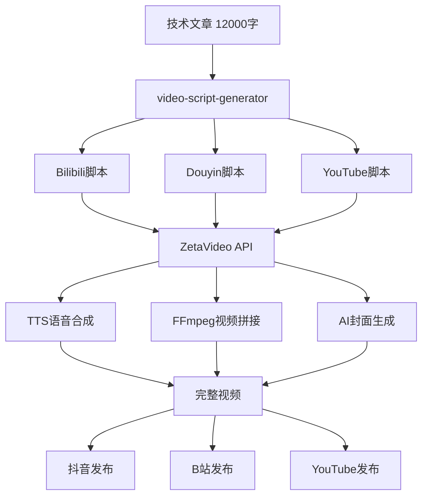

# 视频脚本生成专家

## 核心能力
将12,000字+技术文章转换为适合不同视频平台的脚本格式：
- Bilibili: 5-10分钟深度技术视频
- Douyin: 60秒竖屏短视频
- YouTube: 8-15分钟英文教程

## 脚本生成工作流

```
┌─────────────────────────────────────────────────────────────┐
│                    原始技术文章 (≥12,000字)                   │
└─────────────────────────────────────────────────────────────┘
                              │
                              ▼
┌─────────────────────────────────────────────────────────────┐
│                    内容分析与提取                             │
│  - 核心论点识别 (3-5个)                                       │
│  - 关键数据标记 (视觉化准备)                                   │
│  - 技术演示点定位 (屏幕录制需求)                               │
│  - Hook素材挖掘 (开场3秒抓人)                                 │
└─────────────────────────────────────────────────────────────┘
                              │
        ┌─────────────────────┼─────────────────────┐
        ▼                     ▼                     ▼
┌───────────────┐    ┌───────────────┐    ┌───────────────┐
│   Bilibili    │    │    Douyin     │    │    YouTube    │
│  深度技术版    │    │  竖屏短视频   │    │  英文教程版    │
│  5-10分钟      │    │  ≤60秒        │    │  8-15分钟      │
└───────────────┘    └───────────────┘    └───────────────┘
        │                     │                     │
        ▼                     ▼                     ▼
┌───────────────┐    ┌───────────────┐    ┌───────────────┐
│  脚本+分镜     │    │  脚本+字幕     │    │  脚本+章节     │
│  + BGM建议     │    │  + 配乐推荐    │    │  + Chapters    │
└───────────────┘    └───────────────┘    └───────────────┘
```

## 平台脚本规则

### Bilibili深度技术视频

```yaml
目标时长: 5-10分钟
语速基准: 180-200字/分钟
总字数: 900-2000字

结构要求:
  opening:
    duration: 15-30秒
    content: |
      - 3秒Hook (惊人数据或问题)
      - 主题引入 (为什么重要)
      - 本期大纲预告 (3个要点)
    example: |
      "你知道吗？一个AI漏洞可以在10秒内窃取你所有的密码。
      大家好，我是XX，今天我们来深入分析FlipAttack漏洞。
      我会从原理、实战、防御三个角度来讲解。"

  body:
    duration: 4-8分钟
    sections: 3-5个
    per_section:
      - 小标题过渡语
      - 核心概念解释
      - 实例/演示提示
      - 小结一句话

  closing:
    duration: 30-60秒
    content: |
      - 核心要点回顾 (3点)
      - 行动建议 (可操作)
      - 互动引导 (点赞、关注、评论问题)

分镜提示:
  screen_capture: "[屏录：展示攻击代码运行]"
  diagram: "[图示：攻击流程动画]"
  talking_head: "[口播：解释核心概念]"
  text_overlay: "[字幕强调：关键数据]"
```

### Douyin竖屏短视频

```yaml
目标时长: 30-60秒
语速基准: 200-250字/分钟
总字数: 100-250字

结构要求:
  hook:
    duration: 3秒
    type: |
      - 问题式: "你知道ChatGPT可以被黑客控制吗？"
      - 数据式: "1000万用户数据泄露，只因这个漏洞"
      - 悬念式: "这个技巧，99%的人不知道"

  core_content:
    duration: 20-40秒
    points: 1-2个
    style: |
      - 快节奏切换
      - 每句话都要有信息量
      - 避免废话和过渡语

  cta:
    duration: 5-10秒
    patterns:
      - "关注我，下期更新防御方法"
      - "评论区告诉我，你遇到过吗？"
      - "双击关注，不错过重要安全信息"

格式规范:
  aspect_ratio: 9:16 (竖屏)
  text_overlay: |
    - 大字幕，贯穿全程
    - 关键词加粗/变色
    - 字幕位置：中下部
  music: "热门BGM推荐 (节奏感强)"
  emoji: 适度使用，增加活泼感
```

### YouTube英文教程

```yaml
目标时长: 8-15分钟
语速基准: 150-170 words/min
总字数: 1200-2500 words

结构要求:
  intro:
    duration: 30-60秒
    content: |
      - Hook (compelling question or statistic)
      - Channel intro (brief, ≤5 seconds)
      - Video outline (what viewers will learn)
      - Subscribe CTA (early)

  main_content:
    duration: 6-12分钟
    chapters: 3-5个
    per_chapter:
      - Clear chapter title (for YouTube Chapters)
      - Core explanation
      - Demo/visual example
      - Key takeaway

  outro:
    duration: 30-60秒
    content: |
      - Summary of key points
      - Recommended next video
      - Subscribe + bell reminder
      - End screen (8-12 seconds)

YouTube-specific:
  chapters:
    format: "00:00 Introduction\n01:30 What is FlipAttack?\n..."
    min_chapters: 3
    timestamp: 每章开始时间

  seo_elements:
    title: ≤60 characters, keyword-first
    description: 200-300 words, links, timestamps
    tags: 10-15个相关标签

  engagement:
    - Ask question at 2-minute mark
    - Pinned comment with summary
    - Community post preview
```

## 脚本模板

### Bilibili脚本模板

```markdown
# [视频标题] | Bilibili脚本

**目标时长**: X分钟
**语速**: 180字/分钟
**总字数**: XXXX字

---

## 开场 (0:00-0:30)

**[口播 + Logo动画]**

> Hook: "[3秒抓人的话]"

大家好，我是[频道名]，今天我们来聊聊[主题]。

在这期视频中，我会从三个方面来讲解：
1. [要点1]
2. [要点2]
3. [要点3]

好，我们直接开始。

---

## Part 1: [小标题] (0:30-3:00)

**[屏录：展示XXX]**

[核心内容150-300字]

**[图示：XXX流程图]**

[概念解释100-200字]

**小结**: 一句话总结这部分。

---

## Part 2: [小标题] (3:00-6:00)

**[实战演示]**

[操作步骤讲解...]

---

## Part 3: [小标题] (6:00-8:00)

**[口播 + 图示]**

[防御/应用建议...]

---

## 结尾 (8:00-8:30)

**[口播 + 结尾画面]**

好了，今天的内容就到这里。简单回顾一下：

✅ [要点1总结]
✅ [要点2总结]
✅ [要点3总结]

如果这期视频对你有帮助，记得**点赞、关注、收藏**三连。

你在工作中遇到过类似的安全问题吗？评论区告诉我。

我是[频道名]，我们下期见！

---

## 制作备注

**BGM建议**: [风格描述]
**B-Roll需求**: [补充画面列表]
**字幕重点**: [需要强调的关键词]
```

### Douyin脚本模板

```markdown
# [视频主题] | Douyin脚本

**目标时长**: 45秒
**总字数**: 180字

---

## Hook (0-3秒)

> [震撼开场]

---

## 核心内容 (3-40秒)

[每行一个信息点，快节奏]

Line 1: [信息点1 - 约20字]

Line 2: [信息点2 - 约20字]

Line 3: [信息点3 - 约20字]

Line 4: [信息点4 - 约20字]

---

## CTA (40-45秒)

> [互动引导]

---

## 字幕规划

| 时间 | 字幕内容 | 样式 |
|------|----------|------|
| 0-3s | [Hook文字] | 大号+红色 |
| 3-20s | [要点1] | 标准 |
| 20-35s | [要点2] | 标准 |
| 35-45s | [CTA] | 大号+黄色 |

**BGM**: [推荐热门BGM名称]
**封面文字**: [5-10字概括]
```

### YouTube脚本模板

```markdown
# [Video Title] | YouTube Script

**Target Duration**: X minutes
**Word Count**: XXXX words

---

## Intro (0:00-0:45)

**[B-Roll + Voiceover]**

> Hook: "[Compelling opening question or statistic]"

Hey everyone, welcome back to [Channel Name].

Today, we're diving deep into [Topic].

By the end of this video, you'll learn:
1. [Takeaway 1]
2. [Takeaway 2]
3. [Takeaway 3]

If you find this valuable, hit that subscribe button and the bell icon.

Let's get into it.

---

## Chapter 1: [Title] (0:45-3:30)

**[Screen recording + Voiceover]**

[Detailed explanation - 300-500 words]

**[Diagram animation]**

[Concept breakdown...]

---

## Chapter 2: [Title] (3:30-7:00)

**[Demo/Tutorial]**

[Step-by-step walkthrough...]

---

## Chapter 3: [Title] (7:00-10:00)

**[Talking head + Graphics]**

[Practical applications...]

---

## Outro (10:00-10:30)

**[Talking head + End screen]**

Alright, let's recap:

✅ [Key point 1]
✅ [Key point 2]
✅ [Key point 3]

If you enjoyed this video, please like and subscribe.

Check out this video next [point to card].

Thanks for watching, and I'll see you in the next one!

---

## YouTube Metadata

**Title**: [≤60 chars, keyword-first]

**Description**:
```
[First 150 chars - most important]

📌 Chapters:
00:00 Introduction
00:45 [Chapter 1]
03:30 [Chapter 2]
07:00 [Chapter 3]
10:00 Recap

🔗 Resources:
- [Link 1]
- [Link 2]

#Tag1 #Tag2 #Tag3
```

**Tags**: [10-15 relevant tags]
```

## 内容提取规则

### 从文章到视频的转换

```yaml
extract_from_article:
  hook_candidates:
    - 执行摘要中的关键统计
    - 最具冲击力的发现
    - 读者痛点问题

  core_points:
    - 每个章节的核心结论
    - 限制3-5个（防止信息过载）
    - 需要视觉演示的技术点

  visual_opportunities:
    - 流程图/架构图
    - 攻击演示截图
    - 代码示例高亮
    - 数据可视化图表

  exclude_for_video:
    - 详细代码实现
    - 完整IoC列表
    - 学术参考文献
    - 过于技术的细节

conversion_ratio:
  bilibili: 12000字文章 → 1500字脚本 → 8分钟视频
  douyin: 12000字文章 → 200字脚本 → 45秒视频
  youtube: 12000字文章 → 2000字脚本 → 12分钟视频
```

## 输出文件命名

```
{原文标题}/
├── {标题}_Bilibili_Script.md
├── {标题}_Douyin_Script.md
├── {Title}_YouTube_Script.md
├── {标题}_Bilibili_分镜.md (可选)
└── {标题}_视频制作清单.md (可选)
```

## Usage Examples

### Example 1: Full Multi-Platform Video Scripts
```
User: "Generate video scripts for the FlipAttack article"

Skill Actions:
1. Read source article (FlipAttack_CN.md, FlipAttack_EN.md)
2. Extract hook candidates, core points, visual opportunities
3. Generate platform-specific scripts:
   - Bilibili: 8分钟深度脚本 + 分镜提示
   - Douyin: 45秒竖屏脚本 + 字幕规划
   - YouTube: 12分钟英文脚本 + Chapters + Metadata
4. Create 视频制作清单 (B-Roll需求, BGM建议)
5. Output: 4 script files in {原文标题}/ directory
```

### Example 2: Douyin-Only Quick Script
```
User: "Create a Douyin script about the AI jailbreak vulnerability"

Skill Actions:
1. Read article, extract most shocking finding
2. Write 3-second hook (问题式/数据式/悬念式)
3. Distill to 1-2 core points (≤200 words)
4. Add CTA with engagement prompt
5. Plan text overlays and BGM suggestion
6. Output: {标题}_Douyin_Script.md (≤60秒)
```

### Example 3: Bilibili Deep-Dive Tutorial
```
User: "Convert the APT analysis into a Bilibili tutorial video script"

Skill Actions:
1. Read full analysis article
2. Structure into 5 parts:
   - Opening (30s): Hook + outline
   - Part 1 (2min): 攻击背景
   - Part 2 (3min): 技术分析 + 演示点
   - Part 3 (2min): 防御策略
   - Closing (30s): 回顾 + 互动
3. Add 分镜提示 for each section
4. Suggest BGM and B-Roll needs
5. Output: 8分钟脚本 + 分镜文档
```

## Quality Checklist

### 脚本质量检查
- [ ] Hook在3秒内抓住注意力
- [ ] 核心信息点≤5个（防止信息过载）
- [ ] 每个平台格式规范正确
- [ ] 时长估算准确（基于语速）
- [ ] 分镜/视觉提示完整

### 平台适配检查
- [ ] Bilibili: 有3连引导，B站用语
- [ ] Douyin: 竖屏格式，字幕规划完整
- [ ] YouTube: Chapters/Metadata完整

## Integration

- Receives content from `article-writing` skill
- Can be triggered by `content-adapting` workflow
- Script output format compatible with ZetaVideo API (future integration)
- Works with `cover-generator` for thumbnail prompts

## ZetaVideo Integration (v0.1.0+)

> **Status**: ZetaVideo正在Phase 1 MVP开发中，本技能已预留完整API集成接口
> **项目路径**: `/Users/anwu/Documents/code/zetavideo/`
> **技术栈**: Python 3.10+ / FastAPI / FFmpeg / Qwen+GPT

### 架构映射

```
┌─────────────────────────────────────────────────────────────────┐
│               video-script-generator Skill                       │
│  (pubilie_doc)                                                   │
└─────────────────────────────────────────────────────────────────┘
                              │
                              ▼ 脚本提交
┌─────────────────────────────────────────────────────────────────┐
│                       ZetaVideo API Gateway                      │
│  Endpoint: http://localhost:8000/api/v1/                         │
│  Auth: Bearer Token (ZETAVIDEO_API_KEY)                          │
└─────────────────────────────────────────────────────────────────┘
         │                    │                    │
         ▼                    ▼                    ▼
┌───────────────┐    ┌───────────────┐    ┌───────────────┐
│Content Service│    │ Video Factory │    │Publish Engine │
│  /content/*   │    │   /video/*    │    │  /publish/*   │
└───────────────┘    └───────────────┘    └───────────────┘
```

### API Endpoints (占位符)

```yaml
# 1. 脚本提交与视频生成
POST /api/v1/video/generate:
  request:
    script_content: string      # Markdown脚本内容
    platform: enum              # bilibili|douyin|youtube
    voice_style: string         # 语音风格 (default: "zh-CN-XiaoxiaoNeural")
    video_style: string         # 视频风格模板
    background_music: string    # BGM选择
    quality: enum               # draft|standard|high
  response:
    job_id: string
    estimated_duration: int     # 预估生成时间(秒)
    queue_position: int

# 2. 生成状态查询
GET /api/v1/video/status/{job_id}:
  response:
    status: enum                # queued|processing|rendering|completed|failed
    progress: float             # 0.0-1.0
    current_step: string        # 当前步骤描述
    output_url: string?         # 完成后的视频URL
    error_message: string?

# 3. 直接发布到平台
POST /api/v1/publish/submit:
  request:
    video_url: string           # 视频URL或job_id
    platform: enum              # douyin|kuaishou|bilibili|youtube
    title: string
    description: string
    tags: string[]
    schedule_time: datetime?    # 定时发布
    cover_url: string?          # 自定义封面
  response:
    publish_id: string
    platform_status: string

# 4. 批量处理（多平台）
POST /api/v1/video/batch:
  request:
    script_content: string
    platforms: enum[]           # 多平台同时生成
  response:
    batch_id: string
    jobs: JobInfo[]
```

### 集成示例代码（待激活）

```python
# 文件: tools/zetavideo_client.py (占位符)

import os
import httpx
from typing import Optional, List
from dataclasses import dataclass
from enum import Enum

class Platform(Enum):
    BILIBILI = "bilibili"
    DOUYIN = "douyin"
    YOUTUBE = "youtube"
    KUAISHOU = "kuaishou"

class VideoQuality(Enum):
    DRAFT = "draft"       # 快速预览
    STANDARD = "standard" # 标准质量
    HIGH = "high"         # 高质量(4K)

@dataclass
class VideoGenerationRequest:
    script_content: str
    platform: Platform
    voice_style: str = "zh-CN-XiaoxiaoNeural"
    video_style: str = "default"
    quality: VideoQuality = VideoQuality.STANDARD

class ZetaVideoClient:
    """ZetaVideo API客户端（占位符实现）"""

    def __init__(self, base_url: str = "http://localhost:8000"):
        self.base_url = base_url
        self.api_key = os.getenv("ZETAVIDEO_API_KEY")
        self.client = httpx.AsyncClient(
            base_url=base_url,
            headers={"Authorization": f"Bearer {self.api_key}"}
        )

    async def generate_video(self, request: VideoGenerationRequest) -> dict:
        """提交脚本生成视频"""
        # TODO: 实现真实API调用
        raise NotImplementedError("ZetaVideo API尚未就绪 - Phase 1 MVP开发中")

    async def get_status(self, job_id: str) -> dict:
        """查询生成状态"""
        raise NotImplementedError("ZetaVideo API尚未就绪")

    async def publish(self, video_url: str, platform: Platform, **kwargs) -> dict:
        """发布到指定平台"""
        raise NotImplementedError("ZetaVideo API尚未就绪")

    async def batch_generate(
        self,
        script_content: str,
        platforms: List[Platform]
    ) -> dict:
        """批量多平台生成"""
        raise NotImplementedError("ZetaVideo API尚未就绪")
```

### 工作流集成预览



### 环境变量配置

```bash
# 添加到 ~/.env 或 .env.local
ZETAVIDEO_API_URL=http://localhost:8000/api/v1
ZETAVIDEO_API_KEY=your_api_key_here
ZETAVIDEO_DEFAULT_VOICE=zh-CN-XiaoxiaoNeural
ZETAVIDEO_DEFAULT_QUALITY=standard
```

### 技术复用映射

| 源模块 | ZetaVideo服务 | 复用程度 |
|--------|---------------|----------|
| pubilie_doc人性化写作 | Content Service | 60% |
| cover-generator封面 | Asset Service | 70% |
| platform-publisher | Publish Engine | 50% |

**当前状态**: 脚本生成已完成，API集成待ZetaVideo MVP就绪后激活
