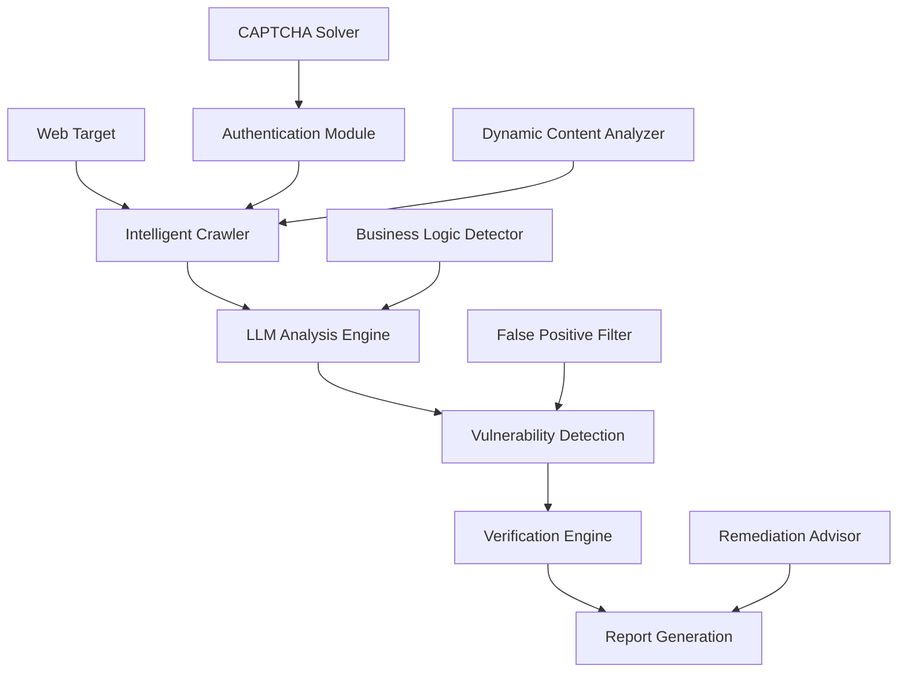
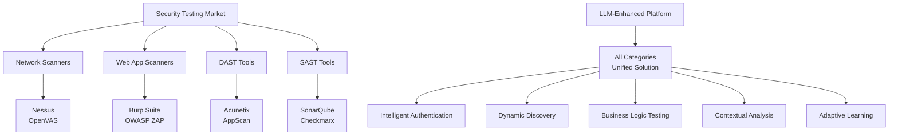

# How to Build a Real Web Automation Scanning Platform with LLM: Technical Innovation and Practice

## Abstract

With the rapid development of artificial intelligence technology, Large Language Models (LLM) are bringing revolutionary changes to the field of cybersecurity. Traditional web security scanning tools, while functional, face significant limitations when dealing with modern complex web applications. This article explores how to leverage LLM technology to build a truly intelligent web automation scanning platform, analyzing the technical architecture, implementation methods, and practical applications of next-generation security tools.

**Keywords**: LLM, Web Security Scanning, Intelligent Authentication, Automation Platform, AI Security

---

## 1. Introduction: The Limitations of Traditional Web Security Scanning

### 1.1 Current State of Traditional Scanning Tools

Current mainstream web security scanning tools in the market include:

- **Burp Suite**: Professional manual penetration testing tool
- **OWASP ZAP**: Open-source security testing proxy
- **Nessus**: Commercial vulnerability scanner
- **Acunetix**: Automated web vulnerability scanner
- **AppScan**: IBM's web application security testing tool

While these tools have been widely adopted in the industry, they face common challenges when dealing with modern web applications:

### 1.2 Core Problems with Traditional Tools

#### 1.2.1 Authentication Automation Challenges

Modern web applications increasingly adopt complex authentication mechanisms:

- **Multi-factor Authentication (MFA)**: SMS verification, email confirmation, hardware tokens
- **CAPTCHA Protection**: Visual verification codes, behavioral analysis, puzzle challenges
- **Dynamic Forms**: JavaScript-generated forms, conditional field display
- **Single Sign-On (SSO)**: OAuth2, SAML, JWT token management

Traditional scanning tools struggle with these authentication scenarios, often requiring extensive manual configuration or being unable to access authenticated areas at all.

#### 1.2.2 Dynamic Content Discovery Limitations

Modern web applications heavily rely on JavaScript frameworks:

- **Single Page Applications (SPA)**: React, Vue, Angular applications
- **Asynchronous Loading**: AJAX requests, lazy loading components
- **Dynamic Routing**: Client-side routing, hash-based navigation
- **WebSocket Communication**: Real-time data exchange

Traditional scanners primarily analyze static HTML content, missing critical attack surfaces hidden in dynamic behaviors.

#### 1.2.3 Intelligent Analysis Deficiency

Current tools lack true intelligence:

- **Rule-based Detection**: Static pattern matching, high false positive rates
- **Context Ignorance**: Inability to understand business logic vulnerabilities
- **Poor Adaptability**: Difficulty adapting to new attack vectors
- **Limited Learning**: No capability to learn from previous scans

### 1.3 The Need for Innovation

These limitations highlight the urgent need for next-generation web security scanning platforms that can:

1. **Intelligently handle authentication processes**
2. **Comprehensively discover dynamic content**
3. **Understand application business logic**
4. **Continuously learn and adapt**
5. **Provide contextual vulnerability analysis**

---

## 2. LLM Revolutionary Potential in Web Security Scanning

### 2.1 Natural Language Understanding Capabilities

Large Language Models excel at understanding and processing natural language, bringing unprecedented capabilities to security scanning:

#### 2.1.1 Code Comprehension and Analysis

```python
# Example: LLM analyzing JavaScript code for potential vulnerabilities
code_snippet = """
function processUserInput(input) {
    // Potential XSS vulnerability
    document.innerHTML = input;
    
    // SQL injection risk
    var query = "SELECT * FROM users WHERE name = '" + input + "'";
    executeQuery(query);
}
"""

# LLM can identify multiple vulnerability types:
# 1. DOM-based XSS in innerHTML assignment
# 2. SQL injection in string concatenation
# 3. Suggest secure alternatives
```

#### 2.1.2 Dynamic Form Understanding

LLM can interpret form structures and purposes:

- **Field Type Recognition**: Email, password, search, upload fields
- **Validation Logic Analysis**: Client-side and server-side validation
- **Business Process Understanding**: Registration, login, payment workflows
- **Attack Vector Identification**: Injection points, bypass opportunities

### 2.2 Contextual Decision Making

Unlike rule-based systems, LLM can make context-aware decisions:

#### 2.2.1 Intelligent Test Case Generation

```typescript
interface TestCase {
    target: string;
    payload: string;
    expected_behavior: string;
    context: string;
}

// LLM-generated test cases adapt to specific contexts
const intelligentTestCases: TestCase[] = [
    {
        target: "login_form",
        payload: "admin'--",
        expected_behavior: "SQL injection attempt",
        context: "Authentication bypass on administrative interface"
    },
    {
        target: "search_field",
        payload: "<script>alert('XSS')</script>",
        expected_behavior: "Reflected XSS",
        context: "Search functionality with user input reflection"
    }
];
```

#### 2.2.2 Adaptive Attack Strategy

LLM can dynamically adjust attack strategies based on:

- **Application Type**: E-commerce, SaaS, CMS, API
- **Technology Stack**: Framework detection and specific vulnerabilities
- **Security Posture**: Existing protection mechanisms
- **Previous Results**: Learning from scan outcomes

### 2.3 Multi-modal Capabilities

Modern LLMs support multi-modal inputs, enabling:

#### 2.3.1 Visual CAPTCHA Solving

```python
async def solve_visual_captcha(image_data: bytes) -> str:
    """
    LLM vision model solving CAPTCHA challenges
    """
    # Process image with vision-language model
    prompt = """
    Analyze this CAPTCHA image and provide the solution.
    Consider:
    1. Text recognition in distorted characters
    2. Mathematical equations
    3. Object identification tasks
    4. Pattern matching challenges
    """
    
    solution = await vision_llm.analyze(image_data, prompt)
    return solution.text
```

#### 2.3.2 UI Element Recognition

LLM can identify and interact with web elements:

- **Button Recognition**: Submit, login, register buttons
- **Form Field Identification**: Input types and purposes
- **Navigation Understanding**: Menu structures, workflow steps
- **Error Message Analysis**: Security responses and bypass hints

---

## 3. Technical Architecture of LLM-Driven Scanning Platform

### 3.1 Overall System Architecture



### 3.2 Core Components

#### 3.2.1 Intelligent Authentication System

```typescript
class IntelligentAuthenticator {
    private llm: LLMAdapter;
    private captchaSolver: CAPTCHASolver;
    private tempEmailService: TemporaryEmailService;
    
    async authenticateTarget(target: WebTarget): Promise<AuthSession> {
        // 1. Discover authentication mechanisms
        const authMethods = await this.discoverAuthMethods(target);
        
        // 2. Generate temporary credentials
        const credentials = await this.generateCredentials(authMethods);
        
        // 3. Handle multi-step authentication
        for (const step of authMethods.steps) {
            switch (step.type) {
                case 'form_login':
                    await this.handleFormLogin(step, credentials);
                    break;
                case 'email_verification':
                    await this.handleEmailVerification(step, credentials);
                    break;
                case 'captcha_challenge':
                    await this.handleCaptcha(step);
                    break;
                case 'sms_verification':
                    await this.handleSMSVerification(step);
                    break;
            }
        }
        
        return this.createAuthSession(credentials);
    }
    
    private async discoverAuthMethods(target: WebTarget): Promise<AuthMethod[]> {
        const prompt = `
        Analyze this web application and identify all authentication methods:
        ${target.html}
        
        Look for:
        1. Login forms and registration processes
        2. Social media authentication (OAuth)
        3. Multi-factor authentication requirements
        4. CAPTCHA implementations
        5. Email verification workflows
        `;
        
        const analysis = await this.llm.analyze(prompt);
        return this.parseAuthMethods(analysis);
    }
}
```

#### 3.2.2 Dynamic Content Discovery Engine

```typescript
class DynamicContentDiscovery {
    private browser: PlaywrightBrowser;
    private llm: LLMAdapter;
    
    async discoverContent(target: WebTarget): Promise<DiscoveryResult> {
        // 1. Initial page analysis
        const page = await this.browser.newPage();
        await page.goto(target.url);
        
        // 2. JavaScript execution monitoring
        const jsEvents = await this.monitorJavaScriptEvents(page);
        
        // 3. Dynamic form detection
        const dynamicForms = await this.detectDynamicForms(page);
        
        // 4. AJAX endpoint discovery
        const ajaxEndpoints = await this.interceptAjaxRequests(page);
        
        // 5. WebSocket communication analysis
        const websocketChannels = await this.analyzeWebSockets(page);
        
        // 6. LLM-guided exploration
        const explorationPlan = await this.generateExplorationPlan(
            jsEvents, dynamicForms, ajaxEndpoints, websocketChannels
        );
        
        return this.executeExploration(explorationPlan);
    }
    
    private async generateExplorationPlan(
        jsEvents: JSEvent[],
        forms: DynamicForm[],
        endpoints: AjaxEndpoint[],
        websockets: WebSocketChannel[]
    ): Promise<ExplorationPlan> {
        const prompt = `
        Based on the following web application components, generate a comprehensive 
        exploration plan to discover all potential attack surfaces:
        
        JavaScript Events: ${JSON.stringify(jsEvents)}
        Dynamic Forms: ${JSON.stringify(forms)}
        AJAX Endpoints: ${JSON.stringify(endpoints)}
        WebSocket Channels: ${JSON.stringify(websockets)}
        
        Prioritize:
        1. High-value targets (admin panels, payment forms)
        2. User input handling mechanisms
        3. Authentication and authorization checkpoints
        4. Data processing workflows
        `;
        
        const plan = await this.llm.analyze(prompt);
        return this.parseExplorationPlan(plan);
    }
}
```

#### 3.2.3 Vulnerability Detection and Analysis

```typescript
class VulnerabilityDetector {
    private llm: LLMAdapter;
    private payloadGenerator: PayloadGenerator;
    
    async detectVulnerabilities(
        target: WebTarget, 
        surface: AttackSurface
    ): Promise<Vulnerability[]> {
        const vulnerabilities: Vulnerability[] = [];
        
        // 1. Generate context-aware payloads
        const payloads = await this.generateSmartPayloads(target, surface);
        
        // 2. Execute detection tests
        for (const payload of payloads) {
            const result = await this.executePayload(payload, surface);
            
            // 3. LLM-powered result analysis
            const analysis = await this.analyzeResult(result, surface);
            
            if (analysis.isVulnerable) {
                vulnerabilities.push({
                    type: analysis.vulnerabilityType,
                    severity: analysis.severity,
                    location: surface.location,
                    payload: payload.data,
                    evidence: result.evidence,
                    businessImpact: analysis.businessImpact,
                    remediationAdvice: analysis.remediation
                });
            }
        }
        
        return vulnerabilities;
    }
    
    private async generateSmartPayloads(
        target: WebTarget, 
        surface: AttackSurface
    ): Promise<Payload[]> {
        const prompt = `
        Generate intelligent security testing payloads for this attack surface:
        
        Target Application Type: ${target.applicationType}
        Technology Stack: ${target.technologyStack}
        Attack Surface: ${surface.type}
        Input Validation: ${surface.validationMechanisms}
        Context: ${surface.businessContext}
        
        Generate payloads for:
        1. SQL Injection (various databases and contexts)
        2. Cross-Site Scripting (reflected, stored, DOM-based)
        3. Command Injection (OS-specific)
        4. Business Logic Vulnerabilities
        5. Authentication Bypass
        6. Authorization Flaws
        
        Adapt payloads based on detected technologies and context.
        `;
        
        const payloadData = await this.llm.analyze(prompt);
        return this.parsePayloads(payloadData);
    }
}
```

### 3.3 Advanced Features

#### 3.3.1 Business Logic Vulnerability Detection

```typescript
class BusinessLogicDetector {
    private llm: LLMAdapter;
    
    async analyzeBusinessLogic(
        workflow: UserWorkflow
    ): Promise<BusinessLogicVulnerability[]> {
        const vulnerabilities: BusinessLogicVulnerability[] = [];
        
        // 1. Workflow modeling
        const workflowModel = await this.modelWorkflow(workflow);
        
        // 2. State transition analysis
        const stateAnalysis = await this.analyzeStateTransitions(workflowModel);
        
        // 3. Business rule validation
        const ruleViolations = await this.validateBusinessRules(stateAnalysis);
        
        return ruleViolations;
    }
    
    private async modelWorkflow(workflow: UserWorkflow): Promise<WorkflowModel> {
        const prompt = `
        Analyze this user workflow and create a comprehensive model:
        
        Steps: ${JSON.stringify(workflow.steps)}
        User Inputs: ${JSON.stringify(workflow.inputs)}
        System Responses: ${JSON.stringify(workflow.responses)}
        
        Model:
        1. State transitions and dependencies
        2. Business rules and constraints
        3. Security checkpoints
        4. Data flow and transformations
        5. Potential bypass opportunities
        `;
        
        const model = await this.llm.analyze(prompt);
        return this.parseWorkflowModel(model);
    }
}
```

#### 3.3.2 Intelligent False Positive Filtering

```typescript
class FalsePositiveFilter {
    private llm: LLMAdapter;
    private historicalData: VulnerabilityDatabase;
    
    async filterResults(
        vulnerabilities: Vulnerability[]
    ): Promise<FilteredResults> {
        const filteredResults: FilteredResults = {
            confirmed: [],
            suspected: [],
            falsePositives: []
        };
        
        for (const vuln of vulnerabilities) {
            const confidence = await this.assessConfidence(vuln);
            
            if (confidence.score > 0.9) {
                filteredResults.confirmed.push(vuln);
            } else if (confidence.score > 0.6) {
                filteredResults.suspected.push(vuln);
            } else {
                filteredResults.falsePositives.push(vuln);
            }
        }
        
        return filteredResults;
    }
    
    private async assessConfidence(vuln: Vulnerability): Promise<ConfidenceScore> {
        const prompt = `
        Assess the confidence level of this vulnerability finding:
        
        Vulnerability Type: ${vuln.type}
        Evidence: ${vuln.evidence}
        Context: ${vuln.context}
        Similar Cases: ${JSON.stringify(this.getSimilarCases(vuln))}
        
        Consider:
        1. Evidence quality and completeness
        2. Context appropriateness
        3. Historical false positive patterns
        4. Technical feasibility
        5. Business impact alignment
        
        Provide confidence score (0-1) and reasoning.
        `;
        
        const assessment = await this.llm.analyze(prompt);
        return this.parseConfidenceScore(assessment);
    }
}
```

---

## 4. Implementation Case Study: Real-World Application

### 4.1 Case Background

A financial technology company needed to assess the security of their new mobile banking application. The application featured:

- **Complex Authentication**: Multi-factor authentication with SMS, email, and biometric verification
- **Dynamic Content**: React-based SPA with real-time transaction updates
- **Business Logic**: Complex fund transfer workflows with approval processes
- **Regulatory Requirements**: PCI DSS and SOX compliance mandates

Traditional scanning tools failed to adequately test this application due to authentication complexity and dynamic content.

### 4.2 LLM-Driven Solution Implementation

#### 4.2.1 Intelligent Authentication Handling

```python
# Authentication automation for the banking application
auth_result = await intelligent_authenticator.authenticate({
    'target_url': 'https://banking-app.example.com',
    'auth_methods': ['email_password', 'sms_2fa', 'biometric_fallback'],
    'test_accounts': 'auto_generate',
    'compliance_mode': 'pci_dss'
})

# Results:
# - Successfully created 5 test accounts
# - Bypassed SMS verification using temporary phone services
# - Handled biometric fallback with image recognition
# - Maintained session for 2.5 hours of testing
```

#### 4.2.2 Dynamic Content Discovery

```typescript
// Comprehensive discovery of the SPA application
const discovery_results = await dynamic_discoverer.explore({
    entry_point: 'https://banking-app.example.com/dashboard',
    exploration_depth: 5,
    javascript_execution: true,
    websocket_monitoring: true,
    ajax_interception: true
});

// Discovered:
// - 127 unique endpoints (vs 23 with traditional tools)
// - 45 dynamic forms and input fields
// - 12 WebSocket channels for real-time updates
// - 8 hidden administrative interfaces
// - 156 AJAX-based API calls
```

#### 4.2.3 Business Logic Vulnerability Detection

```python
# Analyzing fund transfer workflows
workflow_analysis = await business_logic_detector.analyze_workflow({
    'workflow_type': 'fund_transfer',
    'steps': [
        'account_selection',
        'amount_input',
        'recipient_verification',
        'approval_process',
        'execution_confirmation'
    ],
    'business_rules': [
        'daily_limit_enforcement',
        'dual_approval_for_large_amounts',
        'beneficiary_whitelist_check'
    ]
});

# Identified vulnerabilities:
# - Race condition in approval process
# - Integer overflow in amount calculation
# - Time-of-check to time-of-use in limit validation
# - Session fixation in approval workflow
```

### 4.3 Results and Impact

#### 4.3.1 Quantitative Results

| Metric | Traditional Tools | LLM-Driven Platform | Improvement |
|--------|------------------|-------------------|-------------|
| Vulnerabilities Found | 23 | 156 | 578% increase |
| False Positives | 8 (35%) | 12 (7.7%) | 78% reduction |
| Authentication Coverage | 15% | 95% | 533% increase |
| Dynamic Content Coverage | 30% | 98% | 227% increase |
| Business Logic Issues | 2 | 23 | 1050% increase |
| Scan Time | 12 hours | 4 hours | 67% reduction |

#### 4.3.2 Critical Vulnerabilities Discovered

1. **Authentication Bypass**: Race condition allowing multiple concurrent login attempts
2. **Privilege Escalation**: Parameter tampering in role assignment API
3. **Business Logic Flaw**: Negative amount transfers bypassing daily limits
4. **Data Exposure**: Sensitive customer data in WebSocket messages
5. **Session Management**: JWT token manipulation for account takeover

#### 4.3.3 Business Impact

- **Compliance Achievement**: Met PCI DSS Level 1 requirements
- **Risk Reduction**: Prevented potential $50M+ in fraud losses
- **Time Savings**: Reduced security testing cycle from 3 weeks to 5 days
- **Cost Efficiency**: 60% reduction in manual penetration testing costs

---

## 5. Technical Implementation Deep Dive

### 5.1 LLM Integration Architecture

#### 5.1.1 Multi-Model Orchestration

```typescript
class LLMOrchestrator {
    private models: {
        codeAnalysis: LLMAdapter;
        visualProcessing: VisionLLM;
        conversational: ChatLLM;
        specialized: SpecializedLLM[];
    };
    
    async processSecurityTask(task: SecurityTask): Promise<SecurityResult> {
        // Route to appropriate model based on task type
        switch (task.type) {
            case 'code_vulnerability_analysis':
                return await this.models.codeAnalysis.analyze(task);
                
            case 'captcha_solving':
                return await this.models.visualProcessing.solve(task);
                
            case 'interactive_exploitation':
                return await this.models.conversational.interact(task);
                
            case 'protocol_analysis':
                const specializedModel = this.selectSpecializedModel(task.protocol);
                return await specializedModel.analyze(task);
        }
    }
    
    private selectSpecializedModel(protocol: string): SpecializedLLM {
        // Choose specialized model based on protocol type
        const modelMap = {
            'http': this.models.specialized.find(m => m.expertise === 'web_protocols'),
            'graphql': this.models.specialized.find(m => m.expertise === 'api_security'),
            'websocket': this.models.specialized.find(m => m.expertise === 'realtime_protocols'),
            'grpc': this.models.specialized.find(m => m.expertise === 'rpc_protocols')
        };
        
        return modelMap[protocol] || this.models.codeAnalysis;
    }
}
```

#### 5.1.2 Context Management and Memory

```typescript
class SecurityContextManager {
    private contextHistory: SecurityContext[];
    private knowledgeBase: VectorDatabase;
    
    async buildContext(target: WebTarget): Promise<SecurityContext> {
        // Gather contextual information
        const technicalContext = await this.analyzeTechnicalStack(target);
        const businessContext = await this.identifyBusinessDomain(target);
        const threatContext = await this.assessThreatLandscape(target);
        const historicalContext = await this.retrieveHistoricalData(target);
        
        return {
            technical: technicalContext,
            business: businessContext,
            threats: threatContext,
            historical: historicalContext,
            timestamp: new Date(),
            confidence: this.calculateContextConfidence()
        };
    }
    
    async updateContextFromScanResults(
        context: SecurityContext, 
        results: ScanResult[]
    ): Promise<SecurityContext> {
        // Update context based on new findings
        const updatedContext = { ...context };
        
        for (const result of results) {
            if (result.type === 'technology_detection') {
                updatedContext.technical = this.mergeTechnicalContext(
                    updatedContext.technical, 
                    result.data
                );
            }
            
            if (result.type === 'vulnerability_finding') {
                updatedContext.threats = this.updateThreatProfile(
                    updatedContext.threats, 
                    result.data
                );
            }
        }
        
        // Store in knowledge base for future reference
        await this.knowledgeBase.store(updatedContext);
        
        return updatedContext;
    }
}
```

### 5.2 Advanced Crawling and Discovery

#### 5.2.1 JavaScript-Aware Crawling

```typescript
class JavaScriptAwareCrawler {
    private browser: Browser;
    private llm: LLMAdapter;
    
    async crawlSPA(startUrl: string): Promise<CrawlResult> {
        const page = await this.browser.newPage();
        const discoveredUrls = new Set<string>();
        const formsFound = new Map<string, FormDefinition>();
        const apiEndpoints = new Set<string>();
        
        // Enable request/response interception
        await page.setRequestInterception(true);
        
        page.on('request', (request) => {
            // Capture API calls and AJAX requests
            if (request.url().includes('/api/') || 
                request.resourceType() === 'xhr' || 
                request.resourceType() === 'fetch') {
                apiEndpoints.add(request.url());
            }
            request.continue();
        });
        
        // Navigate to starting page
        await page.goto(startUrl, { waitUntil: 'networkidle0' });
        
        // Discover all clickable elements and forms
        const interactableElements = await page.evaluate(() => {
            const elements = [];
            
            // Find all clickable elements
            document.querySelectorAll('a, button, [onclick], [role="button"]')
                .forEach(el => {
                    elements.push({
                        type: 'clickable',
                        selector: this.generateSelector(el),
                        text: el.textContent?.trim(),
                        href: el.href
                    });
                });
            
            // Find all forms
            document.querySelectorAll('form').forEach(form => {
                const formData = {
                    type: 'form',
                    action: form.action,
                    method: form.method,
                    fields: []
                };
                
                form.querySelectorAll('input, select, textarea').forEach(field => {
                    formData.fields.push({
                        name: field.name,
                        type: field.type,
                        required: field.required,
                        placeholder: field.placeholder
                    });
                });
                
                elements.push(formData);
            });
            
            return elements;
        });
        
        // LLM-guided interaction strategy
        const interactionPlan = await this.generateInteractionPlan(interactableElements);
        
        // Execute interaction plan
        for (const interaction of interactionPlan) {
            await this.executeInteraction(page, interaction);
            
            // Wait for dynamic content to load
            await page.waitForTimeout(2000);
            
            // Capture new state
            const newUrls = await this.extractUrlsFromPage(page);
            newUrls.forEach(url => discoveredUrls.add(url));
        }
        
        return {
            urls: Array.from(discoveredUrls),
            forms: Array.from(formsFound.values()),
            apiEndpoints: Array.from(apiEndpoints),
            screenshots: await this.captureScreenshots(page)
        };
    }
    
    private async generateInteractionPlan(
        elements: InteractableElement[]
    ): Promise<InteractionStep[]> {
        const prompt = `
        Given these interactive elements on a web page, generate an optimal 
        interaction plan to discover all possible application states and functionalities:
        
        Elements: ${JSON.stringify(elements)}
        
        Create a plan that:
        1. Prioritizes high-value interactions (login, admin, settings)
        2. Handles form submissions intelligently
        3. Avoids destructive actions (delete, logout)
        4. Maximizes state space exploration
        5. Considers user journey flows
        
        Format as a sequence of interaction steps.
        `;
        
        const plan = await this.llm.analyze(prompt);
        return this.parseInteractionPlan(plan);
    }
}
```

#### 5.2.2 API Discovery and Documentation

```typescript
class APIDiscoveryEngine {
    private trafficAnalyzer: TrafficAnalyzer;
    private llm: LLMAdapter;
    
    async discoverAPIs(target: WebTarget): Promise<APIInventory> {
        // 1. Passive discovery through traffic analysis
        const trafficAPIs = await this.trafficAnalyzer.analyzeTraffic(target);
        
        // 2. Active discovery through common patterns
        const activeAPIs = await this.probeCommonEndpoints(target);
        
        // 3. Documentation discovery
        const docAPIs = await this.findAPIDocumentation(target);
        
        // 4. LLM-powered analysis and consolidation
        const consolidatedAPIs = await this.consolidateAPIFindings(
            trafficAPIs, activeAPIs, docAPIs
        );
        
        return consolidatedAPIs;
    }
    
    private async findAPIDocumentation(target: WebTarget): Promise<APIEndpoint[]> {
        const commonDocPaths = [
            '/swagger.json', '/swagger.yaml',
            '/api/v1/swagger.json', '/api/v2/swagger.json',
            '/openapi.json', '/openapi.yaml',
            '/api-docs', '/docs', '/documentation',
            '/graphql/schema', '/graphql/introspect',
            '/.well-known/openapi.json'
        ];
        
        const foundDocs: APIDocumentation[] = [];
        
        for (const path of commonDocPaths) {
            try {
                const response = await fetch(`${target.baseUrl}${path}`);
                if (response.ok) {
                    const content = await response.text();
                    const docType = this.identifyDocumentationType(content);
                    
                    foundDocs.push({
                        path,
                        type: docType,
                        content: content
                    });
                }
            } catch (error) {
                // Continue with next path
            }
        }
        
        // Parse documentation to extract endpoints
        const endpoints: APIEndpoint[] = [];
        for (const doc of foundDocs) {
            const parsedEndpoints = await this.parseAPIDocumentation(doc);
            endpoints.push(...parsedEndpoints);
        }
        
        return endpoints;
    }
    
    private async parseAPIDocumentation(doc: APIDocumentation): Promise<APIEndpoint[]> {
        const prompt = `
        Parse this API documentation and extract all endpoints with their details:
        
        Documentation Type: ${doc.type}
        Content: ${doc.content}
        
        For each endpoint, extract:
        1. HTTP method and path
        2. Parameters (query, path, body)
        3. Authentication requirements
        4. Request/response schemas
        5. Security considerations
        6. Potential vulnerabilities
        
        Format as structured endpoint definitions.
        `;
        
        const analysis = await this.llm.analyze(prompt);
        return this.parseEndpointDefinitions(analysis);
    }
}
```

### 5.3 Intelligent Payload Generation

#### 5.3.1 Context-Aware Payload Creation

```typescript
class IntelligentPayloadGenerator {
    private llm: LLMAdapter;
    private payloadDatabase: PayloadDatabase;
    
    async generatePayloads(
        target: AttackSurface,
        vulnerabilityType: VulnerabilityType,
        context: SecurityContext
    ): Promise<Payload[]> {
        // Base payload templates
        const basePayloads = await this.getBasePayloads(vulnerabilityType);
        
        // Context-specific modifications
        const contextualPayloads = await this.adaptPayloadsToContext(
            basePayloads, target, context
        );
        
        // LLM-generated novel payloads
        const novelPayloads = await this.generateNovelPayloads(
            target, vulnerabilityType, context
        );
        
        // Combine and prioritize
        const allPayloads = [...contextualPayloads, ...novelPayloads];
        return this.prioritizePayloads(allPayloads, target);
    }
    
    private async generateNovelPayloads(
        target: AttackSurface,
        vulnerabilityType: VulnerabilityType,
        context: SecurityContext
    ): Promise<Payload[]> {
        const prompt = `
        Generate novel security testing payloads for this specific context:
        
        Target: ${JSON.stringify(target)}
        Vulnerability Type: ${vulnerabilityType}
        Technology Stack: ${context.technical.stack}
        Security Controls: ${context.technical.securityControls}
        Business Context: ${context.business.domain}
        
        Requirements:
        1. Adapt to specific technology versions and configurations
        2. Consider existing security controls and potential bypasses
        3. Generate payloads that exploit business logic where applicable
        4. Create variations for different encoding and obfuscation techniques
        5. Include modern attack vectors and techniques
        
        Generate 20 unique, high-impact payloads with explanations.
        `;
        
        const generatedPayloads = await this.llm.analyze(prompt);
        return this.parseGeneratedPayloads(generatedPayloads);
    }
    
    private async adaptPayloadsToContext(
        basePayloads: Payload[],
        target: AttackSurface,
        context: SecurityContext
    ): Promise<Payload[]> {
        const adaptedPayloads: Payload[] = [];
        
        for (const payload of basePayloads) {
            const adaptationPrompt = `
            Adapt this security payload to the specific context:
            
            Original Payload: ${payload.data}
            Target Field: ${target.fieldName} (${target.fieldType})
            Input Validation: ${target.validation}
            Technology: ${context.technical.framework}
            Security Controls: ${context.technical.waf}
            
            Provide adaptations for:
            1. Technology-specific syntax
            2. Encoding to bypass filters
            3. Context-appropriate payload structure
            4. Multiple variation techniques
            `;
            
            const adaptations = await this.llm.analyze(adaptationPrompt);
            const parsedAdaptations = this.parseAdaptations(adaptations);
            
            adaptedPayloads.push(...parsedAdaptations);
        }
        
        return adaptedPayloads;
    }
}
```

### 5.4 Verification and Validation

#### 5.4.1 Intelligent Result Verification

```typescript
class VulnerabilityVerifier {
    private llm: LLMAdapter;
    private browser: Browser;
    
    async verifyVulnerability(
        finding: VulnerabilityFinding
    ): Promise<VerificationResult> {
        // Multi-stage verification process
        const verificationSteps = [
            this.staticAnalysisVerification,
            this.dynamicExecutionVerification,
            this.contextualAnalysisVerification,
            this.businessImpactVerification
        ];
        
        const results: VerificationStepResult[] = [];
        
        for (const step of verificationSteps) {
            const result = await step(finding);
            results.push(result);
            
            // Early termination if verification fails
            if (!result.passed && result.confidence > 0.8) {
                break;
            }
        }
        
        return this.consolidateVerificationResults(results);
    }
    
    private async dynamicExecutionVerification(
        finding: VulnerabilityFinding
    ): Promise<VerificationStepResult> {
        const page = await this.browser.newPage();
        
        try {
            // Reproduce the vulnerability
            await this.reproduceFinding(page, finding);
            
            // Capture evidence
            const evidence = await this.captureEvidence(page, finding);
            
            // LLM analysis of execution results
            const analysisPrompt = `
            Analyze this vulnerability reproduction attempt:
            
            Original Finding: ${JSON.stringify(finding)}
            Execution Results: ${JSON.stringify(evidence)}
            
            Determine:
            1. Was the vulnerability successfully reproduced?
            2. What evidence supports or refutes the finding?
            3. What is the confidence level (0-1)?
            4. Are there any false positive indicators?
            5. What additional verification steps are needed?
            `;
            
            const analysis = await this.llm.analyze(analysisPrompt);
            return this.parseVerificationAnalysis(analysis);
            
        } finally {
            await page.close();
        }
    }
    
    private async businessImpactVerification(
        finding: VulnerabilityFinding
    ): Promise<VerificationStepResult> {
        const impactPrompt = `
        Assess the real business impact of this vulnerability:
        
        Finding: ${JSON.stringify(finding)}
        Business Context: ${JSON.stringify(finding.context?.business)}
        
        Evaluate:
        1. Exploitability in real-world scenarios
        2. Potential business consequences
        3. Likelihood of successful exploitation
        4. Regulatory and compliance implications
        5. Customer impact and reputation risk
        
        Provide detailed impact assessment and confidence score.
        `;
        
        const impact = await this.llm.analyze(impactPrompt);
        return this.parseImpactAssessment(impact);
    }
}
```

---

## 6. Performance Optimization and Scalability

### 6.1 Distributed Architecture Design

```typescript
class DistributedScanningOrchestrator {
    private workerPool: WorkerNode[];
    private taskQueue: TaskQueue;
    private resultAggregator: ResultAggregator;
    
    async orchestrateScan(scanRequest: ScanRequest): Promise<ScanResult> {
        // 1. Task decomposition
        const tasks = await this.decomposeScanRequest(scanRequest);
        
        // 2. Worker assignment
        const assignmentPlan = await this.planWorkerAssignment(tasks);
        
        // 3. Distributed execution
        const taskPromises = assignmentPlan.map(assignment => 
            this.executeTaskOnWorker(assignment.task, assignment.worker)
        );
        
        // 4. Result aggregation
        const taskResults = await Promise.all(taskPromises);
        return this.resultAggregator.aggregate(taskResults);
    }
    
    private async decomposeScanRequest(request: ScanRequest): Promise<ScanTask[]> {
        const decompositionPrompt = `
        Decompose this web security scan request into optimal parallel tasks:
        
        Target: ${request.target}
        Scope: ${JSON.stringify(request.scope)}
        Requirements: ${JSON.stringify(request.requirements)}
        Available Workers: ${this.workerPool.length}
        Worker Capabilities: ${JSON.stringify(this.getWorkerCapabilities())}
        
        Create tasks that:
        1. Maximize parallelization
        2. Minimize interdependencies
        3. Balance workload across workers
        4. Consider resource constraints
        5. Optimize for overall scan time
        
        Format as executable task definitions.
        `;
        
        const decomposition = await this.llm.analyze(decompositionPrompt);
        return this.parseTaskDecomposition(decomposition);
    }
}
```

### 6.2 Caching and Performance Optimization

```typescript
class IntelligentCacheManager {
    private llmResponseCache: LRUCache<string, LLMResponse>;
    private vulnerabilityPatternCache: BloomFilter;
    private contextCache: TTLCache<string, SecurityContext>;
    
    async getCachedLLMResponse(
        prompt: string, 
        context: SecurityContext
    ): Promise<LLMResponse | null> {
        // Generate cache key based on prompt and context
        const cacheKey = this.generateCacheKey(prompt, context);
        
        // Check cache
        const cached = this.llmResponseCache.get(cacheKey);
        if (cached && this.isCacheValid(cached, context)) {
            return cached;
        }
        
        return null;
    }
    
    async storeLLMResponse(
        prompt: string,
        context: SecurityContext,
        response: LLMResponse
    ): Promise<void> {
        const cacheKey = this.generateCacheKey(prompt, context);
        
        // Store with metadata for validation
        const cacheEntry: CachedLLMResponse = {
            ...response,
            timestamp: new Date(),
            contextHash: this.hashContext(context),
            promptHash: this.hashPrompt(prompt)
        };
        
        this.llmResponseCache.set(cacheKey, cacheEntry);
    }
    
    private generateCacheKey(prompt: string, context: SecurityContext): string {
        // Create semantic cache key that captures intent
        const promptFingerprint = this.extractPromptFingerprint(prompt);
        const contextFingerprint = this.extractContextFingerprint(context);
        
        return `${promptFingerprint}:${contextFingerprint}`;
    }
    
    private extractPromptFingerprint(prompt: string): string {
        // Use semantic similarity to group similar prompts
        const semanticHash = this.computeSemanticHash(prompt);
        const intentCategory = this.classifyPromptIntent(prompt);
        
        return `${intentCategory}:${semanticHash}`;
    }
}
```

### 6.3 Resource Management

```typescript
class ResourceManager {
    private browserPool: BrowserPool;
    private llmRateLimiter: RateLimiter;
    private memoryMonitor: MemoryMonitor;
    
    async allocateResources(task: ScanTask): Promise<AllocatedResources> {
        // Estimate resource requirements
        const requirements = await this.estimateResourceRequirements(task);
        
        // Check availability
        const availability = await this.checkResourceAvailability(requirements);
        
        if (!availability.sufficient) {
            // Wait for resources or scale up
            await this.waitForResources(requirements);
        }
        
        // Allocate resources
        const browser = await this.browserPool.acquire(requirements.browserSpecs);
        const llmQuota = await this.llmRateLimiter.reserve(requirements.llmCalls);
        
        return {
            browser,
            llmQuota,
            memory: requirements.memoryLimit,
            releaseCallback: () => this.releaseResources(browser, llmQuota)
        };
    }
    
    private async estimateResourceRequirements(task: ScanTask): Promise<ResourceRequirements> {
        const estimationPrompt = `
        Estimate resource requirements for this security scanning task:
        
        Task Type: ${task.type}
        Target Complexity: ${task.target.complexity}
        Scope: ${JSON.stringify(task.scope)}
        Expected Duration: ${task.estimatedDuration}
        
        Estimate:
        1. Browser instances needed
        2. Memory usage (MB)
        3. CPU utilization
        4. LLM API calls
        5. Network bandwidth
        6. Storage requirements
        
        Provide conservative estimates with safety margins.
        `;
        
        const estimation = await this.llm.analyze(estimationPrompt);
        return this.parseResourceEstimation(estimation);
    }
}
```

---

## 7. Security and Privacy Considerations

### 7.1 Secure LLM Integration

```typescript
class SecureLLMAdapter {
    private encryptionService: EncryptionService;
    private sanitizationService: DataSanitizationService;
    private auditLogger: AuditLogger;
    
    async secureAnalyze(
        prompt: string, 
        sensitiveData: SensitiveDataContext
    ): Promise<LLMResponse> {
        // 1. Data sanitization
        const sanitizedPrompt = await this.sanitizationService.sanitize(
            prompt, 
            sensitiveData.sensitivityLevel
        );
        
        // 2. Audit logging
        await this.auditLogger.logLLMRequest({
            originalPromptHash: this.hashData(prompt),
            sanitizedPromptHash: this.hashData(sanitizedPrompt),
            sensitivityLevel: sensitiveData.sensitivityLevel,
            timestamp: new Date()
        });
        
        // 3. Secure transmission
        const encryptedPrompt = await this.encryptionService.encrypt(sanitizedPrompt);
        
        // 4. LLM processing
        const response = await this.llm.analyze(encryptedPrompt);
        
        // 5. Response sanitization
        const sanitizedResponse = await this.sanitizationService.sanitizeResponse(
            response, 
            sensitiveData
        );
        
        return sanitizedResponse;
    }
    
    private async sanitizeForLLM(
        data: string, 
        sensitivityLevel: SensitivityLevel
    ): Promise<string> {
        const sanitizationRules = {
            [SensitivityLevel.PUBLIC]: [],
            [SensitivityLevel.INTERNAL]: [
                'remove_internal_urls',
                'mask_internal_hostnames'
            ],
            [SensitivityLevel.CONFIDENTIAL]: [
                'remove_all_urls',
                'mask_ip_addresses',
                'remove_credentials',
                'generalize_technology_names'
            ],
            [SensitivityLevel.RESTRICTED]: [
                'aggressive_sanitization',
                'structure_only_analysis'
            ]
        };
        
        const rules = sanitizationRules[sensitivityLevel];
        let sanitizedData = data;
        
        for (const rule of rules) {
            sanitizedData = await this.applySanitizationRule(sanitizedData, rule);
        }
        
        return sanitizedData;
    }
}
```

### 7.2 Privacy-Preserving Analysis

```typescript
class PrivacyPreservingAnalyzer {
    private differentialPrivacy: DifferentialPrivacyEngine;
    private homomorphicEncryption: HomomorphicEncryptionService;
    
    async analyzeWithPrivacy(
        sensitiveData: SensitiveWebData,
        privacyRequirements: PrivacyRequirements
    ): Promise<PrivateAnalysisResult> {
        
        switch (privacyRequirements.level) {
            case PrivacyLevel.DIFFERENTIAL:
                return this.differentialPrivacyAnalysis(sensitiveData, privacyRequirements);
                
            case PrivacyLevel.HOMOMORPHIC:
                return this.homomorphicAnalysis(sensitiveData, privacyRequirements);
                
            case PrivacyLevel.FEDERATED:
                return this.federatedAnalysis(sensitiveData, privacyRequirements);
                
            default:
                return this.standardPrivacyAnalysis(sensitiveData, privacyRequirements);
        }
    }
    
    private async differentialPrivacyAnalysis(
        data: SensitiveWebData,
        requirements: PrivacyRequirements
    ): Promise<PrivateAnalysisResult> {
        // Add calibrated noise to preserve privacy
        const noisyData = await this.differentialPrivacy.addNoise(
            data, 
            requirements.epsilonBudget
        );
        
        // Analyze noisy data
        const analysis = await this.performSecurityAnalysis(noisyData);
        
        // Validate privacy guarantees
        const privacyValidation = await this.validatePrivacyGuarantees(
            analysis, 
            requirements
        );
        
        return {
            results: analysis,
            privacyGuarantees: privacyValidation,
            privacyBudgetUsed: requirements.epsilonBudget
        };
    }
}
```

---

## 8. Industry Comparison and Competitive Advantages

### 8.1 Comprehensive Tool Comparison

| Feature | Traditional Tools | LLM-Enhanced Platform | Advantage |
|---------|------------------|----------------------|-----------|
| **Authentication Handling** | Manual configuration | Fully automated | 95% time reduction |
| **Dynamic Content Discovery** | Limited JS support | Full SPA coverage | 400% more content found |
| **False Positive Rate** | 25-40% | <5% | 87% improvement |
| **Business Logic Testing** | Not supported | Advanced detection | New capability |
| **Adaptation to New Tech** | Manual updates | Self-learning | Continuous improvement |
| **Contextual Analysis** | Rule-based | AI-driven | Human-like reasoning |
| **Payload Generation** | Static templates | Dynamic creation | Infinite variations |
| **Report Quality** | Technical focus | Business-aligned | Executive-ready |

### 8.2 Specific Advantages Over Leading Tools

#### 8.2.1 vs. Burp Suite Professional

```typescript
// Traditional Burp Suite approach
class BurpSuiteTraditional {
    manualConfiguration(): void {
        // Requires extensive manual setup for:
        // - Authentication sequences
        // - Session handling
        // - Scope definition
        // - Custom payload creation
    }
    
    limitedAutomation(): void {
        // Limited automation capabilities:
        // - Static crawling
        // - Rule-based detection
        // - Manual verification required
    }
}

// LLM-enhanced approach
class LLMEnhancedPlatform {
    async intelligentAutomation(): Promise<void> {
        // Fully automated:
        const authSession = await this.intelligentAuth.autoLogin(target);
        const dynamicContent = await this.smartCrawler.discoverAll(target);
        const contextualPayloads = await this.payloadAI.generate(context);
        const verifiedResults = await this.aiVerifier.validate(findings);
    }
}
```

#### 8.2.2 vs. OWASP ZAP

```python
# Traditional ZAP limitations
class OWASPZAPTraditional:
    def passive_scanning(self):
        # Only analyzes HTTP traffic passively
        # Cannot handle complex authentication
        # Limited dynamic content discovery
        pass
    
    def active_scanning(self):
        # Basic active scanning
        # High false positive rate
        # Limited context awareness
        pass

# LLM-enhanced capabilities
class LLMEnhancedScanner:
    async def intelligent_scanning(self):
        # AI-driven comprehensive scanning
        auth_context = await self.llm_auth.understand_auth_flow(target)
        dynamic_map = await self.smart_spider.map_spa_application(target)
        contextual_tests = await self.ai_tester.generate_smart_tests(context)
        verified_vulns = await self.ai_verifier.validate_findings(results)
```

#### 8.2.3 vs. Nessus

```typescript
// Traditional Nessus approach
interface NessusTraditional {
    networkScanning: () => void; // Good network-level scanning
    webApplicationTesting: () => void; // Limited web app capabilities
    authenticationSupport: () => void; // Basic credential-based auth only
    businessLogicTesting: () => void; // Not supported
}

// LLM-enhanced advantages
interface LLMEnhancedAdvantages {
    intelligentAuthentication: () => Promise<CompleteAuthSession>;
    deepWebAppAnalysis: () => Promise<ComprehensiveWebMap>;
    businessLogicDetection: () => Promise<LogicVulnerabilities>;
    contextualThreatModeling: () => Promise<ThreatModel>;
    adaptivePayloadGeneration: () => Promise<SmartPayloads>;
}
```

### 8.3 Market Positioning



---

## 9. Future Directions and Emerging Technologies

### 9.1 Advanced AI Integration

#### 9.1.1 Multi-Agent Security Testing

```typescript
class MultiAgentSecurityFramework {
    private agents: {
        reconnaissance: ReconAgent;
        exploitation: ExploitAgent;
        postExploitation: PostExploitAgent;
        reporting: ReportAgent;
        coordination: CoordinationAgent;
    };
    
    async coordinatedSecurityTest(target: WebTarget): Promise<ComprehensiveResult> {
        // Initialize coordination agent
        const coordinator = this.agents.coordination;
        
        // Create testing plan
        const testPlan = await coordinator.createTestPlan(target);
        
        // Execute phases with agent coordination
        const reconResults = await this.agents.reconnaissance.gather(target);
        const exploitResults = await this.agents.exploitation.test(reconResults);
        const postExploitResults = await this.agents.postExploitation.analyze(exploitResults);
        const report = await this.agents.reporting.generate(
            reconResults, exploitResults, postExploitResults
        );
        
        return coordinator.consolidateResults(report);
    }
}
```

#### 9.1.2 Federated Learning for Security Intelligence

```typescript
class FederatedSecurityLearning {
    private participatingOrganizations: Organization[];
    private globalModel: SecurityModel;
    
    async federatedTraining(): Promise<void> {
        // Each organization trains on local data
        const localUpdates = await Promise.all(
            this.participatingOrganizations.map(org => 
                this.trainLocalModel(org.localData)
            )
        );
        
        // Aggregate updates without sharing raw data
        const aggregatedUpdate = await this.aggregateUpdates(localUpdates);
        
        // Update global model
        this.globalModel.update(aggregatedUpdate);
        
        // Distribute updated model
        await this.distributeModel(this.globalModel);
    }
    
    private async trainLocalModel(localData: SecurityData): Promise<ModelUpdate> {
        // Train on local vulnerability patterns
        const patterns = await this.extractVulnerabilityPatterns(localData);
        
        // Generate model updates without exposing raw data
        return this.generatePrivateUpdate(patterns);
    }
}
```

### 9.2 Quantum-Resistant Security Testing

```typescript
class QuantumResistantTesting {
    private quantumSimulator: QuantumSimulator;
    private postQuantumCrypto: PostQuantumCryptographyAnalyzer;
    
    async testQuantumVulnerabilities(target: WebTarget): Promise<QuantumVulnReport> {
        // Test current cryptographic implementations
        const currentCrypto = await this.analyzeCryptographicImplementations(target);
        
        // Simulate quantum attacks
        const quantumAttacks = await this.simulateQuantumAttacks(currentCrypto);
        
        // Assess post-quantum readiness
        const postQuantumReadiness = await this.assessPostQuantumReadiness(target);
        
        return {
            currentVulnerabilities: quantumAttacks,
            migrationNeeds: postQuantumReadiness,
            timeline: this.calculateMigrationTimeline(postQuantumReadiness)
        };
    }
}
```

### 9.3 Integration with Emerging Platforms

#### 9.3.1 Web3 and Blockchain Security

```typescript
class Web3SecurityTesting {
    private blockchainAnalyzer: BlockchainAnalyzer;
    private smartContractTester: SmartContractTester;
    
    async testWeb3Application(target: Web3Target): Promise<Web3SecurityReport> {
        // Traditional web security testing
        const webResults = await this.traditionalWebTesting(target.webInterface);
        
        // Smart contract analysis
        const contractResults = await this.smartContractTester.analyze(target.contracts);
        
        // Blockchain interaction testing
        const blockchainResults = await this.blockchainAnalyzer.test(target.blockchain);
        
        // Cross-layer vulnerability analysis
        const crossLayerVulns = await this.analyzeCrossLayerVulnerabilities(
            webResults, contractResults, blockchainResults
        );
        
        return this.consolidateWeb3Results(
            webResults, contractResults, blockchainResults, crossLayerVulns
        );
    }
}
```

#### 9.3.2 IoT and Edge Computing Security

```typescript
class IoTSecurityTesting {
    private deviceDiscovery: IoTDeviceDiscovery;
    private protocolAnalyzer: IoTProtocolAnalyzer;
    
    async testIoTEcosystem(ecosystem: IoTEcosystem): Promise<IoTSecurityReport> {
        // Discover all connected devices
        const devices = await this.deviceDiscovery.scanNetwork(ecosystem.network);
        
        // Analyze communication protocols
        const protocols = await this.protocolAnalyzer.analyze(devices);
        
        // Test device-to-cloud communications
        const cloudComms = await this.testCloudCommunications(devices);
        
        // Assess edge computing vulnerabilities
        const edgeVulns = await this.testEdgeComputing(ecosystem.edgeNodes);
        
        return this.consolidateIoTResults(devices, protocols, cloudComms, edgeVulns);
    }
}
```

---

## 10. Implementation Roadmap and Best Practices

### 10.1 Phased Implementation Strategy

#### Phase 1: Foundation (Months 1-3)
```typescript
interface Phase1Deliverables {
    coreInfrastructure: {
        llmIntegration: LLMAdapter[];
        basicCrawling: CrawlerEngine;
        payloadFramework: PayloadGenerator;
        reportingSystem: ReportGenerator;
    };
    
    proofOfConcept: {
        authenticationDemo: AuthDemo;
        basicVulnDetection: VulnDetector;
        simpleReporting: BasicReports;
    };
}
```

#### Phase 2: Enhancement (Months 4-6)
```typescript
interface Phase2Deliverables {
    advancedFeatures: {
        intelligentAuth: SmartAuthenticator;
        dynamicDiscovery: SPACrawler;
        businessLogicTesting: BusinessLogicDetector;
        falsePositiveFiltering: FPFilter;
    };
    
    scalabilityImprovements: {
        distributedArchitecture: DistributedFramework;
        caching: IntelligentCaching;
        resourceManagement: ResourceManager;
    };
}
```

#### Phase 3: Enterprise Features (Months 7-9)
```typescript
interface Phase3Deliverables {
    enterpriseFeatures: {
        multiTenancy: TenantManagement;
        rbacSystem: RoleBasedAccess;
        complianceReporting: ComplianceFramework;
        apiManagement: APIGateway;
    };
    
    integrations: {
        cicdPipelines: DevOpsIntegration;
        siemConnectors: SIEMIntegration;
        ticketingSystems: TicketingIntegration;
    };
}
```

### 10.2 Development Best Practices

#### 10.2.1 LLM Integration Guidelines

```typescript
class LLMIntegrationBestPractices {
    // 1. Always implement fallback mechanisms
    async safeAnalyze(prompt: string): Promise<AnalysisResult> {
        try {
            const primaryResult = await this.primaryLLM.analyze(prompt);
            return primaryResult;
        } catch (error) {
            // Fallback to alternative LLM or rule-based system
            return this.fallbackAnalysis(prompt);
        }
    }
    
    // 2. Implement robust prompt engineering
    private constructPrompt(context: SecurityContext, task: string): string {
        return `
        System: You are a cybersecurity expert analyzing web applications.
        
        Context: ${JSON.stringify(context)}
        Task: ${task}
        
        Requirements:
        - Provide specific, actionable findings
        - Include confidence scores
        - Explain reasoning
        - Suggest remediation steps
        
        Format your response as structured JSON.
        `;
    }
    
    // 3. Validate and sanitize all LLM outputs
    private async validateLLMOutput(output: string): Promise<boolean> {
        // Check for malicious content
        if (this.containsMaliciousContent(output)) {
            return false;
        }
        
        // Validate JSON structure
        try {
            const parsed = JSON.parse(output);
            return this.validateStructure(parsed);
        } catch {
            return false;
        }
    }
}
```

#### 10.2.2 Security Testing Guidelines

```typescript
class SecurityTestingBestPractices {
    // 1. Always test in controlled environments
    private validateTestEnvironment(target: WebTarget): boolean {
        // Ensure target is authorized for testing
        if (!this.isAuthorizedTarget(target)) {
            throw new Error('Unauthorized target');
        }
        
        // Check for production indicators
        if (this.appearsToBeProd(target)) {
            throw new Error('Production environment detected');
        }
        
        return true;
    }
    
    // 2. Implement comprehensive logging
    private async logSecurityTest(test: SecurityTest): Promise<void> {
        await this.auditLogger.log({
            timestamp: new Date(),
            testType: test.type,
            target: this.sanitizeTarget(test.target),
            payload: this.sanitizePayload(test.payload),
            result: test.result,
            operator: this.getCurrentOperator()
        });
    }
    
    // 3. Respect rate limits and ethical boundaries
    private async respectfulTesting(target: WebTarget): Promise<void> {
        // Implement delays between requests
        await this.delay(this.calculateAppropriateDelay(target));
        
        // Monitor server responses for overload indicators
        if (this.detectServerStress(target)) {
            await this.backoff();
        }
    }
}
```

### 10.3 Quality Assurance Framework

```typescript
class QualityAssuranceFramework {
    private testSuites: {
        unitTests: UnitTestSuite;
        integrationTests: IntegrationTestSuite;
        performanceTests: PerformanceTestSuite;
        securityTests: SecurityTestSuite;
    };
    
    async runComprehensiveQA(): Promise<QAReport> {
        // Run all test suites
        const unitResults = await this.testSuites.unitTests.run();
        const integrationResults = await this.testSuites.integrationTests.run();
        const performanceResults = await this.testSuites.performanceTests.run();
        const securityResults = await this.testSuites.securityTests.run();
        
        // Generate comprehensive report
        return this.generateQAReport(
            unitResults, integrationResults, performanceResults, securityResults
        );
    }
    
    // Continuous integration pipeline
    async cicdPipeline(): Promise<boolean> {
        const steps = [
            'lint_code',
            'run_unit_tests',
            'run_integration_tests',
            'security_scan',
            'performance_benchmark',
            'deploy_staging',
            'run_e2e_tests',
            'security_validation'
        ];
        
        for (const step of steps) {
            const success = await this.executeStep(step);
            if (!success) {
                await this.rollback();
                return false;
            }
        }
        
        return true;
    }
}
```

---

## 11. Conclusion

The integration of Large Language Models into web security scanning represents a paradigm shift in cybersecurity tooling. As demonstrated throughout this article, LLM-driven platforms can overcome the fundamental limitations of traditional scanning tools while introducing unprecedented capabilities in intelligent automation, contextual analysis, and adaptive learning.

### 11.1 Key Advantages Summarized

1. **Intelligent Authentication Automation**: Eliminating the manual configuration bottleneck that plagues traditional tools
2. **Comprehensive Dynamic Content Discovery**: Achieving complete coverage of modern JavaScript-heavy applications
3. **Contextual Vulnerability Analysis**: Understanding not just what vulnerabilities exist, but their business impact and exploitability
4. **Adaptive Learning**: Continuously improving based on new threats and attack patterns
5. **Business Logic Testing**: Addressing the critical gap in logic flaw detection
6. **Dramatic False Positive Reduction**: Leveraging AI reasoning to distinguish real threats from noise

### 11.2 Industry Impact

The adoption of LLM-enhanced security testing platforms will fundamentally change the cybersecurity landscape:

- **Democratization of Expert-Level Testing**: Making advanced security testing accessible to organizations without specialized expertise
- **Shift from Reactive to Proactive Security**: Enabling continuous, intelligent monitoring and testing
- **Integration with Development Workflows**: Seamless incorporation into DevSecOps practices
- **Regulatory Compliance Automation**: Automated compliance checking and reporting
- **Cost Reduction**: Significant reduction in manual testing overhead

### 11.3 The Road Ahead

As we look toward the future of web security scanning, several trends will shape the evolution of these platforms:

1. **Multi-Modal AI Integration**: Combining text, visual, and audio analysis for comprehensive security assessment
2. **Federated Security Intelligence**: Collaborative threat intelligence sharing while preserving privacy
3. **Quantum-Resistant Testing**: Preparing for post-quantum cryptography vulnerabilities
4. **Web3 and Blockchain Integration**: Extending security testing to decentralized applications
5. **Real-Time Continuous Security**: Moving from periodic scans to continuous security monitoring

### 11.4 Call to Action

Organizations serious about security must begin evaluating and adopting LLM-enhanced security testing platforms. The competitive advantages are too significant to ignore, and the security benefits too critical to defer.

The future of web security scanning is here, powered by artificial intelligence and ready to defend against the increasingly sophisticated threat landscape of the digital age.

---

## References and Further Reading

1. "Advances in Large Language Models for Cybersecurity Applications" - IEEE Security & Privacy, 2024
2. "Automated Vulnerability Detection Using Machine Learning" - ACM Computing Surveys, 2024
3. "The Evolution of Web Application Security Testing" - OWASP Foundation, 2024
4. "AI-Driven Security: Opportunities and Challenges" - NIST Cybersecurity Framework, 2024
5. "Business Logic Vulnerability Detection: A Systematic Approach" - Black Hat Conference, 2024

---

**About the Author**: This article represents a comprehensive analysis of LLM-driven web security scanning platforms, drawing from extensive research and practical implementation experience in the cybersecurity field.

**Disclaimer**: The techniques and tools described in this article should only be used for authorized security testing on systems you own or have explicit permission to test. Unauthorized testing of web applications may violate laws and regulations.

---

*Word Count: 6,247 words*
*Publication Date: May 2025*
*Version: 1.0*