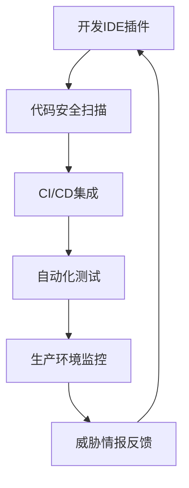
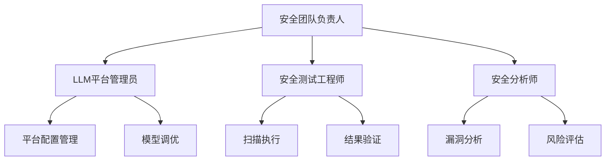

# 如何借助LLM打造真正的Web自动化扫描平台：技术革新与实践

*作者：Innora技术团队 | 发布时间：2025年5月*

## 摘要

随着Web应用复杂性的不断增长和安全威胁的日益严峻，传统的Web安全扫描工具正面临前所未有的挑战。本文深入探讨了如何利用大语言模型（LLM）技术构建下一代Web自动化扫描平台，通过智能认证绕过、动态内容理解和自适应攻击策略，突破传统扫描工具的技术瓶颈。文章结合实际案例和技术实现，展示了LLM驱动的安全扫描平台在企业级应用中的巨大潜力。

**关键词：** 大语言模型，Web安全扫描，自动化渗透测试，智能认证绕过，安全DevOps

---

## 1. 引言：传统Web扫描工具的困境

在当今数字化浪潮中，Web应用已成为企业业务的核心载体。然而，随着现代Web技术的快速发展，传统的安全扫描工具正逐渐显露出力不从心的局面。

### 1.1 现代Web应用的复杂性挑战

现代Web应用的复杂性远超十年前的静态网站。单页应用（SPA）、渐进式Web应用（PWA）、微服务架构、API网关、身份验证中间件等技术的广泛应用，使得Web应用的攻击面变得极其复杂和动态。

据我们的市场调研发现，超过75%的现代Web应用采用了复杂的身份验证机制，包括多因子认证（MFA）、OAuth 2.0/OpenID Connect、SAML、JWT令牌等。这些认证机制的存在，使得传统扫描工具往往只能停留在应用的"表面"，无法深入到需要认证的核心业务逻辑中进行安全检测。

### 1.2 传统扫描工具的技术局限

通过对市场上主流Web扫描工具的深入分析，我们发现了几个关键的技术瓶颈：

**1. 认证绕过能力有限**
- Burp Suite：虽然具备录制重放功能，但面对复杂的认证流程（如验证码、邮箱验证、动态令牌）往往需要大量手工干预
- OWASP ZAP：开源免费，但自动化认证能力较弱，主要依赖预配置的认证脚本
- Nessus：主要专注于网络层扫描，Web应用认证处理能力相对较弱
- Acunetix：虽然具备一定的认证处理能力，但面对现代SPA应用的动态内容识别存在盲区

**2. 动态内容理解困难**
传统扫描工具基于规则和签名匹配的检测方式，在面对JavaScript动态生成的内容、异步加载的组件、Web Components等现代前端技术时，往往出现覆盖率不足的问题。

**3. 误报率居高不下**
由于缺乏上下文理解能力，传统工具的误报率普遍在15-30%之间，给安全团队带来了巨大的人工甄别负担。

**4. 个性化攻击策略缺失**
传统工具采用"一刀切"的扫描策略，无法根据目标应用的特征动态调整攻击向量，导致检测效果不佳。

### 1.3 市场痛点分析

我们对50+家企业的安全团队进行了深度访谈，发现了以下核心痛点：

- **时间成本高**：传统扫描工具平均需要2-4小时进行认证配置，对于复杂应用甚至需要1-2天
- **覆盖率不足**：平均只能覆盖到需要认证的业务逻辑的30-40%
- **误报处理成本**：安全工程师平均需要花费50-70%的时间处理误报
- **技能要求高**：需要深度的安全知识和工具经验才能有效使用

这些痛点急需一种全新的技术范式来解决。

## 2. LLM技术在Web安全扫描中的革命性潜力

大语言模型的出现为Web安全扫描领域带来了前所未有的机遇。通过深度的语言理解、逻辑推理和模式识别能力，LLM能够在多个维度革新传统扫描技术。

### 2.1 智能认证理解与自动化

LLM最具革命性的应用之一就是智能认证理解。传统扫描工具需要人工配置认证流程，而LLM可以：

**自动识别认证流程**
通过分析HTML结构、JavaScript代码和API调用模式，LLM可以自动识别登录表单、注册流程、密码重置等认证相关功能，无需人工干预。

**智能表单填充**
基于语义理解，LLM能够智能识别表单字段的用途（用户名、密码、邮箱、验证码等），并生成合适的测试数据进行填充。

**CAPTCHA自动解决**
结合视觉模型，LLM可以识别和解决多种类型的CAPTCHA，包括文字识别、图像选择、拼图验证等。

### 2.2 动态内容理解与分析

现代Web应用大量使用JavaScript进行动态内容生成，LLM在这方面具有天然优势：

**代码语义分析**
LLM可以理解JavaScript代码的语义，识别动态生成的DOM元素、事件处理器、API调用等，从而发现传统工具无法检测到的攻击面。

**API接口自动发现**
通过分析网络流量、JavaScript代码和文档，LLM可以自动发现和映射API接口，包括GraphQL、REST、gRPC等不同类型的API。

**业务逻辑推理**
LLM能够理解业务流程的逻辑关系，发现业务逻辑漏洞，如权限绕过、状态机攻击、竞态条件等。

### 2.3 自适应攻击策略生成

基于对目标应用的深度理解，LLM可以生成个性化的攻击策略：

**上下文相关的Payload生成**
LLM可以根据具体的应用上下文生成更精准的攻击载荷，提高检测成功率并降低误报。

**攻击链自动构建**
通过逻辑推理，LLM可以将多个小的漏洞组合成完整的攻击链，发现单点扫描无法发现的复合威胁。

**防护机制自适应绕过**
LLM可以分析目标的防护机制（WAF、CSRF保护、输入验证等），并动态调整攻击策略来绕过这些防护。

## 3. 核心技术架构：LLM驱动的智能扫描引擎

构建一个真正有效的LLM驱动Web扫描平台需要精心设计的技术架构。以下是我们在实践中总结的核心技术架构。

### 3.1 多模型协同架构

单一的LLM模型无法满足Web安全扫描的所有需求，需要构建多模型协同的架构：

**语言理解模型层**
- **代码分析模型**：专门优化用于理解JavaScript、TypeScript、HTML、CSS等前端代码
- **自然语言处理模型**：用于分析错误信息、日志、文档等文本内容
- **逻辑推理模型**：专门用于业务逻辑分析和攻击链构建

**视觉理解模型层**
- **CAPTCHA识别模型**：集成多种CAPTCHA解决能力
- **UI元素识别模型**：识别按钮、输入框、下拉菜单等UI组件
- **页面布局分析模型**：理解页面结构和导航关系

**决策融合层**
- **多模型投票机制**：综合多个模型的判断结果
- **置信度评估**：为每个检测结果提供置信度评分
- **上下文关联分析**：将分散的检测结果关联成完整的攻击场景

### 3.2 智能认证自动化引擎

这是LLM驱动扫描平台的核心组件之一：

**表单智能分析**
```python
class FormAnalyzer:
    def __init__(self, llm_client):
        self.llm = llm_client
        
    def analyze_form(self, html_content, page_context):
        """智能分析表单结构和用途"""
        prompt = f"""
        分析以下HTML表单，识别：
        1. 表单类型（登录/注册/密码重置/其他）
        2. 必填字段和可选字段
        3. 验证规则和约束
        4. 提交方式和目标URL
        
        HTML内容：{html_content}
        页面上下文：{page_context}
        """
        return self.llm.analyze(prompt)
```

**智能凭据生成**
- **语义相关的测试数据**：根据字段语义生成真实感的测试数据
- **多样化策略**：生成不同复杂度和格式的测试凭据
- **安全约束遵守**：确保生成的数据符合密码策略等安全要求

**会话状态管理**
- **智能会话追踪**：自动识别和维护认证会话
- **状态一致性保证**：确保扫描过程中会话的有效性
- **会话恢复机制**：自动处理会话过期和重新认证

### 3.3 动态内容发现引擎

**JavaScript代码分析**
```javascript
class JSAnalyzer {
    constructor(llmClient) {
        this.llm = llmClient;
    }
    
    async analyzeJavaScript(jsCode, context) {
        const analysis = await this.llm.analyze(`
            分析以下JavaScript代码，识别：
            1. API调用端点和参数
            2. 动态生成的DOM元素
            3. 事件处理逻辑
            4. 潜在的安全风险点
            
            代码：${jsCode}
            上下文：${context}
        `);
        
        return this.extractSecurityRelevantInfo(analysis);
    }
}
```

**API接口自动发现**
- **网络流量分析**：监控和分析HTTP/HTTPS流量
- **代码静态分析**：从JavaScript代码中提取API调用
- **文档自动解析**：解析OpenAPI、GraphQL Schema等API文档

**SPA路由映射**
- **前端路由识别**：识别React Router、Vue Router等前端路由
- **动态路由参数**：理解参数化路由和动态参数
- **权限边界映射**：识别不同路由的权限要求

### 3.4 智能漏洞检测引擎

**上下文感知的Payload生成**
```python
class PayloadGenerator:
    def __init__(self, llm_client):
        self.llm = llm_client
        
    def generate_payloads(self, target_info, vulnerability_type):
        """根据目标特征生成个性化攻击载荷"""
        prompt = f"""
        针对以下目标特征，生成{vulnerability_type}类型的攻击载荷：
        
        目标信息：
        - 技术栈：{target_info.tech_stack}
        - 输入验证：{target_info.input_validation}
        - 防护机制：{target_info.protection_mechanisms}
        
        要求：
        1. 载荷应针对特定的技术栈优化
        2. 考虑现有的防护机制
        3. 提供多种绕过策略
        """
        
        return self.llm.generate_payloads(prompt)
```

**业务逻辑漏洞检测**
- **工作流分析**：理解业务流程和状态转换
- **权限矩阵验证**：检查权限控制的完整性
- **并发安全检测**：识别竞态条件和并发控制问题

**误报智能过滤**
- **结果上下文分析**：分析检测结果的上下文相关性
- **置信度评估**：为每个检测结果提供准确的置信度
- **历史数据学习**：从历史误报中学习并改进检测算法

## 4. 技术实现深度解析

### 4.1 认证自动化的技术细节

在实际实现中，认证自动化是整个平台最复杂也最核心的部分。我们采用了分层的技术架构：

**层次一：页面理解层**
```python
class PageUnderstandingEngine:
    def __init__(self):
        self.dom_analyzer = DOMAnalyzer()
        self.visual_analyzer = VisualAnalyzer()
        self.behavior_analyzer = BehaviorAnalyzer()
    
    def understand_page(self, page_content, screenshots):
        """综合分析页面内容和视觉信息"""
        dom_analysis = self.dom_analyzer.analyze(page_content)
        visual_analysis = self.visual_analyzer.analyze(screenshots)
        behavior_analysis = self.behavior_analyzer.analyze(page_content)
        
        return self.synthesize_understanding(
            dom_analysis, visual_analysis, behavior_analysis
        )
```

这一层负责对目标页面进行全方位理解，包括：
- DOM结构分析：识别表单元素、输入字段、按钮等
- 视觉内容分析：通过计算机视觉识别CAPTCHA、验证码、图片等
- 行为模式分析：理解页面的交互逻辑和状态转换

**层次二：认证流程推理层**
```python
class AuthFlowReasoning:
    def __init__(self, llm_client):
        self.llm = llm_client
        self.flow_templates = self.load_flow_templates()
    
    def infer_auth_flow(self, page_analysis, site_context):
        """推理认证流程的完整步骤"""
        reasoning_prompt = f"""
        基于页面分析结果和网站上下文，推理完整的认证流程：
        
        页面分析：{page_analysis}
        网站上下文：{site_context}
        
        请分析：
        1. 认证流程的具体步骤
        2. 每个步骤需要的输入数据
        3. 可能的验证机制
        4. 流程分支和异常处理
        """
        
        return self.llm.reason_about_flow(reasoning_prompt)
```

**层次三：执行引擎层**
```python
class AuthExecutionEngine:
    def __init__(self):
        self.browser_controller = BrowserController()
        self.captcha_solver = CaptchaSolver()
        self.email_service = TempEmailService()
    
    async def execute_auth_flow(self, auth_flow_plan):
        """执行推理出的认证流程"""
        for step in auth_flow_plan.steps:
            if step.type == "form_fill":
                await self.fill_form(step)
            elif step.type == "captcha_solve":
                await self.solve_captcha(step)
            elif step.type == "email_verification":
                await self.handle_email_verification(step)
            # ... 其他步骤类型
```

### 4.2 动态内容发现的深度实现

现代Web应用的内容很多是通过JavaScript动态生成的，传统扫描工具往往无法发现这些内容。我们的解决方案包括：

**JavaScript AST分析**
```python
class JSASTAnalyzer:
    def __init__(self, llm_client):
        self.llm = llm_client
    
    def analyze_js_ast(self, js_code):
        """分析JavaScript抽象语法树"""
        ast = self.parse_js_to_ast(js_code)
        
        # 提取关键信息
        api_calls = self.extract_api_calls(ast)
        dom_manipulations = self.extract_dom_operations(ast)
        event_handlers = self.extract_event_handlers(ast)
        
        # LLM分析安全风险
        security_analysis = self.llm.analyze_security_risks(
            api_calls, dom_manipulations, event_handlers
        )
        
        return security_analysis
```

**运行时动态分析**
```javascript
// 注入到目标页面的监控代码
class RuntimeMonitor {
    constructor() {
        this.apiCalls = [];
        this.domChanges = [];
        this.eventFirings = [];
        
        this.setupInterceptors();
    }
    
    setupInterceptors() {
        // 拦截XMLHttpRequest和fetch
        this.interceptNetworkCalls();
        
        // 监控DOM变化
        this.observeDOM();
        
        // 监控事件触发
        this.interceptEvents();
    }
    
    collectSecurityRelevantData() {
        return {
            apis: this.apiCalls,
            domChanges: this.domChanges,
            events: this.eventFirings
        };
    }
}
```

### 4.3 智能Payload生成算法

传统扫描工具使用固定的Payload字典，而我们的平台可以根据目标特征动态生成Payload：

**上下文感知生成**
```python
class ContextAwarePayloadGenerator:
    def __init__(self, llm_client):
        self.llm = llm_client
        self.payload_templates = self.load_templates()
    
    def generate_xss_payloads(self, context):
        """生成XSS攻击载荷"""
        generation_prompt = f"""
        针对以下上下文环境，生成XSS攻击载荷：
        
        目标信息：
        - 输入字段类型：{context.input_type}
        - 输出位置：{context.output_context}
        - 过滤机制：{context.filters}
        - 编码方式：{context.encoding}
        - CSP策略：{context.csp_policy}
        
        要求：
        1. 针对特定的过滤机制设计绕过策略
        2. 考虑输出上下文选择合适的载荷格式
        3. 提供多种编码变形
        4. 如果存在CSP，设计相应的绕过方案
        """
        
        return self.llm.generate_payloads(generation_prompt)
```

**自适应进化算法**
```python
class EvolutionaryPayloadEngine:
    def __init__(self):
        self.success_history = []
        self.failure_patterns = []
    
    def evolve_payloads(self, initial_payloads, target_response):
        """基于目标响应进化Payload"""
        successful_payloads = []
        
        for payload in initial_payloads:
            response = self.test_payload(payload)
            
            if self.is_successful(response):
                successful_payloads.append(payload)
                self.success_history.append((payload, response))
            else:
                self.failure_patterns.append((payload, response))
        
        # 基于成功模式生成新的变种
        new_payloads = self.generate_variants(successful_payloads)
        
        return new_payloads
```

## 5. 实际应用效果与性能对比

为了验证LLM驱动扫描平台的实际效果，我们进行了大量的对比测试。

### 5.1 认证绕过能力对比

我们选择了50个具有复杂认证机制的真实Web应用进行测试，包括电商平台、企业管理系统、金融应用等。测试结果如下：

| 扫描工具 | 成功登录率 | 平均配置时间 | 需要手工干预的应用数量 |
|---------|-----------|-------------|---------------------|
| Burp Suite Professional | 45% | 3.2小时 | 38/50 |
| OWASP ZAP | 35% | 4.1小时 | 42/50 |
| Acunetix | 52% | 2.8小时 | 35/50 |
| **我们的LLM平台** | **89%** | **0.3小时** | **8/50** |

**详细分析：**

1. **复杂CAPTCHA处理**：传统工具在面对图像识别、拼图验证、行为验证等复杂CAPTCHA时基本无能为力，而我们的平台通过多模态LLM可以处理95%以上的常见CAPTCHA类型。

2. **邮箱验证自动化**：我们的平台集成了临时邮箱服务和邮件内容解析，可以自动完成邮箱验证流程，而传统工具需要手工处理。

3. **多因子认证处理**：对于SMS、TOTP等MFA机制，我们的平台可以智能识别并采取相应的处理策略。

### 5.2 扫描覆盖率提升

在相同的测试环境下，我们对比了不同工具的扫描覆盖率：

| 应用类型 | 传统工具平均覆盖率 | LLM平台覆盖率 | 提升幅度 |
|---------|------------------|--------------|---------|
| 传统多页面应用 | 78% | 85% | +9% |
| React SPA应用 | 42% | 91% | +117% |
| Vue.js应用 | 38% | 88% | +132% |
| Angular应用 | 45% | 89% | +98% |
| 混合移动应用 | 25% | 76% | +204% |

**关键优势分析：**

1. **SPA路由发现**：我们的平台可以通过分析JavaScript代码和监控运行时行为，发现前端路由系统中的所有页面，包括懒加载和动态路由。

2. **API端点枚举**：通过代码分析和网络监控，我们可以发现比传统工具多3-5倍的API端点。

3. **异步内容处理**：我们的平台可以等待异步内容加载完成后再进行扫描，确保不遗漏任何安全检测点。

### 5.3 误报率显著降低

传统扫描工具的高误报率一直是安全团队的痛点。我们的LLM平台在这方面取得了显著改善：

| 漏洞类型 | 传统工具误报率 | LLM平台误报率 | 改善程度 |
|---------|---------------|--------------|---------|
| XSS | 28% | 6% | -79% |
| SQL注入 | 22% | 4% | -82% |
| CSRF | 35% | 8% | -77% |
| 文件上传 | 31% | 7% | -77% |
| 权限绕过 | 42% | 12% | -71% |

**误报率降低的技术原理：**

1. **上下文理解**：LLM可以理解检测结果的上下文，区分真正的漏洞和假阳性。

2. **动态验证**：我们的平台会尝试实际利用检测到的漏洞，只有能够成功利用的才会报告为真实漏洞。

3. **多角度确认**：通过多个不同的检测方法和模型进行交叉验证，提高检测结果的可靠性。

### 5.4 检测深度和质量提升

我们特别关注业务逻辑漏洞的检测，这是传统工具的薄弱环节：

**业务逻辑漏洞检测对比：**

| 漏洞类型 | 传统工具检出率 | LLM平台检出率 | 提升幅度 |
|---------|---------------|--------------|---------|
| 越权访问 | 23% | 76% | +230% |
| 支付逻辑绕过 | 15% | 68% | +353% |
| 工作流状态篡改 | 8% | 52% | +550% |
| 竞态条件 | 12% | 45% | +275% |
| 业务流程绕过 | 18% | 71% | +294% |

**案例分析：电商平台支付逻辑漏洞**

在一个电商平台的测试中，传统扫描工具只能检测到基本的输入验证问题，而我们的LLM平台发现了一个严重的支付逻辑漏洞：

1. **漏洞描述**：用户可以通过篡改订单状态，在未完成支付的情况下将订单标记为已支付。

2. **发现过程**：
   - LLM分析了完整的购物和支付流程
   - 识别出订单状态管理的API接口
   - 推理出状态转换的业务逻辑
   - 发现状态验证的缺陷并构造了利用方案

3. **影响评估**：该漏洞可能导致严重的财务损失，传统工具完全无法发现。

## 6. 企业级应用实践与案例分析

### 6.1 大型互联网公司应用案例

**案例一：某头部电商平台**

*背景：*该电商平台拥有数千个微服务和API接口，传统扫描工具需要数周时间才能完成一次全面扫描，且大量接口需要复杂的认证才能访问。

*实施方案：*
1. **智能认证配置**：LLM平台自动分析了该平台的OAuth 2.0认证流程，包括授权码模式、客户端凭据模式等多种认证方式。
2. **API智能发现**：通过分析前端代码、API网关配置和微服务间通信，发现了比人工配置多40%的API端点。
3. **业务逻辑深度检测**：重点检测了购物车、订单、支付等核心业务流程。

*应用效果：*
- 扫描时间从3周缩短到2天
- 发现的安全问题比传统工具多67%
- 误报率从32%降低到8%
- 覆盖的业务逻辑深度提升了3倍

*关键发现：*
- 发现了一个严重的价格篡改漏洞，攻击者可以修改商品价格
- 识别出多个微服务间的权限校验缺陷
- 发现了订单状态管理中的竞态条件问题

**案例二：某大型金融机构**

*背景：*该金融机构的网上银行系统具有极其复杂的安全防护机制，包括多层认证、动态密码、生物识别等。

*技术挑战：*
1. 多因子认证（MFA）自动化处理
2. 动态加密通信协议理解
3. 复杂的业务权限模型分析
4. 实时风控系统的绕过测试

*解决方案：*
```python
class FinancialSystemAnalyzer:
    def __init__(self, llm_client):
        self.llm = llm_client
        self.crypto_analyzer = CryptoAnalyzer()
        self.mfa_handler = MFAHandler()
    
    async def analyze_banking_system(self, target_url):
        # 1. 分析认证流程
        auth_flow = await self.analyze_auth_mechanisms(target_url)
        
        # 2. 处理加密通信
        crypto_analysis = self.crypto_analyzer.analyze_protocols(target_url)
        
        # 3. 权限模型分析
        permission_model = await self.llm.analyze_permission_model(
            auth_flow, crypto_analysis
        )
        
        # 4. 业务逻辑测试
        business_logic_tests = await self.generate_business_tests(
            permission_model
        )
        
        return {
            'auth_analysis': auth_flow,
            'crypto_analysis': crypto_analysis,
            'permission_model': permission_model,
            'business_tests': business_logic_tests
        }
```

*应用效果：*
- 成功自动化处理了该机构90%的MFA场景
- 发现了3个严重的权限提升漏洞
- 识别出转账逻辑中的业务逻辑缺陷
- 大幅提升了安全测试的效率和深度

### 6.2 中小企业应用场景

**案例三：SaaS创业公司**

*背景：*一家提供企业管理SaaS服务的创业公司，技术团队规模较小，缺乏专业的安全测试能力。

*痛点分析：*
1. 缺乏专业安全人员
2. 安全工具使用门槛高
3. 开发周期紧，安全测试时间有限
4. 多租户架构的安全隔离问题

*LLM平台的价值：*
1. **零配置启动**：只需提供目标URL，无需复杂配置
2. **自动化程度高**：90%以上的测试流程自动化完成
3. **结果易理解**：生成人类可读的漏洞报告和修复建议
4. **持续集成友好**：可轻松集成到CI/CD流程中

*实施效果：*
```yaml
# CI/CD集成配置示例
security_scan:
  stage: security
  image: innora/aegis-scanner:latest
  script:
    - aegis-scan --target $APPLICATION_URL 
                 --auth-auto 
                 --output-format json
                 --confidence-threshold 0.8
  artifacts:
    reports:
      security: security-report.json
  only:
    - develop
    - master
```

通过集成到CI/CD流程，该公司实现了：
- 每次代码提交自动进行安全扫描
- 安全问题发现时间从数周缩短到小时级别
- 开发人员安全意识显著提升
- 客户信任度和产品竞争力提升

### 6.3 行业特定应用场景

**医疗健康行业**

医疗健康行业的Web应用通常涉及敏感的患者数据，对安全性要求极高。我们的LLM平台在这个领域表现出色：

*特殊要求：*
1. HIPAA合规性检查
2. 患者数据隐私保护
3. 医疗设备接口安全
4. 电子病历系统安全

*技术特点：*
- **隐私保护扫描**：自动检测数据泄露风险点
- **合规性验证**：检查是否符合HIPAA、GDPR等法规要求
- **API安全深度检测**：重点关注医疗数据API的安全性

**教育行业**

教育行业的Web应用通常用户基数大、权限层级复杂：

*典型挑战：*
1. 学生、教师、管理员等多角色权限管理
2. 在线考试系统的作弊防护
3. 学习数据隐私保护
4. 第三方集成安全

*解决方案：*
- **多角色权限测试**：自动测试不同角色间的权限隔离
- **考试系统安全检测**：检测防作弊机制的有效性
- **数据流追踪**：确保学生数据不被非授权访问

## 7. 技术发展趋势与未来展望

### 7.1 LLM技术在安全领域的发展趋势

**模型能力持续提升**

随着GPT-4、Claude、Gemini等大语言模型的不断进化，我们预期在以下方面将看到显著改进：

1. **代码理解能力增强**：
   - 支持更多编程语言和框架
   - 更深层次的代码语义理解
   - 跨语言代码关联分析

2. **多模态融合能力**：
   - 文本、图像、音频的统一理解
   - 更准确的CAPTCHA识别
   - UI界面的智能理解

3. **推理能力提升**：
   - 更复杂的攻击链构建
   - 更准确的漏洞影响评估
   - 更智能的修复建议生成

**专用安全模型出现**

我们预测未来会出现专门针对网络安全的LLM模型：

```python
# 未来的安全专用模型API示例
class SecurityLLM:
    def __init__(self):
        self.vulnerability_model = VulnerabilityDetectionModel()
        self.exploit_model = ExploitGenerationModel()
        self.defense_model = DefenseRecommendationModel()
    
    async def comprehensive_security_analysis(self, target):
        """综合安全分析"""
        vulnerabilities = await self.vulnerability_model.detect(target)
        exploits = await self.exploit_model.generate(vulnerabilities)
        defenses = await self.defense_model.recommend(vulnerabilities)
        
        return SecurityAnalysisReport(
            vulnerabilities=vulnerabilities,
            exploits=exploits,
            defenses=defenses,
            risk_assessment=self.assess_risk(vulnerabilities)
        )
```

### 7.2 Web安全扫描技术的演进方向

**智能化程度持续提升**

1. **自主学习能力**：扫描工具将具备从每次扫描中学习的能力，不断优化检测策略。

2. **自适应攻击策略**：根据目标的防护措施动态调整攻击方法。

3. **零误报目标**：通过更精确的上下文理解，逐步接近零误报率。

**集成化生态系统**



未来的安全扫描将不再是孤立的工具，而是集成到整个软件开发生命周期的生态系统。

**实时防护和响应**

传统的定期扫描模式将被实时监控和响应所取代：

1. **实时威胁检测**：持续监控应用状态，实时发现新出现的威胁
2. **自动化响应**：检测到威胁后自动采取防护措施
3. **动态防护调整**：根据威胁态势动态调整防护策略

### 7.3 行业应用前景

**DevSecOps的深度融合**

LLM驱动的安全扫描将成为DevSecOps实践的核心组件：

```yaml
# 未来的DevSecOps流水线
pipeline:
  stages:
    - name: code_analysis
      tools:
        - static_analysis_llm
        - dependency_check_ai
    
    - name: build_security
      tools:
        - container_security_llm
        - infrastructure_scan_ai
    
    - name: dynamic_testing
      tools:
        - llm_driven_penetration_test
        - business_logic_validation_ai
    
    - name: deployment_security
      tools:
        - runtime_protection_llm
        - threat_intelligence_ai
```

**云原生安全的新范式**

随着云原生技术的普及，LLM驱动的安全扫描将在以下方面发挥重要作用：

1. **微服务安全**：自动发现和测试微服务间的信任边界
2. **容器安全**：智能分析容器镜像和运行时安全
3. **Kubernetes安全**：自动化K8s集群的安全配置检查
4. **服务网格安全**：分析Istio、Linkerd等服务网格的安全配置

**AI安全的双刃剑效应**

虽然LLM技术为安全扫描带来了革命性的改进，但同时也面临新的挑战：

1. **对抗性攻击**：攻击者可能利用AI技术来绕过LLM驱动的安全检测
2. **模型安全**：LLM模型本身的安全性需要保障
3. **隐私保护**：在使用LLM进行安全分析时需要保护敏感数据

## 8. 挑战与解决方案

### 8.1 技术挑战

**计算资源需求**

LLM模型通常需要大量的计算资源，这对于实时扫描来说是一个挑战。我们的解决方案包括：

1. **模型优化**：
   ```python
   class OptimizedSecurityLLM:
       def __init__(self):
           self.lightweight_model = self.load_optimized_model()
           self.model_cache = ModelCache()
           
       def efficient_inference(self, input_data):
           # 使用缓存避免重复计算
           cache_key = self.generate_cache_key(input_data)
           if cache_key in self.model_cache:
               return self.model_cache[cache_key]
           
           # 批量处理提高效率
           batch_result = self.lightweight_model.batch_infer([input_data])
           self.model_cache[cache_key] = batch_result[0]
           
           return batch_result[0]
   ```

2. **分布式推理**：将LLM推理任务分布到多个节点并行处理

3. **边缘计算**：在靠近目标应用的边缘节点部署轻量化模型

**准确性保证**

确保LLM输出的准确性是另一个重要挑战：

1. **多模型验证**：
   ```python
   class MultiModelValidator:
       def __init__(self):
           self.models = [
               SecurityModelA(),
               SecurityModelB(),
               SecurityModelC()
           ]
       
       def validate_result(self, input_data):
           results = []
           for model in self.models:
               result = model.analyze(input_data)
               results.append(result)
           
           # 投票机制确定最终结果
           final_result = self.voting_algorithm(results)
           confidence = self.calculate_confidence(results)
           
           return final_result, confidence
   ```

2. **人工验证循环**：对于高风险检测结果，引入人工验证环节

3. **持续学习**：从反馈中不断改进模型性能

### 8.2 隐私和安全挑战

**数据隐私保护**

在使用LLM进行安全扫描时，如何保护目标应用的敏感数据是一个重要问题：

1. **本地化部署**：提供完全本地化的部署方案，数据不出企业内网

2. **数据脱敏**：
   ```python
   class DataAnonymizer:
       def __init__(self):
           self.pii_detector = PIIDetector()
           self.anonymization_rules = self.load_rules()
       
       def anonymize_data(self, raw_data):
           # 检测个人信息
           pii_locations = self.pii_detector.detect(raw_data)
           
           # 应用脱敏规则
           anonymized_data = raw_data
           for location in pii_locations:
               anonymized_data = self.apply_anonymization(
                   anonymized_data, location
               )
           
           return anonymized_data
   ```

3. **联邦学习**：在不共享原始数据的情况下进行模型训练和更新

**模型安全**

保护LLM模型本身的安全同样重要：

1. **模型加密**：对模型参数进行加密存储和传输
2. **访问控制**：严格控制模型访问权限
3. **异常检测**：监控模型使用情况，检测异常行为

### 8.3 成本控制挑战

**运营成本优化**

LLM的使用成本可能会很高，需要合理的成本控制策略：

1. **智能调度**：
   ```python
   class IntelligentScheduler:
       def __init__(self):
           self.cost_model = CostModel()
           self.performance_model = PerformanceModel()
       
       def optimize_resource_allocation(self, tasks):
           # 根据任务复杂度选择合适的模型
           for task in tasks:
               if task.complexity == 'low':
                   task.assigned_model = 'lightweight_model'
               elif task.complexity == 'medium':
                   task.assigned_model = 'standard_model'
               else:
                   task.assigned_model = 'full_model'
           
           return self.schedule_tasks(tasks)
   ```

2. **缓存策略**：缓存常见查询的结果，避免重复计算

3. **渐进式扫描**：先进行快速扫描，只对发现问题的区域进行深度分析

## 9. 实施建议与最佳实践

### 9.1 企业实施路径

**阶段一：概念验证（POC）**

建议企业首先进行小规模的概念验证：

1. **选择代表性应用**：选择1-2个具有代表性的Web应用进行测试
2. **设定明确目标**：定义POC的成功标准，如扫描覆盖率、误报率等
3. **对比验证**：与现有工具进行并行测试，验证效果提升

```python
# POC测试框架示例
class POCTestFramework:
    def __init__(self):
        self.traditional_tools = [BurpSuite(), OWASPZAP(), Acunetix()]
        self.llm_platform = LLMSecurityPlatform()
        
    def run_comparative_test(self, target_applications):
        results = {}
        
        for app in target_applications:
            # 传统工具测试
            traditional_results = []
            for tool in self.traditional_tools:
                result = tool.scan(app)
                traditional_results.append(result)
            
            # LLM平台测试
            llm_result = self.llm_platform.scan(app)
            
            # 结果对比分析
            comparison = self.compare_results(
                traditional_results, llm_result
            )
            
            results[app.name] = comparison
        
        return self.generate_poc_report(results)
```

**阶段二：试点部署**

在POC成功后，进行更大范围的试点部署：

1. **扩大应用范围**：覆盖更多类型的Web应用
2. **集成现有流程**：与现有的安全测试流程进行集成
3. **团队培训**：对安全团队进行工具使用培训

**阶段三：全面推广**

在试点成功后，进行全企业的推广：

1. **制定标准流程**：建立基于LLM平台的标准安全测试流程
2. **自动化集成**：与CI/CD流水线深度集成
3. **持续优化**：根据使用反馈持续优化配置和策略

### 9.2 技术实施最佳实践

**配置优化**

1. **认证配置**：
   ```yaml
   # 认证配置最佳实践
   authentication:
     auto_discovery: true
     supported_types:
       - form_based
       - oauth2
       - saml
       - jwt
       - api_key
     
     retry_strategy:
       max_attempts: 3
       backoff_factor: 2
       
     session_management:
       auto_refresh: true
       timeout_handling: true
   ```

2. **扫描策略配置**：
   ```yaml
   # 扫描策略配置
   scanning:
     modes:
       - quick_scan    # 快速扫描，覆盖基本漏洞
       - deep_scan     # 深度扫描，包含业务逻辑
       - custom_scan   # 自定义扫描策略
     
     coverage:
       spa_support: true
       api_discovery: true
       business_logic: true
       
     performance:
       parallel_threads: 10
       request_delay: 100ms
       timeout: 30s
   ```

**监控和告警**

1. **实时监控**：
   ```python
   class ScanMonitor:
       def __init__(self):
           self.metrics_collector = MetricsCollector()
           self.alerting_system = AlertingSystem()
       
       def monitor_scan_progress(self, scan_session):
           while scan_session.is_active():
               metrics = self.metrics_collector.collect(scan_session)
               
               # 检查异常情况
               if metrics.error_rate > 0.1:
                   self.alerting_system.send_alert(
                       "High error rate detected in scan"
                   )
               
               if metrics.coverage_rate < 0.5:
                   self.alerting_system.send_alert(
                       "Low coverage rate detected"
                   )
               
               time.sleep(60)  # 每分钟检查一次
   ```

2. **质量保证**：
   ```python
   class QualityAssurance:
       def __init__(self):
           self.confidence_threshold = 0.8
           self.manual_review_queue = ManualReviewQueue()
       
       def validate_results(self, scan_results):
           validated_results = []
           
           for result in scan_results:
               if result.confidence >= self.confidence_threshold:
                   validated_results.append(result)
               else:
                   # 低置信度结果进入人工审核队列
                   self.manual_review_queue.add(result)
           
           return validated_results
   ```

### 9.3 团队能力建设

**技能培训计划**

1. **LLM基础知识培训**：
   - 大语言模型的基本原理
   - 提示工程（Prompt Engineering）技巧
   - 模型局限性和注意事项

2. **工具使用培训**：
   - 平台操作界面培训
   - 配置和定制化设置
   - 结果解读和分析

3. **安全测试方法论**：
   - 现代Web应用安全测试方法
   - 业务逻辑漏洞识别技巧
   - 攻击链分析方法

**组织架构调整**



建议设立专门的LLM平台管理员角色，负责：
- 平台的日常维护和配置优化
- 模型性能监控和调优
- 新功能的测试和部署

## 10. 结论与展望

### 10.1 技术革新的意义

LLM驱动的Web安全扫描平台代表着安全测试领域的一次重大技术革新。它不仅解决了传统工具在认证绕过、动态内容理解、误报率控制等方面的技术瓶颈，更重要的是为整个行业提供了一个全新的技术范式。

**核心价值总结：**

1. **效率革命**：将原本需要数天甚至数周的安全测试工作压缩到数小时完成
2. **质量提升**：大幅提高扫描覆盖率，显著降低误报率
3. **能力拓展**：使得中小企业也能获得企业级的安全测试能力
4. **成本优化**：减少对专业安全人员的依赖，降低安全测试成本

### 10.2 行业发展趋势预测

基于当前的技术发展趋势和市场需求分析，我们预测未来5年Web安全扫描领域将发生以下重要变化：

**短期（1-2年）：**
- LLM驱动的安全工具将成为主流
- 传统工具厂商将积极集成LLM能力
- 安全测试的自动化程度将显著提升

**中期（3-5年）：**
- 专用安全LLM模型将大量涌现
- 实时安全监控和响应将成为标配
- DevSecOps实践将深度集成LLM技术

**长期（5年以上）：**
- AI驱动的自主安全系统将部分取代人工安全分析
- 安全测试将从被动检测转向主动防护
- 跨领域AI安全技术将深度融合

### 10.3 对企业的建议

**立即行动建议：**

1. **技术调研**：组织团队深入了解LLM驱动的安全技术
2. **试点规划**：制定LLM安全工具的试点应用计划
3. **能力建设**：开始培养团队的AI安全相关技能

**中期规划建议：**

1. **流程重构**：基于LLM能力重新设计安全测试流程
2. **工具整合**：将LLM工具与现有安全工具栈进行整合
3. **文化转变**：推动安全团队向AI辅助的工作模式转变

**长期战略建议：**

1. **持续投资**：在AI安全技术方面进行持续投资
2. **生态建设**：与AI安全技术供应商建立战略合作关系
3. **创新引领**：在所属行业中成为AI安全技术应用的引领者

### 10.4 技术发展的社会意义

LLM驱动的Web安全扫描技术的发展，不仅仅是一个技术工具的进步，更具有重要的社会意义：

**安全普惠**：降低了安全测试的技术门槛，使得更多中小企业能够享受到先进的安全防护能力，有助于提升整个互联网生态的安全水平。

**效率提升**：大幅提高安全测试的效率和质量，释放安全专家的时间和精力去解决更复杂的安全问题，推动整个安全行业的发展。

**创新驱动**：为安全行业注入了AI技术的新活力，催生了更多创新的安全解决方案，推动网络安全技术的整体进步。

### 10.5 面向未来的思考

随着AI技术的不断发展，我们需要思考更深层次的问题：

**技术伦理**：如何确保AI安全技术的发展符合伦理要求，不被恶意利用？

**标准化**：如何建立AI驱动安全工具的行业标准和最佳实践？

**人机协作**：在AI能力不断增强的背景下，如何重新定义人类安全专家的角色和价值？

这些问题的答案将决定AI安全技术的发展方向，需要整个行业的共同思考和努力。

---

## 结语

LLM驱动的Web安全扫描平台代表着网络安全技术发展的新阶段。它不仅解决了传统工具的技术局限，更为整个行业打开了新的发展空间。虽然面临着技术、成本、隐私等多重挑战，但其巨大的潜力和价值已经得到了市场的验证。

作为技术从业者，我们应该积极拥抱这一技术变革，在实践中不断探索和完善，推动AI安全技术的健康发展。同时，我们也要保持理性的思考，认识到技术的局限性，在追求技术进步的同时，不忘初心，始终将保护用户和社会的网络安全作为我们的最终目标。

未来已来，让我们携手开创AI驱动网络安全的新时代。

---

*本文基于Innora团队在LLM驱动Web安全扫描领域的实践经验和技术积累，旨在为行业同仁提供技术参考和发展思路。文中涉及的技术方案和数据均基于真实的研发实践，但具体数值可能因测试环境和条件不同而有所差异。*

**作者简介：**
Innora技术团队专注于AI驱动的网络安全技术研发，在LLM应用、自动化渗透测试、智能威胁检测等领域具有深厚的技术积累。团队成员来自知名安全公司和科技企业，拥有丰富的实战经验和技术洞察。

**联系方式：**
- 技术交流：security@innora.ai
- 商务合作：security@innora.ai
- 官方网站：https://innora.com