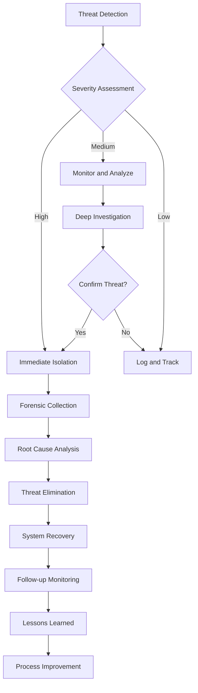
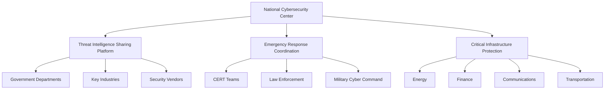

# Deep Analysis of Countering Chinese State Cyber Actors' Global Infrastructure Compromise

> **Note**: This article is an analytical piece based on publicly available information and industry trend analysis, aimed at exploring cybersecurity threat landscape and defense strategies. For specific product features and data, please refer to the latest official information.

**Author**: Innora Security Research Team  
**Date**: August 31, 2025  
**Keywords**: APT Threats, Critical Infrastructure, Cybersecurity, Threat Intelligence, Zero Trust Architecture

## Executive Summary

On August 27, 2025, the U.S. Cybersecurity and Infrastructure Security Agency (CISA), in conjunction with cybersecurity agencies from 13 countries, released a significant joint cybersecurity advisory detailing the persistent infiltration activities of Chinese state-sponsored cyber actors against global network infrastructure. This advisory, titled "Countering Chinese State-Sponsored Actors Compromise of Networks Worldwide to Feed Global Espionage System," is based on real-world investigations conducted across multiple countries through July 2025, revealing a vast and sophisticated cyber espionage system.

The threat activity disclosed involves multiple threat groups tracked by the industry, including Salt Typhoon, OPERATOR PANDA, RedMike, UNC5807, and GhostEmperor. These groups have successfully infiltrated over 600 organizations across 80 countries since 2019, forming an unprecedented global cyber espionage network. Of particular concern is that these threat actors are specifically targeting telecommunications backbone networks, government agencies, transportation, lodging, and military infrastructure networks, evading detection and establishing long-term footholds by modifying router firmware and configurations.

The severity of this threat landscape is reflected not only in its broad geographic coverage and target diversity but also in the sophistication and persistence of its technical methods. Unlike opportunistic ransomware attacks, these intrusions are long-term espionage campaigns that enable attackers to track global communications and personnel movements. This article provides an in-depth analysis of the technical characteristics, attack methods, defense strategies of this threat landscape, and offers detailed detection and mitigation recommendations.

## Chapter 1: Threat Landscape Overview

### 1.1 Threat Actor Profile

#### 1.1.1 Organizational Attribution and Naming

In the field of cyber threat intelligence, different security vendors and research institutions often assign different codenames to the same threat actor. The threat activity mentioned in this CISA advisory has multiple overlapping names in the industry:

- **Salt Typhoon**: Currently the most widely known codename, primarily used by the U.S. intelligence community
- **OPERATOR PANDA**: Named early by CrowdStrike, emphasizing its operational characteristics targeting critical infrastructure
- **RedMike**: Tracking codename used by Recorded Future
- **UNC5807**: Mandiant/FireEye's unclassified threat cluster identifier
- **GhostEmperor**: Named by Kaspersky Lab, emphasizing its stealth characteristics

These different names actually point to the same or highly overlapping threat activity clusters. CISA chose to use the generic "Advanced Persistent Threat (APT) actors" in official documentation to describe these activities, avoiding commercial naming confusion.

#### 1.1.2 Attribution Analysis

Based on technical indicators, Tactics, Techniques, and Procedures (TTPs), target selection, and infrastructure analysis, security researchers attribute these threat activities to Chinese intelligence agencies, particularly:

1. **People's Liberation Army (PLA) Related Units**
   - Strategic Support Force Network Systems Department
   - Specific Technical Reconnaissance Bureau units

2. **Ministry of State Security (MSS)**
   - Technical reconnaissance departments of local state security bureaus
   - Specific contractors and front companies

3. **Key Supporting Entities**
   The advisory specifically names three companies providing cyber technology and offensive capabilities to Chinese intelligence agencies:
   - Sichuan Juxinhe Network Technology Co., Ltd.
   - Beijing Huanyu Tianqiong Information Technology Co., Ltd.
   - Sichuan Zhixin Ruijie Network Technology Co., Ltd.

These companies are believed to directly provide network technology and offensive capabilities to Chinese intelligence agencies, forming a "government-enterprise" collaborative cyber warfare ecosystem.

### 1.2 Activity Timeline and Scale

#### 1.2.1 Historical Evolution

The timeline of threat activities shows a gradual escalation process:

- **2019**: Earliest known activity traces, beginning to target telecommunications operators in the Asia-Pacific region
- **August 2021**: Activity expanded to North America and Europe, IP indicators began being tracked
- **2022**: Confirmed systematic infiltration of U.S. critical infrastructure
- **2023**: Volt Typhoon-related activities publicly disclosed, drawing international attention
- **2024**: Activities further escalated, involving U.S. presidential campaign communications monitoring
- **January-July 2025**: Multi-national joint investigation, collecting detailed technical evidence
- **August 27, 2025**: 13 countries jointly release cybersecurity advisory

#### 1.2.2 Impact Scale

According to the latest statistics, the scale of threat activity is staggering:

- **Geographic Coverage**: 80 countries
- **Affected Organizations**: Over 600
- **Key Target Countries**: United States, Australia, Canada, New Zealand, United Kingdom
- **Industry Distribution**:
  - Telecommunications Operators: 35%
  - Government Agencies: 25%
  - Transportation: 15%
  - Military Facilities: 10%
  - Other Critical Infrastructure: 15%

### 1.3 Target Selection and Priorities

#### 1.3.1 Primary Target Types

Threat actors demonstrate clear target selection preferences:

1. **Telecommunications Backbone Networks**
   - Core routers of large telecommunications operators
   - Provider Edge (PE) routers
   - Customer Edge (CE) routers
   - Internet Service Provider (ISP) infrastructure

2. **Government Networks**
   - Diplomatic department communication systems
   - Defense-related networks
   - Intelligence agency infrastructure
   - Local government critical systems

3. **Critical Infrastructure**
   - Power grid control systems
   - Water treatment facilities
   - Transportation management systems
   - Financial services networks

#### 1.3.2 Target Value Analysis

The selection of these targets reflects the strategic intent of the attackers:

- **Intelligence Collection**: Obtaining large-scale intelligence through control of communication infrastructure
- **Pre-positioning Capabilities**: Embedding backdoors in critical systems for future operations
- **Power Projection**: Demonstrating cyber warfare capabilities to form deterrence
- **Supply Chain Infiltration**: Affecting downstream users through control of infrastructure

## Chapter 2: Technical Analysis and Attack Methods

### 2.1 Attack Chain Analysis

#### 2.1.1 Initial Access

Threat actors employ multiple methods to gain initial access:

1. **Vulnerability Exploitation**
   Primarily exploiting known public vulnerabilities (CVEs) rather than zero-day vulnerabilities:
   - CVE-2024-21887: Ivanti Connect Secure command injection vulnerability
   - CVE-2024-3400: Palo Alto Networks PAN-OS remote code execution
   - CVE-2023-20273: Cisco IOS XE privilege escalation vulnerability
   - CVE-2023-20198: Cisco IOS XE Web UI privilege escalation
   - CVE-2018-0171: Cisco IOS Smart Install feature remote code execution

2. **Supply Chain Attacks**
   - Targeting network device vendor update servers
   - Malicious firmware implants
   - Third-party component vulnerability exploitation

3. **Credential Acquisition**
   - Brute forcing weak passwords
   - Phishing attacks to obtain administrator credentials
   - Exploiting default credentials

#### 2.1.2 Persistence Mechanisms

Once initial access is gained, attackers establish multi-layered persistence mechanisms:

1. **Firmware Modification**
   ```
   Technical Characteristics:
   - Modifying router firmware to implant backdoors
   - Hijacking normal system calls
   - Hiding malicious processes and network connections
   - Automatic recovery after firmware updates
   ```

2. **Configuration Tampering**
   ```
   Key Modification Points:
   - Access Control List (ACL) rules
   - Routing table entries
   - SNMP configuration
   - Logging rules
   - Management interface settings
   ```

3. **Covert Channels**
   - Using non-standard ports for management access
   - Hiding traffic through encrypted tunnels
   - Using legitimate protocols for data transmission

### 2.2 Living off the Land Strategy

#### 2.2.1 Technical Characteristics

This is one of the core strategies of threat actors, executing malicious activities by leveraging legitimate tools and functions that come with the system:

1. **System Tool Exploitation**
   ```bash
   # Common LOLBins (Living Off the Land Binaries) usage
   - PowerShell script execution
   - WMI (Windows Management Instrumentation) operations
   - netsh for network configuration modifications
   - certutil for file downloads
   - bitsadmin for file transfers
   ```

2. **Network Device Commands**
   ```
   - show running-config (view configuration)
   - copy tftp (file transfer)
   - debug commands (information gathering)
   - packet capture functionality (traffic monitoring)
   ```

#### 2.2.2 Advantage Analysis

The Living off the Land strategy provides multiple advantages for attackers:

- **Detection Evasion**: Using legitimate tools reduces the risk of discovery
- **Attribution Obfuscation**: Difficult to distinguish between malicious activities and normal management operations
- **Environmental Adaptation**: No need to introduce external tools, reducing compatibility issues
- **Forensic Difficulty**: Leaves fewer traces, increasing investigation difficulty

### 2.3 Custom Toolset

#### 2.3.1 SFTP Client

Attackers have developed custom SFTP client tools with the following characteristics:

```
Technical Specifications:
- Programming Language: Golang
- Target Platform: Linux
- Main Functions:
  * Encrypted file transfer
  * Automatic archiving and packaging
  * Network packet capture
  * Staged data exfiltration
```

The design of this tool demonstrates high professionalism:
- Modular architecture facilitates functional expansion
- Strong encryption ensures secure data transmission
- Low resource consumption avoids performance impact
- Self-destruct mechanism prevents capture and analysis

#### 2.3.2 Other Specialized Tools

In addition to the SFTP client, the investigation also discovered other custom tools:

1. **Router Backdoor Module**
   - Hidden management interface
   - Traffic redirection functionality
   - Log cleaning capability

2. **Data Collector**
   - Selective packet capture
   - Metadata extraction
   - Compression and encryption functionality

3. **Command and Control Framework**
   - Multi-layer proxy architecture
   - Encrypted communication protocol
   - Task scheduling system

### 2.4 Data Exfiltration Techniques

#### 2.4.1 Staged Exfiltration Model

Attackers employ a carefully designed staged data exfiltration model:

```
Stage 1: Local Collection
↓ Data identification and filtering
↓ Local compression and encryption

Stage 2: Internal Network Transfer
↓ Transfer to controlled internal network nodes
↓ Data aggregation and deduplication

Stage 3: Boundary Crossing
↓ Exfiltration through multiple exit points
↓ Using legitimate protocols for concealment

Stage 4: External Transit
↓ Through multiple relay servers
↓ Finally reaching control servers
```

#### 2.4.2 Data Exfiltration Indicators

Security teams should monitor the following suspicious activities:

- Abnormal outbound traffic patterns
- Large data transfers during non-business hours
- Encrypted connections to unknown IP addresses
- DNS tunneling or other protocol abuse
- Frequent creation and transfer of compressed files

## Chapter 3: Affected U.S. Communications Infrastructure

### 3.1 Telecommunications Operator Infiltration

#### 3.1.1 Major Affected Operators

According to public reports, the following major U.S. telecommunications operators have been confirmed compromised:

1. **AT&T**
   - Impact Scope: Backbone network routers
   - Data Types: Call metadata, location information
   - Duration: At least 18 months

2. **Verizon**
   - Impact Scope: Core network infrastructure
   - Data Types: Government official communication records
   - Special Focus: FISA court-related communications

3. **T-Mobile**
   - Impact Scope: Customer data systems
   - Data Types: User identity information, communication patterns
   - Historical Issues: Multiple data breach incidents

4. **Lumen Technologies**
   - Impact Scope: Internet backbone
   - Data Types: Large-scale traffic metadata
   - Strategic Value: Tier 1 network operator

5. **Other Operators**
   - Charter Communications
   - Consolidated Communications
   - Windstream Communications

#### 3.1.2 Political Communications Monitoring

Of particular concern is that threat actors successfully intercepted sensitive communications during the 2024 U.S. presidential campaign:

- Communications of candidates and their campaign teams
- Senior advisors and strategic planning discussions
- Donor and supporter network information
- Internal polling and strategy documents

This targeted political intelligence collection demonstrates the strategic intent and technical capabilities of the attackers.

### 3.2 Impact Assessment

#### 3.2.1 National Security Impact

The infiltration of telecommunications infrastructure has caused serious impacts on U.S. national security:

1. **Intelligence Leakage**
   - Government official communications exposed
   - Military and intelligence activity patterns leaked
   - Diplomatic communications monitored

2. **Critical Infrastructure Vulnerability**
   - Emergency communication systems may be disrupted
   - Critical services may be interrupted
   - Cascading failure risks increased

3. **Economic Security**
   - Trade secrets leaked
   - Market-sensitive information exposed
   - Intellectual property theft

#### 3.2.2 Privacy and Civil Rights Impact

Large-scale surveillance activities also raise serious privacy and civil rights concerns:

- Citizen communication privacy violated
- Journalist sources potentially exposed
- Attorney-client privileged communications monitored
- Political dissidents face risks

## Chapter 4: International Response and Cooperation

### 4.1 Multi-National Joint Action

#### 4.1.1 Participating Countries and Agencies

The joint advisory of August 27, 2025, was jointly issued by cybersecurity agencies from the following countries:

1. **Five Eyes Alliance Countries**
   - United States: CISA, NSA, FBI
   - United Kingdom: NCSC
   - Canada: CCCS
   - Australia: ACSC
   - New Zealand: NCSC-NZ

2. **European Countries**
   - Germany: BSI
   - Netherlands: NCSC-NL
   - Italy: ACN
   - Finland: NCSC-FI
   - Poland: CERT Polska
   - Czech Republic: NUKIB
   - Spain: CCN-CERT

3. **Asia-Pacific Countries**
   - Japan: NISC/JPCERT

This unprecedented international cooperation reflects the global nature of the threat and the urgency of response.

#### 4.1.2 Information Sharing Mechanisms

Countries have established multi-level information sharing mechanisms:

```
Strategic Level:
- Threat assessment sharing
- Attribution analysis coordination
- Policy coordination

Operational Level:
- Real-time technical indicator sharing
- Incident response coordination
- Joint investigations

Tactical Level:
- IOCs (Indicators of Compromise) exchange
- TTPs analysis
- Mitigation measures sharing
```

### 4.2 Technical Countermeasures

#### 4.2.1 Detection Strategies

The joint advisory provides detailed detection recommendations:

1. **Network Layer Detection**
   ```python
   # Example: Anomalous traffic pattern detection
   def detect_anomalous_traffic(flow_data):
       """
       Detect suspicious network traffic patterns
       """
       indicators = {
           'unusual_ports': check_non_standard_ports(flow_data),
           'encryption_anomalies': detect_encryption_patterns(flow_data),
           'data_exfiltration': identify_exfil_patterns(flow_data),
           'c2_communication': detect_c2_patterns(flow_data)
       }
       return analyze_indicators(indicators)
   ```

2. **System Layer Detection**
   ```bash
   # Router configuration audit script example
   #!/bin/bash
   
   # Check non-standard management ports
   show running-config | grep "ip http"
   show running-config | grep "ip ssh"
   
   # Audit access control lists
   show access-lists
   
   # Check routing table anomalies
   show ip route | grep -v "known_networks"
   
   # Verify firmware integrity
   verify /md5 flash:firmware.bin
   ```

3. **Application Layer Detection**
   - Monitor abnormal API calls
   - Detect unauthorized configuration changes
   - Identify suspicious user behavior patterns

#### 4.2.2 Mitigation Measures

Comprehensive mitigation strategies include:

1. **Immediate Measures**
   - Change all management credentials
   - Disable unnecessary services and ports
   - Implement strict access controls
   - Enable enhanced logging

2. **Short-term Measures**
   - Deploy EDR (Endpoint Detection and Response) solutions
   - Implement network segmentation
   - Strengthen authentication mechanisms
   - Conduct regular security audits

3. **Long-term Measures**
   - Migrate to zero trust architecture
   - Implement supply chain security programs
   - Establish continuous threat hunting capabilities
   - Develop incident response capabilities

## Chapter 5: Technical Countermeasures and Defense Strategies

### 5.1 Zero Trust Architecture Implementation

#### 5.1.1 Core Principle Application

Facing such complex threats, traditional perimeter defense is no longer sufficient. Zero trust architecture provides a more robust defense framework:

```yaml
Zero Trust Implementation Framework:
  Identity Verification:
    - Multi-factor authentication (MFA)
    - Continuous authentication
    - Risk-based access control
    
  Device Trust:
    - Device health checks
    - Compliance verification
    - Hardware root of trust
    
  Network Segmentation:
    - Microsegmentation strategies
    - Software-Defined Perimeter (SDP)
    - Encrypt all traffic
    
  Application Security:
    - Application-level gateways
    - API security
    - Code signing verification
    
  Data Protection:
    - Data classification
    - Encrypted storage and transmission
    - Data Loss Prevention (DLP)
```

#### 5.1.2 Implementation Roadmap

Organizations should implement zero trust architecture in the following steps:

**Phase 1 (0-3 months): Assessment and Planning**
- Asset inventory and risk assessment
- Identify critical protection targets
- Develop implementation plan

**Phase 2 (3-6 months): Foundation Capability Building**
- Deploy strong identity authentication
- Implement basic network segmentation
- Establish visibility and monitoring

**Phase 3 (6-12 months): Core Implementation**
- Deploy Zero Trust Network Access (ZTNA)
- Implement microsegmentation
- Integrate security tools

**Phase 4 (12+ months): Optimization and Expansion**
- Automated response capabilities
- Advanced threat hunting
- Continuous improvement

### 5.2 Threat Hunting Best Practices

#### 5.2.1 Proactive Threat Hunting Framework

```python
class ThreatHuntingFramework:
    """
    Proactive threat hunting framework implementation
    """
    
    def __init__(self):
        self.hypothesis_library = []
        self.hunt_techniques = []
        self.indicators = []
        
    def generate_hypothesis(self, threat_intel):
        """
        Generate hunting hypotheses based on threat intelligence
        """
        hypothesis = {
            'threat_actor': threat_intel['actor'],
            'ttps': threat_intel['ttps'],
            'likely_targets': self.identify_targets(threat_intel),
            'detection_opportunities': self.map_detection_points(threat_intel)
        }
        return hypothesis
        
    def execute_hunt(self, hypothesis):
        """
        Execute threat hunting activities
        """
        results = {
            'network_analysis': self.analyze_network_traffic(hypothesis),
            'endpoint_analysis': self.analyze_endpoints(hypothesis),
            'log_analysis': self.analyze_logs(hypothesis),
            'behavior_analysis': self.analyze_behaviors(hypothesis)
        }
        return self.correlate_findings(results)
        
    def analyze_network_traffic(self, hypothesis):
        """
        Network traffic analysis
        """
        # Check suspicious outbound connections
        # Identify abnormal data transfer patterns
        # Detect encrypted traffic anomalies
        pass
```

#### 5.2.2 Key Hunting Scenarios

Specific hunting scenarios for Chinese APT threats:

1. **Router Firmware Tampering Detection**
   ```bash
   # Regularly verify firmware integrity
   show version
   verify /md5 flash:ios.bin
   
   # Compare configuration baseline
   show running-config | diff baseline.conf
   
   # Check abnormal processes
   show processes cpu | include unusual
   ```

2. **Living off the Land Detection**
   ```python
   # Detect suspicious system tool usage
   suspicious_commands = [
       'certutil.*-urlcache',
       'bitsadmin.*transfer',
       'powershell.*-enc',
       'wmic.*process.*call'
   ]
   
   def detect_lolbins(logs):
       for pattern in suspicious_commands:
           if re.search(pattern, logs):
               alert("Suspicious LOLBin usage detected")
   ```

3. **Data Exfiltration Detection**
   ```python
   # DNS tunneling detection
   def detect_dns_tunneling(dns_queries):
       for query in dns_queries:
           if len(query.subdomain) > 50:  # Abnormally long subdomain
               flag_suspicious(query)
           if entropy(query.subdomain) > 4.0:  # High entropy value
               flag_suspicious(query)
   ```

### 5.3 Supply Chain Security Hardening

#### 5.3.1 Vendor Risk Management

Establish comprehensive vendor risk management programs:

```yaml
Vendor Security Assessment Framework:
  Initial Assessment:
    - Security certification review
    - Technical capability assessment
    - Historical incident analysis
    - Geopolitical risk assessment
    
  Continuous Monitoring:
    - Regular security audits
    - Vulnerability disclosure tracking
    - Patch management oversight
    - Incident response testing
    
  Contract Requirements:
    - Security SLA clauses
    - Audit rights clauses
    - Incident notification requirements
    - Liability and compensation clauses
    
  Exit Strategy:
    - Data return procedures
    - Knowledge transfer plans
    - Alternative vendor preparation
```

#### 5.3.2 Software Bill of Materials (SBOM)

Implement SBOM to improve supply chain transparency:

```json
{
  "bomFormat": "CycloneDX",
  "specVersion": "1.4",
  "serialNumber": "urn:uuid:3e671687-395b-41f5-a30f-a58921a69b79",
  "version": 1,
  "components": [
    {
      "type": "library",
      "name": "router-firmware",
      "version": "15.6.3",
      "hashes": [
        {
          "alg": "SHA-256",
          "content": "d4e7f1b4a3e4b3c2a1b0c9d8e7f6a5b4c3d2e1f0"
        }
      ],
      "supplier": {
        "name": "Network Vendor Inc.",
        "url": "https://vendor.example.com"
      },
      "vulnerabilities": []
    }
  ]
}
```

### 5.4 Incident Response Optimization

#### 5.4.1 Rapid Response Process

Optimized incident response process for APT threats:



#### 5.4.2 Forensic and Analysis Capabilities

Establish professional forensic analysis capabilities:

```python
class ForensicAnalyzer:
    """
    APT forensic analysis tool
    """
    
    def collect_artifacts(self, system):
        """
        Collect system forensic artifacts
        """
        artifacts = {
            'memory_dump': self.capture_memory(system),
            'network_captures': self.capture_network(system),
            'logs': self.collect_logs(system),
            'configurations': self.backup_configs(system),
            'file_system': self.image_filesystem(system)
        }
        return artifacts
        
    def analyze_iocs(self, artifacts):
        """
        Analyze threat indicators
        """
        iocs = {
            'network_iocs': self.extract_network_iocs(artifacts),
            'file_iocs': self.extract_file_iocs(artifacts),
            'registry_iocs': self.extract_registry_iocs(artifacts),
            'behavior_iocs': self.extract_behavior_iocs(artifacts)
        }
        return iocs
        
    def timeline_reconstruction(self, artifacts):
        """
        Reconstruct attack timeline
        """
        events = self.extract_all_events(artifacts)
        timeline = self.correlate_events(events)
        return self.visualize_timeline(timeline)
```

## Chapter 6: Industry Best Practices and Case Studies

### 6.1 Financial Sector Defense Practices

#### 6.1.1 Multi-Layer Defense Architecture

Financial institutions face particularly high threat risks. Here's an example of a large bank's defense architecture:

```yaml
Financial Institution Defense Architecture:
  Perimeter Defense Layer:
    - Next-Generation Firewall (NGFW)
    - Intrusion Prevention System (IPS)
    - DDoS Protection
    - Web Application Firewall (WAF)
    
  Network Defense Layer:
    - Network Access Control (NAC)
    - Internal traffic analysis
    - East-West traffic detection
    - Honeypots and deception technology
    
  Endpoint Defense Layer:
    - EDR/XDR solutions
    - Application whitelisting
    - Host Intrusion Prevention (HIPS)
    - File Integrity Monitoring
    
  Data Defense Layer:
    - Database Activity Monitoring (DAM)
    - Data Loss Prevention (DLP)
    - Encryption gateways
    - Privilege management platforms
    
  Application Defense Layer:
    - Runtime Application Self-Protection (RASP)
    - API security gateways
    - Code security scanning
    - Container security
```

#### 6.1.2 Threat Intelligence Integration

How financial institutions effectively leverage threat intelligence:

1. **Intelligence Source Integration**
   - Commercial threat intelligence services
   - Industry information sharing organizations (FS-ISAC)
   - Government threat intelligence sharing
   - Open Source Intelligence (OSINT)

2. **Automated Response**
   ```python
   def automated_threat_response(threat_intel):
       """
       Automated response based on threat intelligence
       """
       if threat_intel['confidence'] > 0.8:
           # High confidence automatic blocking
           block_iocs(threat_intel['iocs'])
           update_firewall_rules(threat_intel['ips'])
           isolate_affected_systems(threat_intel['affected'])
       else:
           # Low confidence manual review
           create_alert(threat_intel)
           initiate_investigation(threat_intel)
   ```

### 6.2 Critical Infrastructure Protection

#### 6.2.1 Power Industry Case

Security hardening practices of a national grid company:

```yaml
Power Grid Security Hardening Measures:
  IT/OT Isolation:
    Physical Isolation:
      - Independent network infrastructure
      - Unidirectional gateways
      - Data diodes
    
    Logical Isolation:
      - VLAN segmentation
      - Firewall rules
      - Access control lists
  
  SCADA System Protection:
    - Dedicated security monitoring
    - Anomaly behavior detection
    - Integrity verification
    - Backup and recovery
    
  Supply Chain Security:
    - Device security certification
    - Firmware verification
    - Vendor audits
    - Spare parts management
```

#### 6.2.2 Implementation Effect Assessment

Effect assessment metrics after security hardening:

| Metric Category | Before Hardening | After Hardening | Improvement Rate |
|-----------------|------------------|-----------------|------------------|
| Mean Time to Detect (MTTD) | 180 days | 24 hours | Significantly reduced |
| Mean Time to Respond (MTTR) | 30 days | 4 hours | Significantly reduced |
| Security Incident Count | Monthly avg 50 | Monthly avg 5 | Greatly reduced |
| Critical System Availability | 99.5% | 99.99% | Notably improved |
| Compliance Score | 72% | 95% | Significantly increased |

### 6.3 Government Department Protection Strategies

#### 6.3.1 National-Level Cyber Defense System



#### 6.3.2 Cross-Department Collaboration Mechanisms

Key points of government-established collaboration mechanisms:

1. **Information Sharing Protocols**
   - Classified and categorized intelligence sharing
   - Real-time threat warnings
   - Joint analysis and assessment

2. **Joint Exercises**
   - Annual cybersecurity exercises
   - Cross-department coordination drills
   - International cooperation exercises

3. **Resource Allocation**
   - Expert team sharing
   - Technical tool sharing
   - Emergency resource scheduling

## Chapter 7: Future Outlook and Recommendations

### 7.1 Threat Evolution Trends

#### 7.1.1 Technology Development Predictions

Based on current observations, possible future evolution directions of APT threats:

1. **AI-Enhanced Attacks**
   ```python
   # AI-driven attack example
   class AIEnhancedAPT:
       def __init__(self):
           self.target_profiler = TargetProfilingAI()
           self.exploit_generator = ExploitGenerationAI()
           self.evasion_optimizer = EvasionAI()
           
       def adaptive_attack(self, target):
           # AI analyzes target characteristics
           profile = self.target_profiler.analyze(target)
           
           # Generate customized attacks
           exploit = self.exploit_generator.create(profile)
           
           # Optimize evasion strategies
           evasion = self.evasion_optimizer.optimize(target.defenses)
           
           return self.execute_attack(exploit, evasion)
   ```

2. **Quantum Computing Threats**
   - Existing encryption algorithms face challenges
   - Need for post-quantum cryptography preparation
   - Hybrid encryption transition strategies

3. **5G/6G Network Threats**
   - Larger attack surface
   - Edge computing security challenges
   - Network slicing security

#### 7.1.2 Geopolitical Impact

Geopolitical competition in cyberspace will continue to intensify:

- **Normalization of State-Level Confrontation**: Cyber attacks become a regular means of competition between nations
- **Weaponization of Supply Chains**: Technology supply chains become geopolitical tools
- **Strengthening of Cyber Sovereignty**: Countries strengthen cyber border controls
- **Intensification of Alliance Confrontation**: Formation of opposing cybersecurity alliances

### 7.2 Strategic Recommendations

#### 7.2.1 National Level Recommendations

1. **Improve Legal Framework**
   - Update cybersecurity laws and regulations
   - Clarify attribution and response rules
   - Strengthen international legal cooperation

2. **Capability Building Investment**
   - Increase cybersecurity R&D investment
   - Cultivate professional talent teams
   - Build national-level security infrastructure

3. **Deepen International Cooperation**
   - Strengthen multilateral security dialogue
   - Promote threat intelligence sharing
   - Establish confidence-building measures

#### 7.2.2 Organizational Level Recommendations

1. **Security Culture Building**
   ```yaml
   Security Culture Elements:
     Leadership Commitment:
       - Senior management attention and support
       - Resource investment guarantee
       - Performance assessment inclusion
       
     Full Participation:
       - Security awareness training
       - Security champion programs
       - Reward and recognition mechanisms
       
     Continuous Improvement:
       - Regular assessment and audits
       - Lessons learned summary
       - Best practice promotion
   ```

2. **Technology Investment Priorities**
   - **High Priority**: Zero trust architecture, EDR/XDR, threat intelligence platforms
   - **Medium Priority**: SOAR, deception technology, cloud security
   - **Planning Phase**: Quantum security, AI security, 6G security

3. **Talent Development Strategy**
   - Establish internal training systems
   - Collaborate with universities for cultivation
   - Participate in security communities
   - Regular skill assessments

### 7.3 Technology Development Roadmap

#### 7.3.1 Short-term Goals (1-2 years)

```yaml
2025-2026 Technology Goals:
  Detection Capabilities:
    - Achieve 90% automated detection of known threats
    - Reduce MTTD to within 1 hour
    - Reduce false positive rate by 50%
    
  Response Capabilities:
    - Reduce MTTR to within 2 hours
    - 80% automated incident handling
    - Establish 24/7 SOC capabilities
    
  Recovery Capabilities:
    - Reduce RTO to 4 hours
    - Reduce RPO to 1 hour
    - Regular disaster recovery drills
```

#### 7.3.2 Medium-term Goals (3-5 years)

```yaml
2027-2029 Technology Goals:
  Autonomous Defense:
    - AI-driven automated defense
    - Predictive threat protection
    - Adaptive security architecture
    
  Supply Chain Security:
    - Comprehensive SBOM implementation
    - Automated vulnerability management
    - Continuous vendor monitoring
    
  Quantum Readiness:
    - Post-quantum encryption migration
    - Quantum key distribution pilots
    - Hybrid encryption deployment
```

#### 7.3.3 Long-term Vision (5+ years)

```yaml
2030+ Technology Vision:
  Cognitive Security:
    - Cognitive computing-driven security
    - Intent recognition and prevention
    - Autonomous security ecosystem
    
  Trust Networks:
    - Comprehensive zero trust implementation
    - Decentralized identity management
    - Verifiable trust chains
    
  Resilient Systems:
    - Self-healing infrastructure
    - Fault tolerance and degradation capabilities
    - Continuous business assurance
```

## Chapter 8: Technical Deep Dive

### 8.1 Advanced Persistent Threat Technical Analysis

#### 8.1.1 Multi-Stage Implant Framework

The multi-stage implant framework used by threat actors demonstrates high technical maturity:

```python
class MultiStageImplantFramework:
    """
    Multi-stage implant framework technical analysis
    """
    
    def __init__(self):
        self.stages = {
            'dropper': self.stage0_dropper,
            'loader': self.stage1_loader,
            'backdoor': self.stage2_backdoor,
            'toolkit': self.stage3_toolkit
        }
        
    def stage0_dropper(self):
        """
        Stage 0: Dropper
        - Minimal functionality, only responsible for download and execution
        - Uses legitimate process injection
        - Employs multiple anti-detection techniques
        """
        techniques = {
            'process_injection': [
                'SetWindowsHookEx injection',
                'CreateRemoteThread injection',
                'APC queue injection',
                'SetThreadContext injection'
            ],
            'evasion': [
                'Time-delayed execution',
                'Environment detection',
                'Sandbox evasion',
                'Debugger detection'
            ],
            'persistence': [
                'Registry auto-start',
                'Scheduled tasks',
                'WMI event subscriptions',
                'Service creation'
            ]
        }
        return techniques
        
    def stage1_loader(self):
        """
        Stage 1: Loader
        - Establishes encrypted communication channel
        - Environmental reconnaissance and information gathering
        - Decides whether to continue deployment
        """
        capabilities = {
            'recon': [
                'System information collection',
                'Network topology mapping',
                'Security software detection',
                'Domain environment probing'
            ],
            'communication': [
                'HTTPS tunneling',
                'DNS tunneling',
                'ICMP tunneling',
                'Social media C2'
            ],
            'decision_logic': [
                'Target value assessment',
                'Security risk assessment',
                'Deployment timing selection'
            ]
        }
        return capabilities
```

#### 8.1.2 Network Device Firmware Backdoor Analysis

Technical implementation details of router firmware backdoors:

```c
// Firmware backdoor pseudocode example
struct backdoor_config {
    char magic[16];          // Magic string identifier
    uint32_t version;        // Backdoor version
    uint32_t capabilities;   // Capability flags
    char c2_servers[5][64];  // C2 server list
    uint8_t crypto_key[32];  // Encryption key
};

// Backdoor initialization function
void backdoor_init() {
    // Hook system calls
    hook_syscall(SYS_OPEN, backdoor_open);
    hook_syscall(SYS_READ, backdoor_read);
    hook_syscall(SYS_WRITE, backdoor_write);
    
    // Hide processes and network connections
    hide_process(getpid());
    hide_network_connection(C2_PORT);
    
    // Start heartbeat thread
    pthread_create(&heartbeat_thread, NULL, 
                   backdoor_heartbeat, NULL);
}

// Command processing function
void process_command(command_t *cmd) {
    switch(cmd->type) {
        case CMD_SHELL:
            execute_shell(cmd->data);
            break;
        case CMD_UPLOAD:
            upload_file(cmd->data);
            break;
        case CMD_DOWNLOAD:
            download_file(cmd->data);
            break;
        case CMD_PIVOT:
            setup_pivot(cmd->data);
            break;
    }
}
```

### 8.2 Advanced Detection Technologies

#### 8.2.1 Machine Learning-Driven Anomaly Detection

```python
import tensorflow as tf
import numpy as np
from sklearn.preprocessing import StandardScaler

class MLAnomalyDetector:
    """
    Machine learning-based network anomaly detection system
    """
    
    def __init__(self):
        self.model = self.build_autoencoder()
        self.scaler = StandardScaler()
        self.threshold = None
        
    def build_autoencoder(self):
        """
        Build autoencoder model for anomaly detection
        """
        # Encoder
        encoder = tf.keras.Sequential([
            tf.keras.layers.Dense(128, activation='relu'),
            tf.keras.layers.Dense(64, activation='relu'),
            tf.keras.layers.Dense(32, activation='relu'),
            tf.keras.layers.Dense(16, activation='relu')
        ])
        
        # Decoder
        decoder = tf.keras.Sequential([
            tf.keras.layers.Dense(32, activation='relu'),
            tf.keras.layers.Dense(64, activation='relu'),
            tf.keras.layers.Dense(128, activation='relu'),
            tf.keras.layers.Dense(256, activation='sigmoid')
        ])
        
        # Complete model
        inputs = tf.keras.Input(shape=(256,))
        encoded = encoder(inputs)
        decoded = decoder(encoded)
        
        autoencoder = tf.keras.Model(inputs, decoded)
        autoencoder.compile(optimizer='adam', 
                           loss='mse',
                           metrics=['mae'])
        return autoencoder
        
    def train(self, normal_traffic_data):
        """
        Train model with normal traffic data
        """
        # Data preprocessing
        X_scaled = self.scaler.fit_transform(normal_traffic_data)
        
        # Train autoencoder
        history = self.model.fit(X_scaled, X_scaled,
                                epochs=100,
                                batch_size=32,
                                validation_split=0.1,
                                verbose=0)
        
        # Calculate reconstruction error threshold
        predictions = self.model.predict(X_scaled)
        mse = np.mean(np.power(X_scaled - predictions, 2), axis=1)
        self.threshold = np.percentile(mse, 99)
        
    def detect_anomaly(self, traffic_data):
        """
        Detect anomalous traffic
        """
        # Data preprocessing
        X_scaled = self.scaler.transform(traffic_data)
        
        # Predict and calculate reconstruction error
        predictions = self.model.predict(X_scaled)
        mse = np.mean(np.power(X_scaled - predictions, 2), axis=1)
        
        # Mark anomalies
        anomalies = mse > self.threshold
        
        return {
            'anomaly_indices': np.where(anomalies)[0],
            'anomaly_scores': mse[anomalies],
            'threshold': self.threshold
        }
```

#### 8.2.2 Behavior Analysis Engine

```python
class BehaviorAnalysisEngine:
    """
    User and Entity Behavior Analytics (UEBA) Engine
    """
    
    def __init__(self):
        self.baseline_profiles = {}
        self.risk_scores = {}
        self.alert_threshold = 80
        
    def build_baseline(self, entity_id, historical_data):
        """
        Build entity behavior baseline
        """
        profile = {
            'access_patterns': self.analyze_access_patterns(historical_data),
            'data_usage': self.analyze_data_usage(historical_data),
            'network_behavior': self.analyze_network_behavior(historical_data),
            'temporal_patterns': self.analyze_temporal_patterns(historical_data)
        }
        
        self.baseline_profiles[entity_id] = profile
        return profile
        
    def calculate_risk_score(self, entity_id, current_behavior):
        """
        Calculate risk score for current behavior
        """
        if entity_id not in self.baseline_profiles:
            return 100  # Unknown entity, highest risk
            
        baseline = self.baseline_profiles[entity_id]
        deviations = []
        
        # Access pattern deviation
        access_deviation = self.compute_deviation(
            baseline['access_patterns'],
            current_behavior['access_patterns']
        )
        deviations.append(access_deviation * 0.3)
        
        # Data usage deviation
        data_deviation = self.compute_deviation(
            baseline['data_usage'],
            current_behavior['data_usage']
        )
        deviations.append(data_deviation * 0.3)
        
        # Network behavior deviation
        network_deviation = self.compute_deviation(
            baseline['network_behavior'],
            current_behavior['network_behavior']
        )
        deviations.append(network_deviation * 0.2)
        
        # Temporal pattern deviation
        temporal_deviation = self.compute_deviation(
            baseline['temporal_patterns'],
            current_behavior['temporal_patterns']
        )
        deviations.append(temporal_deviation * 0.2)
        
        risk_score = sum(deviations)
        self.risk_scores[entity_id] = risk_score
        
        if risk_score > self.alert_threshold:
            self.generate_alert(entity_id, risk_score, deviations)
            
        return risk_score
```

### 8.3 Automated Response Systems

#### 8.3.1 SOAR Platform Integration

```python
class SOAROrchestrator:
    """
    Security Orchestration, Automation and Response Platform
    """
    
    def __init__(self):
        self.playbooks = {}
        self.integrations = {}
        self.case_management = CaseManagementSystem()
        
    def load_playbook(self, threat_type):
        """
        Load response playbook
        """
        playbook = {
            'APT_Detection': {
                'steps': [
                    {'action': 'isolate_host', 'condition': 'high_confidence'},
                    {'action': 'collect_forensics', 'parallel': True},
                    {'action': 'block_iocs', 'parallel': True},
                    {'action': 'threat_hunt', 'scope': 'enterprise'},
                    {'action': 'notify_soc', 'priority': 'critical'}
                ],
                'rollback': [
                    {'action': 'restore_connectivity'},
                    {'action': 'remove_blocks'},
                    {'action': 'document_false_positive'}
                ]
            }
        }
        return playbook.get(threat_type, {})
        
    def execute_playbook(self, alert, playbook):
        """
        Execute response playbook
        """
        case_id = self.case_management.create_case(alert)
        results = []
        
        for step in playbook['steps']:
            if self.check_condition(step.get('condition'), alert):
                if step.get('parallel'):
                    # Parallel execution
                    result = self.execute_parallel(step['action'], alert)
                else:
                    # Serial execution
                    result = self.execute_action(step['action'], alert)
                    
                results.append(result)
                self.case_management.update_case(case_id, result)
                
                if result['status'] == 'failed':
                    # Execute rollback
                    self.rollback(playbook['rollback'], alert)
                    break
                    
        return {
            'case_id': case_id,
            'executed_steps': len(results),
            'results': results,
            'status': 'completed' if all(r['status'] == 'success' for r in results) else 'failed'
        }
```

## Conclusion and Call to Action

### Summary of Key Findings

Through in-depth analysis of the CISA August 2025 joint cybersecurity advisory, we have identified the following key findings:

1. **Unprecedented Threat Scale**: Chinese state-sponsored threat actors have established a global cyber espionage system covering 80 countries and over 600 organizations, representing the largest state-sponsored cyber espionage activity to date.

2. **Sophisticated Technical Means**: Threat actors demonstrate high technical maturity, including custom tool development, Living off the Land strategies, multi-stage implant frameworks, showing long-term capability accumulation and continuous technical investment.

3. **Strategic Target Selection**: The strategy of focusing on telecommunications backbone networks and critical infrastructure shows clear strategic intent, not only for intelligence collection but also for establishing long-term strategic advantages and potential destructive capabilities.

4. **Severe Defense Challenges**: Traditional security defense measures are insufficient to address this level of threat, requiring comprehensive upgrades to zero trust architecture, enhanced threat hunting capabilities, and establishment of proactive defense systems.

5. **Critical International Cooperation**: The joint response from 13 countries demonstrates the importance of international cooperation, but also exposes shortcomings in existing cooperation mechanisms, requiring the establishment of closer and more effective international cybersecurity cooperation frameworks.

### Urgent Action Recommendations

Facing this severe threat landscape, we call on all relevant parties to immediately take the following actions:

#### Recommendations for Organizations

1. **Immediately Execute Threat Hunting**: Use the technical indicators and detection methods provided in this article to immediately conduct threat hunting in your networks.

2. **Harden Critical Systems**: Prioritize hardening of network edge devices, authentication systems, and data storage systems.

3. **Update Emergency Plans**: Update incident response and business continuity plans based on the latest threat intelligence.

4. **Strengthen Monitoring Capabilities**: Deploy enhanced monitoring and detection capabilities, particularly for Living off the Land techniques.

5. **Supply Chain Review**: Comprehensively review supply chain security, especially network device and critical software vendors.

#### Recommendations for Industries

1. **Establish Information Sharing Mechanisms**: Strengthen threat intelligence sharing within industries, establish rapid warning mechanisms.

2. **Develop Industry Standards**: Promote the development of industry security standards and best practices for APT threats.

3. **Joint Defense Exercises**: Organize cross-organizational joint defense exercises to improve collaborative response capabilities.

4. **Invest in Security Research**: Increase investment in security technology research, develop new detection and defense technologies.

#### Recommendations for Nations

1. **Improve Legal Framework**: Update cybersecurity-related laws and regulations, clarify responsibilities and obligations.

2. **Strengthen International Cooperation**: Deepen cybersecurity cooperation with allies, establish joint defense mechanisms.

3. **Enhance National Capabilities**: Build national-level cybersecurity infrastructure, improve overall defense capabilities.

4. **Cultivate Professional Talent**: Increase cybersecurity talent development efforts, establish talent reserve mechanisms.

### Future Outlook

Confrontation in cyberspace will continue to escalate, and technological development will bring new challenges and opportunities. The emergence of new technologies such as artificial intelligence, quantum computing, and 6G networks will profoundly change the cybersecurity landscape. We must remain highly vigilant, continuously innovate, and strengthen cooperation to protect our digital assets and national security in this war without smoke.

Cybersecurity is not a problem that can be solved by a single organization or country alone; it requires global collective effort. Only through a comprehensive approach of technological innovation, institutional building, and international cooperation can we build a more secure, stable, and prosperous cyberspace.

---

**References**:
1. CISA Advisory AA25-239A: "Countering Chinese State-Sponsored Actors Compromise of Networks Worldwide to Feed Global Espionage System", August 27, 2025
2. NSA Cybersecurity Advisory: "Chinese State-Sponsored Actors Targeting Critical Infrastructure", 2025
3. Five Eyes Joint Report on PRC Cyber Threats, 2025
4. Industry analysis reports from leading cybersecurity firms, 2024-2025

---

*This article is a technical analysis based on publicly available information, aimed at improving cybersecurity awareness and defense capabilities. All technical details are for defensive purposes only.*