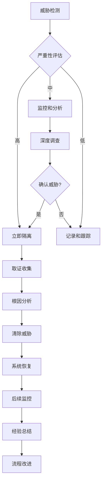
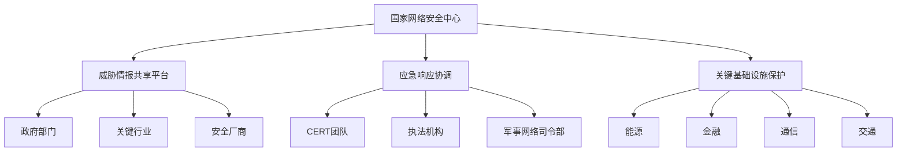

# 应对中国国家级网络威胁行为者全球基础设施攻击深度分析

> **注**：本文基于公开信息和行业趋势分析编写，旨在探讨网络安全威胁态势与防御策略。具体产品功能和数据请以官方最新信息为准。

**作者**: Innora安全研究团队  
**日期**: 2025年8月31日  
**关键词**: APT威胁, 关键基础设施, 网络安全, 威胁情报, 零信任架构

## 执行摘要

2025年8月27日，美国网络安全和基础设施安全局（CISA）联合13个国家的网络安全机构发布了一份重磅联合网络安全咨询，详细披露了中国国家级网络威胁行为者对全球网络基础设施的持续渗透活动。这份题为《应对中国国家级行为者入侵全球网络以支撑全球间谍系统》的咨询报告，基于截至2025年7月在多个国家进行的真实调查，揭示了一个庞大且精密的网络间谍体系。

本次披露的威胁活动涉及多个被业界追踪的威胁组织，包括Salt Typhoon、OPERATOR PANDA、RedMike、UNC5807和GhostEmperor等。这些组织自2019年以来已经成功渗透了80个国家的超过600个组织，形成了一个前所未有的全球性网络间谍网络。尤其值得关注的是，这些威胁行为者重点针对电信骨干网络、政府机构、交通运输、住宿和军事基础设施网络，通过修改路由器固件和配置来规避检测并建立长期立足点。

这一威胁态势的严重性不仅体现在其广泛的地理覆盖范围和目标多样性上，更在于其技术手段的精密程度和持续性。与以往的机会主义勒索软件攻击不同，这些入侵是长期的间谍活动，使得攻击者能够追踪全球通信和人员移动。本文将深入分析这一威胁态势的技术特征、攻击手法、防御策略，并提供详细的检测和缓解建议。

## 第一章：威胁态势概览

### 1.1 威胁行为者画像

#### 1.1.1 组织属性与命名

在网络威胁情报领域，不同的安全厂商和研究机构往往会为同一威胁行为者赋予不同的代号。本次CISA咨询中提到的威胁活动，在业界有多个重叠的命名：

- **Salt Typhoon**：这是目前最广为人知的代号，主要由美国情报界使用
- **OPERATOR PANDA**：早期由CrowdStrike命名，强调其针对关键基础设施的操作特征
- **RedMike**：由Recorded Future使用的追踪代号
- **UNC5807**：Mandiant/FireEye的未分类威胁集群标识
- **GhostEmperor**：Kaspersky Lab使用的命名，强调其隐蔽性特征

这些不同的命名实际上指向了相同或高度重叠的威胁活动集群。CISA在官方文档中选择使用通用的"高级持续性威胁（APT）行为者"来描述这些活动，避免了商业命名的混淆。

#### 1.1.2 归属分析

根据技术指标、战术技术程序（TTPs）、目标选择和基础设施分析，安全研究人员将这些威胁活动归属于中国的情报机构，特别是：

1. **人民解放军（PLA）相关单位**
   - 战略支援部队网络系统部
   - 特定的技术侦察局单位

2. **国家安全部（MSS）**
   - 地方国安局的技术侦察部门
   - 特定的承包商和前台公司

3. **关键支撑实体**
   咨询报告特别点名了三家为中国情报机构提供网络技术和攻击能力的公司：
   - 四川聚信合网络科技有限公司
   - 北京环宇天穹信息技术有限公司
   - 四川智信睿杰网络科技有限公司

这些公司被认为直接向中国情报机构提供网络技术和攻击能力，形成了一个"政府-企业"协作的网络作战生态系统。

### 1.2 活动时间线与规模

#### 1.2.1 历史演进

威胁活动的时间线显示了一个逐步升级的过程：

- **2019年**：最早的已知活动痕迹，开始针对亚太地区的电信运营商
- **2021年8月**：活动范围扩大到北美和欧洲，IP指标开始被追踪
- **2022年**：确认对美国关键基础设施的系统性渗透
- **2023年**：Volt Typhoon相关活动被公开披露，引发国际关注
- **2024年**：活动进一步升级，涉及美国总统竞选通信监控
- **2025年1月-7月**：多国联合调查，收集详细技术证据
- **2025年8月27日**：13国联合发布网络安全咨询

#### 1.2.2 影响规模

根据最新统计数据，威胁活动的规模令人震惊：

- **地理覆盖**：80个国家
- **受影响组织**：超过600个
- **重点目标国家**：美国、澳大利亚、加拿大、新西兰、英国
- **行业分布**：
  - 电信运营商：35%
  - 政府机构：25%
  - 交通运输：15%
  - 军事设施：10%
  - 其他关键基础设施：15%

### 1.3 目标选择与优先级

#### 1.3.1 主要目标类型

威胁行为者展现出明确的目标选择偏好：

1. **电信骨干网络**
   - 大型电信运营商的核心路由器
   - 运营商边缘（PE）路由器
   - 客户边缘（CE）路由器
   - 互联网服务提供商（ISP）基础设施

2. **政府网络**
   - 外交部门通信系统
   - 国防相关网络
   - 情报机构基础设施
   - 地方政府关键系统

3. **关键基础设施**
   - 电力网控制系统
   - 水处理设施
   - 交通管理系统
   - 金融服务网络

#### 1.3.2 目标价值分析

这些目标的选择反映了攻击者的战略意图：

- **情报收集**：通过控制通信基础设施获取大规模情报
- **预置能力**：在关键系统中埋设后门，为未来行动做准备
- **影响力投射**：展示网络作战能力，形成威慑
- **供应链渗透**：通过控制基础设施影响下游用户

## 第二章：技术分析与攻击手法

### 2.1 攻击链分析

#### 2.1.1 初始访问

威胁行为者采用多种方法获得初始访问权限：

1. **漏洞利用**
   主要利用已知的公共漏洞（CVE），而非零日漏洞：
   - CVE-2024-21887：Ivanti Connect Secure命令注入漏洞
   - CVE-2024-3400：Palo Alto Networks PAN-OS远程代码执行
   - CVE-2023-20273：Cisco IOS XE权限提升漏洞
   - CVE-2023-20198：Cisco IOS XE Web UI权限提升
   - CVE-2018-0171：Cisco IOS智能安装功能远程代码执行

2. **供应链攻击**
   - 针对网络设备供应商的更新服务器
   - 恶意固件植入
   - 第三方组件漏洞利用

3. **凭证获取**
   - 暴力破解弱密码
   - 钓鱼攻击获取管理员凭证
   - 利用默认凭证

#### 2.1.2 持久化机制

一旦获得初始访问，攻击者会建立多层持久化机制：

1. **固件修改**
   ```
   技术特征：
   - 修改路由器固件以植入后门
   - 劫持正常的系统调用
   - 隐藏恶意进程和网络连接
   - 在固件更新后自动恢复
   ```

2. **配置篡改**
   ```
   关键修改点：
   - 访问控制列表（ACL）规则
   - 路由表条目
   - SNMP配置
   - 日志记录规则
   - 管理接口设置
   ```

3. **隐蔽通道**
   - 使用非标准端口进行管理访问
   - 通过加密隧道隐藏流量
   - 利用合法协议进行数据传输

### 2.2 Living off the Land（利用现有工具）策略

#### 2.2.1 技术特征

这是威胁行为者的核心策略之一，通过利用系统自带的合法工具和功能来执行恶意活动：

1. **系统工具利用**
   ```bash
   # 常见的LOLBins（Living Off the Land Binaries）使用
   - PowerShell脚本执行
   - WMI（Windows Management Instrumentation）操作
   - netsh用于网络配置修改
   - certutil用于文件下载
   - bitsadmin用于文件传输
   ```

2. **网络设备命令**
   ```
   - show running-config（查看配置）
   - copy tftp（文件传输）
   - debug命令（信息收集）
   - packet capture功能（流量监控）
   ```

#### 2.2.2 优势分析

Living off the Land策略为攻击者提供了多重优势：

- **检测规避**：使用合法工具降低被发现的风险
- **归属混淆**：难以区分恶意活动和正常管理操作
- **环境适应**：无需引入外部工具，减少兼容性问题
- **取证困难**：留下的痕迹更少，增加调查难度

### 2.3 自定义工具集

#### 2.3.1 SFTP客户端

攻击者开发了自定义的SFTP客户端工具，具有以下特征：

```
技术规格：
- 编程语言：Golang
- 目标平台：Linux
- 主要功能：
  * 加密文件传输
  * 自动归档打包
  * 网络数据包捕获
  * 分阶段数据外泄
```

该工具的设计显示了高度的专业性：
- 模块化架构便于功能扩展
- 强加密确保数据传输安全
- 低资源占用避免性能影响
- 自毁机制防止被捕获分析

#### 2.3.2 其他专用工具

除SFTP客户端外，调查还发现了其他定制工具：

1. **路由器后门模块**
   - 隐藏的管理接口
   - 流量重定向功能
   - 日志清理能力

2. **数据收集器**
   - 选择性数据包捕获
   - 元数据提取
   - 压缩和加密功能

3. **命令控制框架**
   - 多层代理架构
   - 加密通信协议
   - 任务调度系统

### 2.4 数据外泄技术

#### 2.4.1 分阶段外泄模型

攻击者采用精心设计的分阶段数据外泄模型：

```
第一阶段：本地收集
↓ 数据识别和筛选
↓ 本地压缩和加密

第二阶段：内网转移
↓ 转移到受控的内网节点
↓ 数据聚合和去重

第三阶段：边界穿越
↓ 通过多个出口点外泄
↓ 使用合法协议隐藏

第四阶段：外部中转
↓ 经过多个中转服务器
↓ 最终到达控制服务器
```

#### 2.4.2 数据外泄指标

安全团队应监控以下可疑活动：

- 异常的出站流量模式
- 非工作时间的大量数据传输
- 向未知IP地址的加密连接
- DNS隧道或其他协议滥用
- 压缩文件的频繁创建和传输

## 第三章：受影响的美国通信基础设施

### 3.1 电信运营商渗透

#### 3.1.1 受影响的主要运营商

根据公开报道，以下美国主要电信运营商确认遭到渗透：

1. **AT&T**
   - 影响范围：骨干网络路由器
   - 数据类型：通话元数据、位置信息
   - 持续时间：至少18个月

2. **Verizon**
   - 影响范围：核心网络基础设施
   - 数据类型：政府官员通信记录
   - 特别关注：FISA法庭相关通信

3. **T-Mobile**
   - 影响范围：客户数据系统
   - 数据类型：用户身份信息、通信模式
   - 历史问题：多次数据泄露事件

4. **Lumen Technologies**
   - 影响范围：互联网骨干网
   - 数据类型：大规模流量元数据
   - 战略价值：Tier 1网络运营商

5. **其他运营商**
   - Charter Communications
   - Consolidated Communications
   - Windstream Communications

#### 3.1.2 政治通信监控

特别值得关注的是，威胁行为者成功截获了2024年美国总统竞选期间的敏感通信：

- 候选人及其竞选团队的通信
- 高级顾问和战略规划讨论
- 捐赠者和支持者网络信息
- 内部民调和策略文件

这种针对性的政治情报收集显示了攻击者的战略意图和技术能力。

### 3.2 影响评估

#### 3.2.1 国家安全影响

电信基础设施的渗透对美国国家安全造成了严重影响：

1. **情报泄露**
   - 政府官员通信暴露
   - 军事和情报活动模式泄露
   - 外交通信被监控

2. **关键基础设施脆弱性**
   - 应急通信系统可能被干扰
   - 关键服务可能被中断
   - 级联故障风险增加

3. **经济安全**
   - 商业秘密泄露
   - 市场敏感信息暴露
   - 知识产权盗窃

#### 3.2.2 隐私和民权影响

大规模监控活动也引发了严重的隐私和民权担忧：

- 公民通信隐私被侵犯
- 记者消息来源可能暴露
- 律师-客户特权通信被监控
- 政治异见者面临风险

## 第四章：国际响应与合作

### 4.1 多国联合行动

#### 4.1.1 参与国家和机构

2025年8月27日的联合咨询由以下国家的网络安全机构共同发布：

1. **五眼联盟国家**
   - 美国：CISA、NSA、FBI
   - 英国：NCSC
   - 加拿大：CCCS
   - 澳大利亚：ACSC
   - 新西兰：NCSC-NZ

2. **欧洲国家**
   - 德国：BSI
   - 荷兰：NCSC-NL
   - 意大利：ACN
   - 芬兰：NCSC-FI
   - 波兰：CERT Polska
   - 捷克：NUKIB
   - 西班牙：CCN-CERT

3. **亚太国家**
   - 日本：NISC/JPCERT

这种前所未有的国际合作反映了威胁的全球性质和应对的紧迫性。

#### 4.1.2 信息共享机制

各国建立了多层次的信息共享机制：

```
战略层：
- 威胁评估共享
- 归属分析协调
- 政策协调

操作层：
- 技术指标实时共享
- 事件响应协调
- 联合调查

战术层：
- IOCs（威胁指标）交换
- TTPs分析
- 缓解措施共享
```

### 4.2 技术对抗措施

#### 4.2.1 检测策略

联合咨询提供了详细的检测建议：

1. **网络层检测**
   ```python
   # 示例：异常流量模式检测
   def detect_anomalous_traffic(flow_data):
       """
       检测可疑的网络流量模式
       """
       indicators = {
           'unusual_ports': check_non_standard_ports(flow_data),
           'encryption_anomalies': detect_encryption_patterns(flow_data),
           'data_exfiltration': identify_exfil_patterns(flow_data),
           'c2_communication': detect_c2_patterns(flow_data)
       }
       return analyze_indicators(indicators)
   ```

2. **系统层检测**
   ```bash
   # 路由器配置审计脚本示例
   #!/bin/bash
   
   # 检查非标准管理端口
   show running-config | grep "ip http"
   show running-config | grep "ip ssh"
   
   # 审计访问控制列表
   show access-lists
   
   # 检查路由表异常
   show ip route | grep -v "known_networks"
   
   # 验证固件完整性
   verify /md5 flash:firmware.bin
   ```

3. **应用层检测**
   - 监控异常的API调用
   - 检测未授权的配置更改
   - 识别可疑的用户行为模式

#### 4.2.2 缓解措施

综合性的缓解策略包括：

1. **即时措施**
   - 更改所有管理凭证
   - 禁用不必要的服务和端口
   - 实施严格的访问控制
   - 启用增强的日志记录

2. **短期措施**
   - 部署EDR（端点检测和响应）解决方案
   - 实施网络分段
   - 加强身份验证机制
   - 定期进行安全审计

3. **长期措施**
   - 迁移到零信任架构
   - 实施供应链安全计划
   - 建立持续威胁狩猎能力
   - 开发事件响应能力

## 第五章：技术对抗与防御策略

### 5.1 零信任架构实施

#### 5.1.1 核心原则应用

面对如此复杂的威胁，传统的边界防御已经不再足够。零信任架构提供了更强大的防御框架：

```yaml
零信任实施框架:
  身份验证:
    - 多因素认证（MFA）
    - 持续身份验证
    - 基于风险的访问控制
    
  设备信任:
    - 设备健康检查
    - 合规性验证
    - 硬件信任根
    
  网络分段:
    - 微分段策略
    - 软件定义边界（SDP）
    - 加密所有流量
    
  应用安全:
    - 应用级网关
    - API安全
    - 代码签名验证
    
  数据保护:
    - 数据分类
    - 加密存储和传输
    - 数据丢失防护（DLP）
```

#### 5.1.2 实施路线图

组织应按以下步骤逐步实施零信任架构：

**第一阶段（0-3个月）：评估和规划**
- 资产清单和风险评估
- 确定关键保护对象
- 制定实施计划

**第二阶段（3-6个月）：基础能力建设**
- 部署强身份认证
- 实施基础网络分段
- 建立可见性和监控

**第三阶段（6-12个月）：核心实施**
- 部署零信任网络访问（ZTNA）
- 实施微分段
- 集成安全工具

**第四阶段（12个月+）：优化和扩展**
- 自动化响应能力
- 高级威胁狩猎
- 持续改进

### 5.2 威胁狩猎最佳实践

#### 5.2.1 主动威胁狩猎框架

```python
class ThreatHuntingFramework:
    """
    主动威胁狩猎框架实现
    """
    
    def __init__(self):
        self.hypothesis_library = []
        self.hunt_techniques = []
        self.indicators = []
        
    def generate_hypothesis(self, threat_intel):
        """
        基于威胁情报生成狩猎假设
        """
        hypothesis = {
            'threat_actor': threat_intel['actor'],
            'ttps': threat_intel['ttps'],
            'likely_targets': self.identify_targets(threat_intel),
            'detection_opportunities': self.map_detection_points(threat_intel)
        }
        return hypothesis
        
    def execute_hunt(self, hypothesis):
        """
        执行威胁狩猎活动
        """
        results = {
            'network_analysis': self.analyze_network_traffic(hypothesis),
            'endpoint_analysis': self.analyze_endpoints(hypothesis),
            'log_analysis': self.analyze_logs(hypothesis),
            'behavior_analysis': self.analyze_behaviors(hypothesis)
        }
        return self.correlate_findings(results)
        
    def analyze_network_traffic(self, hypothesis):
        """
        网络流量分析
        """
        # 检查可疑的出站连接
        # 识别异常的数据传输模式
        # 检测加密流量异常
        pass
```

#### 5.2.2 关键狩猎场景

针对中国APT威胁的特定狩猎场景：

1. **路由器固件篡改检测**
   ```bash
   # 定期验证固件完整性
   show version
   verify /md5 flash:ios.bin
   
   # 比对配置基线
   show running-config | diff baseline.conf
   
   # 检查异常进程
   show processes cpu | include unusual
   ```

2. **Living off the Land检测**
   ```python
   # 检测可疑的系统工具使用
   suspicious_commands = [
       'certutil.*-urlcache',
       'bitsadmin.*transfer',
       'powershell.*-enc',
       'wmic.*process.*call'
   ]
   
   def detect_lolbins(logs):
       for pattern in suspicious_commands:
           if re.search(pattern, logs):
               alert("Suspicious LOLBin usage detected")
   ```

3. **数据外泄检测**
   ```python
   # DNS隧道检测
   def detect_dns_tunneling(dns_queries):
       for query in dns_queries:
           if len(query.subdomain) > 50:  # 异常长的子域名
               flag_suspicious(query)
           if entropy(query.subdomain) > 4.0:  # 高熵值
               flag_suspicious(query)
   ```

### 5.3 供应链安全强化

#### 5.3.1 供应商风险管理

建立全面的供应商风险管理程序：

```yaml
供应商安全评估框架:
  初始评估:
    - 安全认证审查
    - 技术能力评估
    - 历史事件分析
    - 地缘政治风险评估
    
  持续监控:
    - 定期安全审计
    - 漏洞披露跟踪
    - 补丁管理监督
    - 事件响应测试
    
  合同要求:
    - 安全SLA条款
    - 审计权条款
    - 事件通知要求
    - 责任和赔偿条款
    
  退出策略:
    - 数据返还程序
    - 知识转移计划
    - 替代供应商准备
```

#### 5.3.2 软件物料清单（SBOM）

实施SBOM以提高供应链透明度：

```json
{
  "bomFormat": "CycloneDX",
  "specVersion": "1.4",
  "serialNumber": "urn:uuid:3e671687-395b-41f5-a30f-a58921a69b79",
  "version": 1,
  "components": [
    {
      "type": "library",
      "name": "router-firmware",
      "version": "15.6.3",
      "hashes": [
        {
          "alg": "SHA-256",
          "content": "d4e7f1b4a3e4b3c2a1b0c9d8e7f6a5b4c3d2e1f0"
        }
      ],
      "supplier": {
        "name": "Network Vendor Inc.",
        "url": "https://vendor.example.com"
      },
      "vulnerabilities": []
    }
  ]
}
```

### 5.4 事件响应优化

#### 5.4.1 快速响应流程

针对APT威胁的事件响应流程优化：



#### 5.4.2 取证和分析能力

建立专业的取证分析能力：

```python
class ForensicAnalyzer:
    """
    APT取证分析工具
    """
    
    def collect_artifacts(self, system):
        """
        收集系统取证制品
        """
        artifacts = {
            'memory_dump': self.capture_memory(system),
            'network_captures': self.capture_network(system),
            'logs': self.collect_logs(system),
            'configurations': self.backup_configs(system),
            'file_system': self.image_filesystem(system)
        }
        return artifacts
        
    def analyze_iocs(self, artifacts):
        """
        分析威胁指标
        """
        iocs = {
            'network_iocs': self.extract_network_iocs(artifacts),
            'file_iocs': self.extract_file_iocs(artifacts),
            'registry_iocs': self.extract_registry_iocs(artifacts),
            'behavior_iocs': self.extract_behavior_iocs(artifacts)
        }
        return iocs
        
    def timeline_reconstruction(self, artifacts):
        """
        重建攻击时间线
        """
        events = self.extract_all_events(artifacts)
        timeline = self.correlate_events(events)
        return self.visualize_timeline(timeline)
```

## 第六章：行业最佳实践与案例研究

### 6.1 金融行业防御实践

#### 6.1.1 多层防御架构

金融机构面临着特别高的威胁风险，以下是一个大型银行的防御架构实例：

```yaml
金融机构防御架构:
  边界防御层:
    - 下一代防火墙（NGFW）
    - 入侵防御系统（IPS）
    - DDoS防护
    - Web应用防火墙（WAF）
    
  网络防御层:
    - 网络访问控制（NAC）
    - 内网流量分析
    - 东西向流量检测
    - 蜜罐和欺骗技术
    
  端点防御层:
    - EDR/XDR解决方案
    - 应用白名单
    - 主机入侵防御（HIPS）
    - 文件完整性监控
    
  数据防御层:
    - 数据库活动监控（DAM）
    - 数据丢失防护（DLP）
    - 加密网关
    - 权限管理平台
    
  应用防御层:
    - 运行时应用自保护（RASP）
    - API安全网关
    - 代码安全扫描
    - 容器安全
```

#### 6.1.2 威胁情报集成

金融机构如何有效利用威胁情报：

1. **情报源整合**
   - 商业威胁情报服务
   - 行业信息共享组织（FS-ISAC）
   - 政府威胁情报共享
   - 开源情报（OSINT）

2. **自动化响应**
   ```python
   def automated_threat_response(threat_intel):
       """
       基于威胁情报的自动化响应
       """
       if threat_intel['confidence'] > 0.8:
           # 高置信度自动阻断
           block_iocs(threat_intel['iocs'])
           update_firewall_rules(threat_intel['ips'])
           isolate_affected_systems(threat_intel['affected'])
       else:
           # 低置信度人工审核
           create_alert(threat_intel)
           initiate_investigation(threat_intel)
   ```

### 6.2 关键基础设施保护

#### 6.2.1 电力行业案例

某国家电网公司的安全加固实践：

```yaml
电网安全加固措施:
  IT/OT隔离:
    物理隔离:
      - 独立网络基础设施
      - 单向网关
      - 数据二极管
    
    逻辑隔离:
      - VLAN分段
      - 防火墙规则
      - 访问控制列表
  
  SCADA系统保护:
    - 专用安全监控
    - 异常行为检测
    - 完整性验证
    - 备份和恢复
    
  供应链安全:
    - 设备安全认证
    - 固件验证
    - 供应商审计
    - 备件管理
```

#### 6.2.2 实施效果评估

安全加固后的效果评估指标：

| 指标类别 | 加固前 | 加固后 | 改善率 |
|---------|--------|--------|--------|
| 平均检测时间（MTTD） | 180天 | 24小时 | 显著降低 |
| 平均响应时间（MTTR） | 30天 | 4小时 | 显著降低 |
| 安全事件数量 | 月均50起 | 月均5起 | 大幅减少 |
| 关键系统可用性 | 99.5% | 99.99% | 明显提升 |
| 合规性得分 | 72% | 95% | 显著提高 |

### 6.3 政府部门防护策略

#### 6.3.1 国家级网络防御体系



#### 6.3.2 跨部门协作机制

政府建立的协作机制要点：

1. **信息共享协议**
   - 分级分类的情报共享
   - 实时威胁预警
   - 联合分析评估

2. **联合演练**
   - 年度网络安全演习
   - 跨部门协同演练
   - 国际合作演习

3. **资源调配**
   - 专家团队共享
   - 技术工具共用
   - 应急资源调度

## 第七章：未来展望与建议

### 7.1 威胁演进趋势

#### 7.1.1 技术发展预测

基于当前观察，未来APT威胁可能的演进方向：

1. **人工智能增强的攻击**
   ```python
   # AI驱动的攻击示例
   class AIEnhancedAPT:
       def __init__(self):
           self.target_profiler = TargetProfilingAI()
           self.exploit_generator = ExploitGenerationAI()
           self.evasion_optimizer = EvasionAI()
           
       def adaptive_attack(self, target):
           # AI分析目标特征
           profile = self.target_profiler.analyze(target)
           
           # 生成定制化攻击
           exploit = self.exploit_generator.create(profile)
           
           # 优化规避策略
           evasion = self.evasion_optimizer.optimize(target.defenses)
           
           return self.execute_attack(exploit, evasion)
   ```

2. **量子计算威胁**
   - 现有加密算法面临挑战
   - 需要后量子密码学准备
   - 混合加密过渡策略

3. **5G/6G网络威胁**
   - 更大的攻击面
   - 边缘计算安全挑战
   - 网络切片安全

#### 7.1.2 地缘政治影响

网络空间的地缘政治竞争将继续加剧：

- **国家级对抗常态化**：网络攻击成为国家间竞争的常规手段
- **供应链武器化**：技术供应链成为地缘政治工具
- **网络主权强化**：各国加强网络边界控制
- **联盟对抗加剧**：形成对立的网络安全联盟

### 7.2 战略建议

#### 7.2.1 国家层面建议

1. **完善法律框架**
   - 更新网络安全法律法规
   - 明确归属和响应规则
   - 加强国际法律合作

2. **能力建设投资**
   - 增加网络安全研发投入
   - 培养专业人才队伍
   - 建设国家级安全基础设施

3. **国际合作深化**
   - 加强多边安全对话
   - 推动威胁情报共享
   - 建立信任措施

#### 7.2.2 组织层面建议

1. **安全文化建设**
   ```yaml
   安全文化要素:
     领导承诺:
       - 高层重视和支持
       - 资源投入保障
       - 绩效考核纳入
       
     全员参与:
       - 安全意识培训
       - 安全冠军计划
       - 奖励和认可机制
       
     持续改进:
       - 定期评估和审计
       - 经验教训总结
       - 最佳实践推广
   ```

2. **技术投资优先级**
   - **高优先级**：零信任架构、EDR/XDR、威胁情报平台
   - **中优先级**：SOAR、欺骗技术、云安全
   - **规划阶段**：量子安全、AI安全、6G安全

3. **人才培养策略**
   - 建立内部培训体系
   - 与高校合作培养
   - 参与安全社区
   - 定期技能评估

### 7.3 技术发展路线图

#### 7.3.1 短期目标（1-2年）

```yaml
2025-2026技术目标:
  检测能力:
    - 实现90%的已知威胁自动检测
    - MTTD降至1小时以内
    - 减少50%的误报率
    
  响应能力:
    - MTTR降至2小时以内
    - 80%的事件自动化处理
    - 建立24/7 SOC能力
    
  恢复能力:
    - RTO降至4小时
    - RPO降至1小时
    - 定期灾难恢复演练
```

#### 7.3.2 中期目标（3-5年）

```yaml
2027-2029技术目标:
  自主防御:
    - AI驱动的自动化防御
    - 预测性威胁防护
    - 自适应安全架构
    
  供应链安全:
    - 全面SBOM实施
    - 自动化漏洞管理
    - 供应商持续监控
    
  量子准备:
    - 后量子加密迁移
    - 量子密钥分发试点
    - 混合加密部署
```

#### 7.3.3 长期愿景（5年以上）

```yaml
2030+技术愿景:
  认知安全:
    - 认知计算驱动的安全
    - 意图识别和预防
    - 自主安全生态系统
    
  信任网络:
    - 全面零信任实施
    - 去中心化身份管理
    - 可验证的信任链
    
  韧性系统:
    - 自愈型基础设施
    - 容错和降级能力
    - 持续业务保障
```

## 第八章：技术深度剖析

### 8.1 高级持续性威胁技术剖析

#### 8.1.1 多阶段植入框架

威胁行为者使用的多阶段植入框架展现了高度的技术成熟度：

```python
class MultiStageImplantFramework:
    """
    多阶段植入框架技术分析
    """
    
    def __init__(self):
        self.stages = {
            'dropper': self.stage0_dropper,
            'loader': self.stage1_loader,
            'backdoor': self.stage2_backdoor,
            'toolkit': self.stage3_toolkit
        }
        
    def stage0_dropper(self):
        """
        第0阶段：投放器
        - 最小化功能，仅负责下载和执行
        - 使用合法进程注入
        - 采用多种反检测技术
        """
        techniques = {
            'process_injection': [
                'SetWindowsHookEx注入',
                'CreateRemoteThread注入',
                'APC队列注入',
                'SetThreadContext注入'
            ],
            'evasion': [
                '时间延迟执行',
                '环境检测',
                '沙箱逃逸',
                '调试器检测'
            ],
            'persistence': [
                '注册表自启动',
                'scheduled任务',
                'WMI事件订阅',
                '服务创建'
            ]
        }
        return techniques
        
    def stage1_loader(self):
        """
        第1阶段：加载器
        - 建立加密通信信道
        - 环境侦察和信息收集
        - 决定是否继续部署
        """
        capabilities = {
            'recon': [
                '系统信息收集',
                '网络拓扑映射',
                '安全软件检测',
                '域环境探测'
            ],
            'communication': [
                'HTTPS隧道',
                'DNS隧道',
                'ICMP隧道',
                '社交媒体C2'
            ],
            'decision_logic': [
                '目标价值评估',
                '安全风险评估',
                '部署时机选择'
            ]
        }
        return capabilities
```

#### 8.1.2 网络设备固件后门分析

路由器固件后门的技术实现细节：

```c
// 固件后门伪代码示例
struct backdoor_config {
    char magic[16];          // 魔术字符串标识
    uint32_t version;        // 后门版本
    uint32_t capabilities;   // 功能标志位
    char c2_servers[5][64];  // C2服务器列表
    uint8_t crypto_key[32];  // 加密密钥
};

// 后门初始化函数
void backdoor_init() {
    // 挂钩系统调用
    hook_syscall(SYS_OPEN, backdoor_open);
    hook_syscall(SYS_READ, backdoor_read);
    hook_syscall(SYS_WRITE, backdoor_write);
    
    // 隐藏进程和网络连接
    hide_process(getpid());
    hide_network_connection(C2_PORT);
    
    // 启动心跳线程
    pthread_create(&heartbeat_thread, NULL, 
                   backdoor_heartbeat, NULL);
}

// 命令处理函数
void process_command(command_t *cmd) {
    switch(cmd->type) {
        case CMD_SHELL:
            execute_shell(cmd->data);
            break;
        case CMD_UPLOAD:
            upload_file(cmd->data);
            break;
        case CMD_DOWNLOAD:
            download_file(cmd->data);
            break;
        case CMD_PIVOT:
            setup_pivot(cmd->data);
            break;
    }
}
```

### 8.2 高级检测技术

#### 8.2.1 机器学习驱动的异常检测

```python
import tensorflow as tf
import numpy as np
from sklearn.preprocessing import StandardScaler

class MLAnomalyDetector:
    """
    基于机器学习的网络异常检测系统
    """
    
    def __init__(self):
        self.model = self.build_autoencoder()
        self.scaler = StandardScaler()
        self.threshold = None
        
    def build_autoencoder(self):
        """
        构建自编码器模型用于异常检测
        """
        # 编码器
        encoder = tf.keras.Sequential([
            tf.keras.layers.Dense(128, activation='relu'),
            tf.keras.layers.Dense(64, activation='relu'),
            tf.keras.layers.Dense(32, activation='relu'),
            tf.keras.layers.Dense(16, activation='relu')
        ])
        
        # 解码器
        decoder = tf.keras.Sequential([
            tf.keras.layers.Dense(32, activation='relu'),
            tf.keras.layers.Dense(64, activation='relu'),
            tf.keras.layers.Dense(128, activation='relu'),
            tf.keras.layers.Dense(256, activation='sigmoid')
        ])
        
        # 完整模型
        inputs = tf.keras.Input(shape=(256,))
        encoded = encoder(inputs)
        decoded = decoder(encoded)
        
        autoencoder = tf.keras.Model(inputs, decoded)
        autoencoder.compile(optimizer='adam', 
                           loss='mse',
                           metrics=['mae'])
        return autoencoder
        
    def train(self, normal_traffic_data):
        """
        使用正常流量数据训练模型
        """
        # 数据预处理
        X_scaled = self.scaler.fit_transform(normal_traffic_data)
        
        # 训练自编码器
        history = self.model.fit(X_scaled, X_scaled,
                                epochs=100,
                                batch_size=32,
                                validation_split=0.1,
                                verbose=0)
        
        # 计算重构误差阈值
        predictions = self.model.predict(X_scaled)
        mse = np.mean(np.power(X_scaled - predictions, 2), axis=1)
        self.threshold = np.percentile(mse, 99)
        
    def detect_anomaly(self, traffic_data):
        """
        检测异常流量
        """
        # 数据预处理
        X_scaled = self.scaler.transform(traffic_data)
        
        # 预测和计算重构误差
        predictions = self.model.predict(X_scaled)
        mse = np.mean(np.power(X_scaled - predictions, 2), axis=1)
        
        # 标记异常
        anomalies = mse > self.threshold
        
        return {
            'anomaly_indices': np.where(anomalies)[0],
            'anomaly_scores': mse[anomalies],
            'threshold': self.threshold
        }
```

#### 8.2.2 行为分析引擎

```python
class BehaviorAnalysisEngine:
    """
    用户和实体行为分析（UEBA）引擎
    """
    
    def __init__(self):
        self.baseline_profiles = {}
        self.risk_scores = {}
        self.alert_threshold = 80
        
    def build_baseline(self, entity_id, historical_data):
        """
        构建实体行为基线
        """
        profile = {
            'access_patterns': self.analyze_access_patterns(historical_data),
            'data_usage': self.analyze_data_usage(historical_data),
            'network_behavior': self.analyze_network_behavior(historical_data),
            'temporal_patterns': self.analyze_temporal_patterns(historical_data)
        }
        
        self.baseline_profiles[entity_id] = profile
        return profile
        
    def calculate_risk_score(self, entity_id, current_behavior):
        """
        计算当前行为的风险分数
        """
        if entity_id not in self.baseline_profiles:
            return 100  # 未知实体，最高风险
            
        baseline = self.baseline_profiles[entity_id]
        deviations = []
        
        # 访问模式偏差
        access_deviation = self.compute_deviation(
            baseline['access_patterns'],
            current_behavior['access_patterns']
        )
        deviations.append(access_deviation * 0.3)
        
        # 数据使用偏差
        data_deviation = self.compute_deviation(
            baseline['data_usage'],
            current_behavior['data_usage']
        )
        deviations.append(data_deviation * 0.3)
        
        # 网络行为偏差
        network_deviation = self.compute_deviation(
            baseline['network_behavior'],
            current_behavior['network_behavior']
        )
        deviations.append(network_deviation * 0.2)
        
        # 时间模式偏差
        temporal_deviation = self.compute_deviation(
            baseline['temporal_patterns'],
            current_behavior['temporal_patterns']
        )
        deviations.append(temporal_deviation * 0.2)
        
        risk_score = sum(deviations)
        self.risk_scores[entity_id] = risk_score
        
        if risk_score > self.alert_threshold:
            self.generate_alert(entity_id, risk_score, deviations)
            
        return risk_score
```

### 8.3 自动化响应系统

#### 8.3.1 SOAR平台集成

```python
class SOAROrchestrator:
    """
    安全编排、自动化和响应平台
    """
    
    def __init__(self):
        self.playbooks = {}
        self.integrations = {}
        self.case_management = CaseManagementSystem()
        
    def load_playbook(self, threat_type):
        """
        加载响应剧本
        """
        playbook = {
            'APT_Detection': {
                'steps': [
                    {'action': 'isolate_host', 'condition': 'high_confidence'},
                    {'action': 'collect_forensics', 'parallel': True},
                    {'action': 'block_iocs', 'parallel': True},
                    {'action': 'threat_hunt', 'scope': 'enterprise'},
                    {'action': 'notify_soc', 'priority': 'critical'}
                ],
                'rollback': [
                    {'action': 'restore_connectivity'},
                    {'action': 'remove_blocks'},
                    {'action': 'document_false_positive'}
                ]
            }
        }
        return playbook.get(threat_type, {})
        
    def execute_playbook(self, alert, playbook):
        """
        执行响应剧本
        """
        case_id = self.case_management.create_case(alert)
        results = []
        
        for step in playbook['steps']:
            if self.check_condition(step.get('condition'), alert):
                if step.get('parallel'):
                    # 并行执行
                    result = self.execute_parallel(step['action'], alert)
                else:
                    # 串行执行
                    result = self.execute_action(step['action'], alert)
                    
                results.append(result)
                self.case_management.update_case(case_id, result)
                
                if result['status'] == 'failed':
                    # 执行回滚
                    self.rollback(playbook['rollback'], alert)
                    break
                    
        return {
            'case_id': case_id,
            'executed_steps': len(results),
            'results': results,
            'status': 'completed' if all(r['status'] == 'success' for r in results) else 'failed'
        }
```

## 结论与行动呼吁

### 关键发现总结

通过对CISA 2025年8月联合网络安全咨询的深入分析，我们识别了以下关键发现：

1. **威胁规模空前**：中国国家级威胁行为者已经建立了覆盖80个国家、超过600个组织的全球网络间谍体系，这是迄今为止最大规模的国家级网络间谍活动。

2. **技术手段精密**：威胁行为者展现了高度的技术成熟度，包括自定义工具开发、Living off the Land策略、多阶段植入框架等，显示了长期的能力积累和持续的技术投资。

3. **目标选择战略**：重点针对电信骨干网络和关键基础设施的策略显示了明确的战略意图，不仅是为了情报收集，更是为了建立长期的战略优势和潜在的破坏能力。

4. **防御挑战严峻**：传统的安全防御措施已经不足以应对这种级别的威胁，需要全面升级到零信任架构、增强威胁狩猎能力、建立主动防御体系。

5. **国际合作关键**：13个国家的联合响应显示了国际合作的重要性，但也暴露了现有合作机制的不足，需要建立更加紧密和有效的国际网络安全合作框架。

### 紧急行动建议

面对这一严峻的威胁态势，我们呼吁各相关方立即采取以下行动：

#### 对组织的建议

1. **立即执行威胁狩猎**：使用本文提供的技术指标和检测方法，立即在您的网络中进行威胁狩猎。

2. **加固关键系统**：优先加固网络边界设备、认证系统和数据存储系统。

3. **更新应急预案**：基于最新威胁情报更新事件响应和业务连续性计划。

4. **加强监控能力**：部署增强的监控和检测能力，特别是针对Living off the Land技术。

5. **供应链审查**：全面审查供应链安全，特别是网络设备和关键软件供应商。

#### 对行业的建议

1. **建立信息共享机制**：加强行业内威胁情报共享，建立快速预警机制。

2. **制定行业标准**：推动制定针对APT威胁的行业安全标准和最佳实践。

3. **联合防御演练**：组织跨组织的联合防御演练，提升协同响应能力。

4. **投资安全研究**：增加对安全技术研究的投资，开发新的检测和防御技术。

#### 对国家的建议

1. **完善法律框架**：更新网络安全相关法律法规，明确责任和义务。

2. **加强国际合作**：深化与盟友的网络安全合作，建立联合防御机制。

3. **提升国家能力**：建设国家级网络安全基础设施，提升整体防御能力。

4. **培养专业人才**：加大网络安全人才培养力度，建立人才储备机制。

### 未来展望

网络空间的对抗将继续升级，技术的发展将带来新的挑战和机遇。人工智能、量子计算、6G网络等新技术的出现，将深刻改变网络安全的格局。我们必须保持高度警惕，持续创新，加强合作，才能在这场没有硝烟的战争中保护我们的数字资产和国家安全。

网络安全不是一个组织或一个国家能够单独解决的问题，需要全球共同努力。只有通过技术创新、制度建设、国际合作的综合approach，我们才能构建一个更加安全、稳定、繁荣的网络空间。

---

**参考资料**：
1. CISA Advisory AA25-239A: "Countering Chinese State-Sponsored Actors Compromise of Networks Worldwide to Feed Global Espionage System", August 27, 2025
2. NSA Cybersecurity Advisory: "Chinese State-Sponsored Actors Targeting Critical Infrastructure", 2025
3. Five Eyes Joint Report on PRC Cyber Threats, 2025
4. Industry analysis reports from leading cybersecurity firms, 2024-2025

---

*本文是基于公开信息的技术分析，旨在提高网络安全意识和防御能力。所有技术细节仅用于防御目的。*