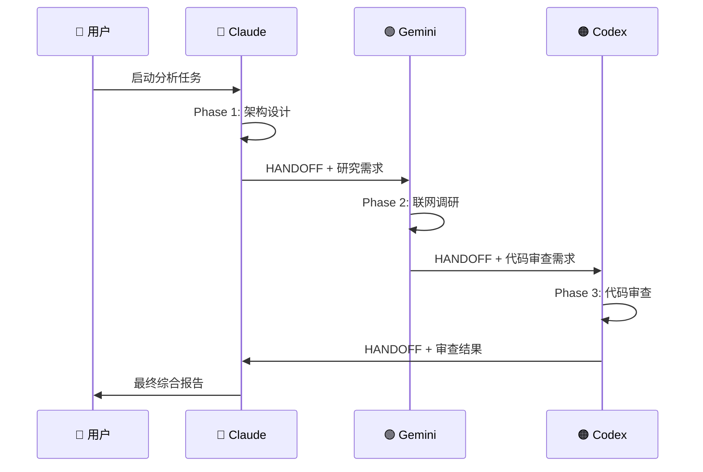

# AI编程研究系列文章配图说明

> **创建时间**: 2026-01-10
> **用途**: 为5篇AI编程研究文章生成封面配图和内文插图
> **推荐工具**: Midjourney, DALL-E 3, Stable Diffusion

---

## 文章1：AI Agent自我迭代系统实践

### 封面配图

**Prompt (英文)**:
```
A futuristic AI brain with glowing neural pathways forming a continuous loop,
representing self-iteration. The brain is surrounded by code snippets and data
streams flowing in a circular pattern. Dark blue and cyan color scheme with
subtle purple accents. Clean, minimalist tech aesthetic. 4K, digital art.
```

**Prompt (中文描述)**:
未来感AI大脑，发光神经通路形成连续循环，象征自我迭代。大脑周围环绕代码片段和数据流，以循环模式流动。深蓝与青色配色，紫色点缀。简洁科技美学风格。

**Mermaid架构图**:

```mermaid
graph TB
    subgraph "自我迭代引擎"
        A[操作分析] --> B[改进识别]
        B --> C[方案生成]
        C --> D[置信度评估]
        D -->|≥0.8| E[自动应用]
        D -->|<0.8| F[人工审核]
        E --> G[效果验证]
        F --> G
        G --> A
    end

    style A fill:#1a1a2e,stroke:#4da6ff
    style B fill:#1a1a2e,stroke:#4da6ff
    style C fill:#1a1a2e,stroke:#4da6ff
    style D fill:#1a1a2e,stroke:#ffd700
    style E fill:#1a1a2e,stroke:#00ff88
    style F fill:#1a1a2e,stroke:#ff6b6b
    style G fill:#1a1a2e,stroke:#4da6ff
```


---

## 文章2：Multi-CLI协作架构设计

### 封面配图

**Prompt (英文)**:
```
Three distinct AI assistants (Claude, Gemini, Codex) represented as luminous
orbs of different colors (blue, green, orange) connected by flowing data
streams. A central HANDOFF document glowing in the middle. Modern tech
illustration style, dark background with vibrant neon accents. 4K.
```

**Prompt (中文描述)**:
三个不同AI助手（Claude、Gemini、Codex）表现为不同颜色的发光球体（蓝、绿、橙），由流动数据流连接。中央是发光的HANDOFF文档。现代科技插画风格，深色背景配霓虹色彩。

**Mermaid协作流程图**:


---

## 文章3：夜间自主AI编排系统设计

### 封面配图

**Prompt (英文)**:
```
A crescent moon overlooking a city of servers and code, with autonomous AI
agents represented as fireflies working while humans sleep. Digital streams
connecting buildings to a central orchestration hub. Night sky with stars
made of code snippets. Dreamy yet technological aesthetic. 4K, cinematic.
```

**Prompt (中文描述)**:
新月俯瞰服务器与代码构成的城市，自主AI代理表现为萤火虫在人类睡眠时工作。数字流将建筑连接到中央编排中心。夜空中的星星由代码片段构成。梦幻与科技美学融合。

**Mermaid 6阶段流程图**:

```mermaid
graph LR
    subgraph "夜间编排 (1:30 AM)"
        P1[Phase 1<br/>操作日志收集] --> P2[Phase 2<br/>代码变更分析]
        P2 --> P3[Phase 3<br/>Multi-CLI协调]
        P3 --> P4[Phase 4<br/>报告生成]
        P4 --> P5[Phase 5<br/>自我迭代]
        P5 --> P6[Phase 6<br/>状态更新]
    end

    style P1 fill:#0a0a1a,stroke:#4da6ff
    style P2 fill:#0a0a1a,stroke:#4da6ff
    style P3 fill:#0a0a1a,stroke:#00ff88
    style P4 fill:#0a0a1a,stroke:#ffd700
    style P5 fill:#0a0a1a,stroke:#ff6b6b
    style P6 fill:#0a0a1a,stroke:#4da6ff
```


---

## 文章4：macOS launchd深度指南

### 封面配图

**Prompt (英文)**:
```
A sleek MacBook Pro with translucent layers showing the launchd system
architecture beneath the surface. Gears and timing mechanisms integrated
with code, representing automated scheduling. Apple design language with
clean lines and subtle gradients. Silver and space gray palette with
accent blue highlights. 4K, product visualization style.
```

**Prompt (中文描述)**:
时尚MacBook Pro，半透明层显示launchd系统架构。齿轮和计时机构与代码集成，象征自动化调度。Apple设计语言，简洁线条与微妙渐变。银色与深空灰配色，蓝色高光点缀。产品可视化风格。

**Mermaid 服务架构图**:

```mermaid
graph TB
    subgraph "launchd服务管理"
        L[launchd<br/>PID 1] --> N[com.anwu.nighttime-ai<br/>每天 1:30 AM]
        L --> D[com.anwu.daily-plan<br/>每天 7:00 AM]
        L --> W[com.anwu.weekly-review<br/>周日 21:00]
    end

    subgraph "资源控制"
        N --> R1[Nice=10]
        N --> R2[LowPriorityIO=true]
        N --> R3[ProcessType=Background]
    end

    style L fill:#1a1a2e,stroke:#0071e3
    style N fill:#1a1a2e,stroke:#4da6ff
    style D fill:#1a1a2e,stroke:#4da6ff
    style W fill:#1a1a2e,stroke:#4da6ff
```


---

## 文章5：Claude Code操作日志智能分析

### 封面配图

**Prompt (英文)**:
```
A magnifying glass hovering over scrolling terminal logs, with highlighted
patterns emerging as glowing connections. Data visualization elements
showing bar charts and time distributions floating around. Purple and
green color scheme representing analysis and insights. Clean data
science aesthetic. 4K, infographic style.
```

**Prompt (中文描述)**:
放大镜悬浮在滚动终端日志上方，高亮模式作为发光连接浮现。数据可视化元素如柱状图和时间分布环绕。紫色与绿色配色象征分析与洞察。数据科学美学，信息图表风格。

**Mermaid 三层架构图**:

```mermaid
graph TB
    subgraph "报告生成层"
        R[ReportGenerator<br/>JSON + Markdown]
    end

    subgraph "分析层"
        A1[命令分析]
        A2[文件分析]
        A3[项目分析]
        A4[模式识别]
    end

    subgraph "解析层"
        P1[bash-commands.log]
        P2[file-changes.log]
        P3[sessions.log]
    end

    P1 --> A1
    P2 --> A2
    P2 --> A3
    P1 --> A4
    P2 --> A4

    A1 --> R
    A2 --> R
    A3 --> R
    A4 --> R

    style R fill:#1a1a2e,stroke:#9b59b6
    style A1 fill:#1a1a2e,stroke:#2ecc71
    style A2 fill:#1a1a2e,stroke:#2ecc71
    style A3 fill:#1a1a2e,stroke:#2ecc71
    style A4 fill:#1a1a2e,stroke:#2ecc71
```


---

## 系列封面（汇总图）

**Prompt (英文)**:
```
A pentagon of interconnected AI systems: self-iteration brain, multi-CLI
collaboration orbs, nighttime orchestration moon, macOS automation gears,
and log analysis magnifying glass. All connected by flowing data streams
in a harmonious composition. Dark blue background with vibrant accents.
Professional tech illustration, 4K, hero image style.
```

**Prompt (中文描述)**:
五边形互联AI系统：自我迭代大脑、Multi-CLI协作球体、夜间编排月亮、macOS自动化齿轮、日志分析放大镜。全部由流动数据流连接，和谐构图。深蓝背景配鲜艳点缀。专业科技插画，英雄图风格。

---

## 使用说明

### Midjourney参数建议
- 基础参数: `--ar 16:9 --v 6 --style raw`
- 封面图: `--ar 2:1 --q 2`
- 内文插图: `--ar 4:3`

### DALL-E 3设置
- 风格: Vivid
- 尺寸: 1792x1024 (封面) / 1024x1024 (内文)

### Mermaid渲染
1. 使用 [Mermaid Live Editor](https://mermaid.live/)
2. 导出为SVG或PNG
3. 建议深色主题: `%%{init: {'theme': 'dark'}}%%`

---

**创建者**: Claude Opus 4.5
**验证时间**: 2026-01-10
