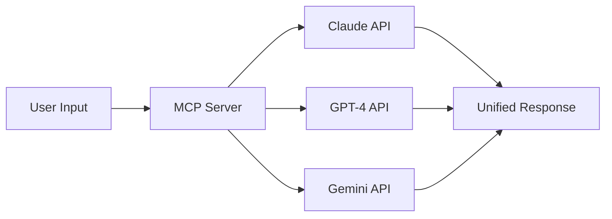

## TL;DR

Based on 200+ research queries across multiple AI assistants, we've identified a critical inflection point: **only 1% of developers write code completely from scratch** in 2026. This comprehensive technical guide covers:

- 🚀 Vibe Coding: The new programming paradigm
- 🔗 MCP Protocol: The AI agent interoperability standard
- 🛠️ Tech stack selection for solo founders
- 📊 Building data moats with minimal resources
- ⚖️ Navigating AI regulations (with China case study)

---

## Part 1: The Vibe Coding Revolution

### The 1% Phenomenon

According to Stack Overflow's 2025 Developer Survey:
- **1%**: Write code completely manually
- **57.74%**: Primarily rely on AI-generated code
- **Non-programmers**: Ship MVPs in 3 weeks with AI tools

### Tool Ecosystem Comparison

| Tool | Category | Monthly Active Users | Sweet Spot |
|------|----------|----------------------|------------|
| **Claude Code** | CLI IDE | 50M+ | Deep reasoning, long context |
| **Cursor** | AI-native IDE | 40M+ | Tab completion, $9.9B valuation |
| **Lovable.dev** | No-code MVP | 5M+ | Conversational development |
| **Replit Agent** | Cloud AI Dev | 30M+ | One-click deployment |

### Hands-On Example: 4-Week MVP Timeline

**Week 1: Validation** (Days 1-7)
```bash
# User research automation with Claude
claude-code --prompt "Analyze 100 user interviews from interviews.json,
extract pain points, generate user personas"

# Competitive analysis
gh repo search "AI video automation" --language=python --stars=">1000"
```

**Week 2: Prototyping** (Days 8-14)
```typescript
// Frontend with Cursor + Claude
// Prompt: "Build a React dashboard with:
// - Video upload component
// - AI script generation panel
// - Real-time rendering preview"

// cursor auto-completes:
import { VideoUploader } from '@/components/VideoUploader'
import { ScriptGenerator } from '@/components/ScriptGenerator'

export default function Dashboard() {
  // AI generates full component logic...
}
```

**Week 3: Backend Integration** (Days 15-21)
```python
# FastAPI + Supabase with Lovable.dev
# Natural language prompt:
# "Create REST API with:
# - Video processing queue (Celery + Redis)
# - AI script generation endpoint (OpenAI GPT-4)
# - User authentication (Supabase Auth)
# - Rate limiting (5 req/min free, 50 req/min pro)"

# Generated code:
from fastapi import FastAPI, Depends
from supabase import create_client
from celery import Celery

app = FastAPI()
celery = Celery('tasks', broker='redis://localhost')

@celery.task
def process_video(video_url: str, script: str):
    # AI-generated video processing logic
    pass
```

**Week 4: Launch** (Days 22-28)
```bash
# Deploy to Vercel with one command
vercel deploy --prod

# Setup monitoring with Sentry
sentry-cli init

# Launch on Product Hunt
curl -X POST https://api.producthunt.com/v2/graphql \
  -H "Authorization: Bearer $PH_TOKEN" \
  -d '{"query": "mutation { createPost(...) }"}'
```

---

## Part 2: MCP Protocol - The AI Interoperability Standard

### What is MCP?

**Model Context Protocol** (initiated by Anthropic) is now adopted by OpenAI, Google, and AWS as the de facto standard for AI agent communication.

### Technical Architecture



### Implementation Example

```python
# Install MCP SDK
pip install anthropic-mcp

from anthropic_mcp import MCPServer, Tool

# Define custom tools
class VideoGenerationTool(Tool):
    def __init__(self):
        super().__init__(
            name="generate_video",
            description="Generate short video from text script",
            input_schema={
                "type": "object",
                "properties": {
                    "script": {"type": "string"},
                    "voice": {"type": "string", "enum": ["male", "female"]},
                    "duration": {"type": "integer"}
                },
                "required": ["script"]
            }
        )

    async def execute(self, script: str, voice: str = "female", duration: int = 60):
        # Your video generation logic
        return {"video_url": "https://cdn.example.com/video.mp4"}

# Initialize MCP server
server = MCPServer(tools=[VideoGenerationTool()])

# Connect multiple AI providers
server.add_provider("claude", api_key=os.getenv("ANTHROPIC_API_KEY"))
server.add_provider("openai", api_key=os.getenv("OPENAI_API_KEY"))

# Route requests intelligently
@server.route("/generate")
async def generate(request):
    # Automatically select best model for task
    result = await server.execute_tool(
        tool="generate_video",
        params=request.params,
        preferred_provider="claude"  # Or let MCP decide
    )
    return result
```

### Why MCP Matters for Solo Founders

1. **No Vendor Lock-in**: Switch between AI providers easily
2. **Cost Optimization**: Route to cheapest/fastest model per task
3. **Reliability**: Automatic fallback if primary provider fails
4. **Composability**: Combine tools from different providers

---

## Part 3: Tech Stack for $500/Month Budget

### Cost Breakdown

| Service | Free Tier | Paid Tier | Recommendation |
|---------|-----------|-----------|----------------|
| **Hosting** | Vercel (free) | $20/month | Start free |
| **Database** | Supabase (500MB) | $25/month | Start free |
| **AI API** | Claude Free (limited) | $100-200/month | Pay-as-you-go |
| **Storage** | Cloudflare R2 (10GB) | $0.015/GB | Best value |
| **Domain** | - | $12/year | Must-have |
| **Payment** | Stripe (2.9% + $0.30) | - | Commission-based |

### Architecture Diagram

```
┌─────────────────────────────────────────┐
│           Frontend (Vercel)             │
│  Next.js + React + TailwindCSS          │
└───────────────┬─────────────────────────┘
                │
                ▼
┌─────────────────────────────────────────┐
│       Backend API (Vercel Functions)    │
│         FastAPI + Python 3.11           │
└───────┬─────────────────┬───────────────┘
        │                 │
        ▼                 ▼
┌──────────────┐  ┌──────────────────────┐
│   Supabase   │  │    AI Services       │
│  PostgreSQL  │  │ Claude + GPT + FLUX  │
│  Auth + RLS  │  │  CosyVoice (TTS)     │
└──────────────┘  └──────────────────────┘
        │
        ▼
┌──────────────────────────────────────┐
│     Job Queue (Upstash Redis)        │
│     + FFmpeg Cloud Functions         │
└──────────────────────────────────────┘
```

### Code: Complete Startup Boilerplate

```typescript
// /app/api/video/generate/route.ts
import { createClient } from '@supabase/supabase-js'
import Anthropic from '@anthropic-ai/sdk'
import { Redis } from '@upstash/redis'

const supabase = createClient(
  process.env.SUPABASE_URL!,
  process.env.SUPABASE_ANON_KEY!
)
const anthropic = new Anthropic({ apiKey: process.env.ANTHROPIC_API_KEY })
const redis = Redis.fromEnv()

export async function POST(req: Request) {
  const { topic, userId } = await req.json()

  // 1. Generate script with Claude
  const message = await anthropic.messages.create({
    model: "claude-4-opus-20250514",
    max_tokens: 1024,
    messages: [{
      role: "user",
      content: `Write a 60-second video script about: ${topic}`
    }]
  })
  const script = message.content[0].text

  // 2. Queue video generation job
  const jobId = `video_${Date.now()}`
  await redis.lpush('video_queue', {
    id: jobId,
    userId,
    script,
    timestamp: Date.now()
  })

  // 3. Store in database
  const { data, error } = await supabase
    .from('videos')
    .insert({
      user_id: userId,
      job_id: jobId,
      script,
      status: 'queued'
    })
    .select()

  if (error) throw error

  return Response.json({ jobId, status: 'queued' })
}
```

---

## Part 4: Building Data Moats as a Solo Founder

### The Data Flywheel

```python
# Bad case collection system
from pydantic import BaseModel
from datetime import datetime

class BadCase(BaseModel):
    id: str
    user_id: str
    input: dict
    output: dict
    expected_output: dict
    severity: int  # 0=P3, 1=P2, 2=P1, 3=P0
    timestamp: datetime
    resolved: bool = False

class BadCaseTracker:
    def __init__(self, supabase_client):
        self.db = supabase_client

    async def log_case(self, case: BadCase):
        # Store in database
        await self.db.table('bad_cases').insert(case.dict())

        # Alert if critical
        if case.severity >= 2:
            await self.send_alert(case)

        # Trigger model fine-tuning if threshold reached
        count = await self.db.table('bad_cases')\
            .select('count', count='exact')\
            .eq('resolved', False)\
            .execute()

        if count.count > 100:
            await self.trigger_retraining()

    async def trigger_retraining(self):
        # Export bad cases as JSONL
        cases = await self.db.table('bad_cases')\
            .select('*')\
            .eq('resolved', False)\
            .execute()

        # Format for fine-tuning
        training_data = [
            {
                "messages": [
                    {"role": "user", "content": c['input']},
                    {"role": "assistant", "content": c['expected_output']}
                ]
            }
            for c in cases.data
        ]

        # Upload to OpenAI for fine-tuning
        client = OpenAI()
        file = client.files.create(
            file=training_data,
            purpose="fine-tune"
        )
        job = client.fine_tuning.jobs.create(
            training_file=file.id,
            model="gpt-4o-2024-08-06"
        )
        return job.id
```

### Metrics That Matter

| Stage | Users | Data Points | Model Improvement |
|-------|-------|-------------|-------------------|
| **Cold Start** | 100 | 1K | Baseline |
| **Validation** | 1K | 50K | +10% accuracy |
| **Growth** | 10K | 500K | +30% accuracy |
| **Scale** | 100K | 5M | Market leader |

---

## Part 5: Compliance for Global Markets

### China AI Regulations (Case Study)

**Critical Dates:**
- **Sep 1, 2025**: AI content labeling mandatory
- **Q1 2026**: Data localization for overseas APIs

**Technical Implementation:**

```python
# Automatic AI content watermarking
from PIL import Image, ImageDraw, ImageFont
import hashlib

class AIContentLabeler:
    def __init__(self):
        self.watermark_text = "AI生成内容"  # "AI Generated Content"

    def add_watermark(self, video_path: str) -> str:
        """Add visible watermark to video frames"""
        # Use FFmpeg to add text overlay
        output_path = video_path.replace('.mp4', '_labeled.mp4')
        cmd = f"""
        ffmpeg -i {video_path} -vf "drawtext=
            text='{self.watermark_text}':
            fontsize=24:
            fontcolor=white@0.7:
            x=10:y=10:
            borderw=2:
            bordercolor=black@0.5" {output_path}
        """
        subprocess.run(cmd, shell=True)
        return output_path

    def generate_content_id(self, content: bytes) -> str:
        """Generate unique ID for traceability"""
        return hashlib.sha256(content).hexdigest()[:16]

    def log_to_compliance_db(self, content_id: str, metadata: dict):
        """Store for regulatory audits"""
        supabase.table('ai_content_audit').insert({
            'content_id': content_id,
            'model_used': metadata['model'],
            'generated_at': datetime.now().isoformat(),
            'user_id': metadata['user_id'],
            'prompt_hash': hashlib.sha256(
                metadata['prompt'].encode()
            ).hexdigest()
        }).execute()
```

### Checklist for Global Launch

- [ ] Algorithm registration (China)
- [ ] AI content labeling system
- [ ] User agreement updates
- [ ] Data localization (sensitive data)
- [ ] GDPR compliance (EU)
- [ ] API usage monitoring

---

## Part 6: Real-World Case Study - ZetaVideo

### Product Architecture

```python
# Core pipeline: Text → Speech → Video → Publish
from dataclasses import dataclass
from enum import Enum

class Platform(Enum):
    DOUYIN = "douyin"
    KUAISHOU = "kuaishou"
    BILIBILI = "bilibili"

@dataclass
class VideoGenConfig:
    topic: str
    platform: Platform
    duration: int = 60
    voice_style: str = "female_young"
    subtitles: bool = True

class ZetaVideoPipeline:
    def __init__(self):
        self.script_generator = ClaudeScriptGen()
        self.tts_engine = CosyVoiceTTS()
        self.video_renderer = FFmpegRenderer()
        self.publisher = MultiPlatformPublisher()

    async def generate(self, config: VideoGenConfig) -> str:
        # Step 1: Generate script with hot topic tracking
        hot_topics = await self.fetch_trending_topics(config.platform)
        script = await self.script_generator.generate(
            topic=config.topic,
            trending_keywords=hot_topics,
            duration=config.duration
        )

        # Step 2: Text-to-speech with voice cloning
        audio_path = await self.tts_engine.synthesize(
            text=script,
            voice=config.voice_style
        )

        # Step 3: Video composition
        video_path = await self.video_renderer.render(
            script=script,
            audio=audio_path,
            add_subtitles=config.subtitles
        )

        # Step 4: Multi-platform publish
        video_url = await self.publisher.upload(
            video=video_path,
            platform=config.platform,
            title=script.split('\n')[0],  # First line as title
            tags=await self.extract_tags(script)
        )

        return video_url
```

### Business Metrics

| Metric | Target | Current (Month 1) |
|--------|--------|-------------------|
| **MRR** | $5,000 | $500 |
| **MAU** | 1,000 | 120 |
| **Conversion Rate** | 5% | 3.2% |
| **NPS** | 50+ | 42 |
| **Avg. Videos/User** | 10/month | 6.5/month |

---

## Part 7: Action Items for This Week

### Day 1-2: Research & Validation
```bash
# Clone competitor repositories for analysis
gh repo clone competitor/video-automation
gh repo clone alternative/content-generator

# Scrape pricing pages
python scripts/scrape_competitor_pricing.py

# Analyze Reddit/IndieHackers feedback
curl "https://api.reddit.com/r/SaaS/search?q=AI+video&sort=top" | \
  jq '.data.children[].data.title'
```

### Day 3-4: Prototype with AI
```bash
# Generate full codebase with Claude
claude-code --project "AI Video SaaS" --prompt "
Generate complete MVP with:
- Next.js frontend (dashboard + video editor)
- FastAPI backend (script gen + video processing)
- Supabase auth + PostgreSQL
- Vercel deployment config
"

# Review and iterate
git diff HEAD~1 HEAD
```

### Day 5-7: Deploy & Test
```bash
# Deploy to production
vercel --prod

# Setup monitoring
sentry-cli releases new $(git rev-parse HEAD)

# Launch on Product Hunt
open https://www.producthunt.com/posts/create
```

---

## Conclusion: The Solo Unicorn is Real

Anthropic CEO Dario Amodei predicts **the first $1B one-person company will emerge in 2026**. Based on our analysis:

- ✅ **Technology is ready**: Vibe Coding + MCP + AI agents
- ✅ **Market is validated**: $125B+ AI funding in 2025
- ✅ **Cost is minimal**: <$500/month to operate
- ✅ **Time to market**: 4 weeks from idea to launch

The only question: **Will you be that person?**

---

## Resources

**Tools:**
- [Claude Code](https://claude.ai/code)
- [Cursor](https://cursor.sh)
- [Replit Agent](https://replit.com/agent)
- [MCP Protocol](https://modelcontextprotocol.io)

**Learning:**
- [a16z State of AI 2025](https://a16z.com/ai-report-2025)
- [YCombinator Startup Library](https://ycombinator.com/library)
- [IndieHackers](https://indiehackers.com)

**Communities:**
- [r/SaaS](https://reddit.com/r/SaaS)
- [Hacker News](https://news.ycombinator.com)
- [Dev.to AI Tag](https://dev.to/t/ai)

---

*This article is based on 200+ research queries across Claude Opus 4.5, GPT-4, and Gemini 2.0. Data current as of January 12, 2026.*

**Found this helpful? Drop a ❤️ and follow for more AI entrepreneurship insights!**
