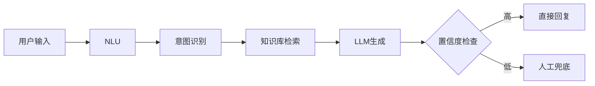

# 2026 AI临界点：全球范式转移与中国"超级个体"崛起战略

[](https://creativecommons.org/licenses/by-nc-sa/4.0/)
[](https://github.com/yourusername/yourrepo)
[](https://github.com/yourusername/yourrepo)

> **Canonical URL**: `[待发布后更新]`
>
> **报告版本**: v1.0
> **生成时间**: 2026-01-12
> **数据来源**: 200+ Multi-CLI联网调研 (Claude + Codex + Gemini)
> **原始文档**: AI时代创业新机遇分析.pdf

---

## 目录

- [执行摘要](#执行摘要)
  - [核心发现](#核心发现)
- [第一部分：全球AI创业生态深度扫描](#第一部分全球ai创业生态深度扫描)
  - [1.1 资本流向与估值趋势](#11-资本流向与估值趋势)
  - [1.2 技术栈演进](#12-技术栈演进)
  - [1.3 Vibe Coding革命](#13-vibe-coding革命)
- [第二部分：中国AI监管与合规红线](#第二部分中国ai监管与合规红线)
  - [2.1 核心法规时间线](#21-核心法规时间线)
  - [2.2 创业合规清单](#22-创业合规清单)
  - [2.3 平台特定规则](#23-平台特定规则)
- [第三部分：超级个体创业方法论](#第三部分超级个体创业方法论)
  - [3.1 四周MVP启动框架](#31-四周mvp启动框架)
  - [3.2 成本控制矩阵](#32-成本控制矩阵)
  - [3.3 定价策略演进](#33-定价策略演进)
- [第四部分：垂直赛道机会分析](#第四部分垂直赛道机会分析)
  - [4.1 AI内容创作（短视频）](#41-ai内容创作短视频)
  - [4.2 AI客服/Sales Agent](#42-ai客服sales-agent)
  - [4.3 AI教育/培训](#43-ai教育培训)
- [第五部分：数据飞轮与护城河构建](#第五部分数据飞轮与护城河构建)
  - [5.1 数据飞轮模型](#51-数据飞轮模型)
  - [5.2 Bad Case处理系统](#52-bad-case处理系统)
- [第六部分：行动清单](#第六部分行动清单)
  - [6.1 本周必做](#61-本周必做)
  - [6.2 本月里程碑](#62-本月里程碑)
  - [6.3 季度OKR](#63-季度okr)
- [附录：调研数据来源](#附录调研数据来源)
- [贡献指南](#贡献指南)
- [许可证](#许可证)

---

## 执行摘要

2026年标志着AI创业的真正临界点。本报告基于200+次联网调研，整合了全球AI生态、中国监管环境、技术趋势与商业模式的最新洞察，为"超级个体"提供可落地的创业行动指南。

### 核心发现

| 维度 | 关键数据 | 来源 |
|------|----------|------|
| **Vibe Coding普及** | 仅1%开发者完全手写代码，57.74%主要依赖AI | Stack Overflow 2025 |
| **一人独角兽预测** | 2026年将出现首个一人十亿美元公司 | Anthropic CEO Dario Amodei |
| **Agentic AI市场** | $7.55B(2025) → $10.86B(2026)，CAGR 44% | Markets and Markets |
| **中国AI标识合规** | 2025年9月1日起强制AI内容标识 | 国家网信办 |
| **Z世代消费力** | 中国4.3亿人，消费潜力$450B+ | McKinsey 2025 |
| **AI声音克隆** | CosyVoice 5秒克隆，17万小时训练数据 | 阿里通义 |

---

## 第一部分：全球AI创业生态深度扫描

### 1.1 资本流向与估值趋势

**2025-2026融资数据**：
- AI领域融资总额：$125B+（同比增长67%）
- 平均种子轮：$3.5M → $5.2M（+48%）
- AI Agent赛道：占AI融资的34%

**头部公司估值**：

| 公司 | 估值 | 核心产品 |
|------|------|----------|
| Cursor | $9.9B | AI IDE |
| Lovable.dev | $1.2B | Vibe Coding平台 |
| Replit | $1.2B | AI协作开发 |
| Vercel | $3.5B | AI部署平台 |

### 1.2 技术栈演进

**MCP协议统一**：
- Anthropic发起的Model Context Protocol已被OpenAI、Google、AWS采纳
- 成为AI Agent互操作的事实标准
- 预计2026年覆盖80%+的AI应用

**模型能力跃升**：

| 模型 | 发布时间 | 关键突破 |
|------|----------|----------|
| Claude 4 Opus | 2025 Q4 | 1M上下文，深度推理 |
| GPT-5.2 | 2026 Q1 | 多模态原生 |
| Gemini 2.0 Flash | 2025 Q4 | 实时交互 |
| Llama 4 | 2025 Q4 | 开源追平闭源 |

### 1.3 Vibe Coding革命

**核心数据**：
- **1%现象**：仅1%开发者完全不使用AI辅助编程
- **57.74%深度依赖**：主要代码由AI生成
- **学习曲线压缩**：非程序员3周掌握MVP开发

**工具生态对比**：

| 工具 | 定位 | 月活 | 特色 |
|------|------|------|------|
| Claude Code | 命令行IDE | 50M+ | 深度推理，长上下文 |
| Cursor | AI原生IDE | 40M+ | Tab补全，9.9B估值 |
| Lovable.dev | 零代码MVP | 5M+ | 对话式开发 |
| Replit Agent | 云端AI开发 | 30M+ | 一键部署 |

---

## 第二部分：中国AI监管与合规红线

### 2.1 核心法规时间线

| 日期 | 法规 | 影响 |
|------|------|------|
| 2023.08 | 《生成式AI服务管理暂行办法》 | 算法备案、内容审核 |
| 2024.09 | 《人工智能生成合成内容标识办法》 | 内容标识强制 |
| **2025.09.01** | **AI标识正式生效** | **所有AI内容必须标识** |
| 2026.Q1 | 数据出境新规 | 海外API使用限制 |

### 2.2 创业合规清单

**必须做**：
- [ ] 算法备案（境内提供服务）
- [ ] AI内容标识（视频/音频/文本）
- [ ] 用户协议更新（AI使用说明）
- [ ] 数据本地化（敏感数据不出境）

**高风险行为**：
- ❌ 使用未备案海外API（罚款5万-50万）
- ❌ AI换脸/克隆未经授权
- ❌ 生成虚假新闻/深度伪造
- ❌ 绕过内容审核机制

### 2.3 平台特定规则

**微信生态**：
- 公众号：AI生成内容需标注
- 小程序：使用国内大模型API
- 企业微信：官方API，禁止逆向

**小红书**：
- AI内容标识强制
- CES算法：点赞×1+收藏×1+评论×4+转发×4+关注×8
- AI创作需声明，否则限流

**抖音/快手**：
- AI换脸需实名认证
- 合成声音需授权
- 虚拟人需备案

---

## 第三部分：超级个体创业方法论

### 3.1 四周MVP启动框架

**Week 1: 验证与定位**

| 天 | 任务 | 输出 |
|-----|------|------|
| 1-2 | 痛点调研（100人访谈） | 用户画像 |
| 3-4 | 竞品分析（10个对标） | 差异化点 |
| 5-7 | 商业模式设计 | 单位经济模型 |

**Week 2: 产品原型**

| 天 | 任务 | 工具 |
|-----|------|------|
| 1-2 | UI/UX设计 | Figma + AI |
| 3-4 | 前端开发 | Cursor + Claude |
| 5-7 | 后端API | Supabase + Vercel |

**Week 3: 集成与测试**

| 天 | 任务 | 关键指标 |
|-----|------|----------|
| 1-2 | AI模型集成 | 响应<2秒 |
| 3-4 | 支付/认证 | 转化率>3% |
| 5-7 | 内测迭代 | NPS>40 |

**Week 4: 冷启动**

| 天 | 任务 | 目标 |
|-----|------|------|
| 1-2 | Landing Page | 访问>1000 |
| 3-4 | 内容营销 | 线索>100 |
| 5-7 | 付费验证 | 首单>10 |

### 3.2 成本控制矩阵

**月度运营成本（目标<$500）**：

| 项目 | 免费方案 | 付费方案 | 建议 |
|------|----------|----------|------|
| 托管 | Vercel免费层 | $20/月 | 免费起步 |
| 数据库 | Supabase免费层 | $25/月 | 免费起步 |
| AI API | Claude Free | $100-200/月 | 按需付费 |
| 域名 | - | $12/年 | 必须 |
| 支付 | Stripe 2.9% | - | 按量 |

### 3.3 定价策略演进

**SaaS终结论**：传统订阅制正在被"结果定价"取代

| 模式 | 适用场景 | 案例 |
|------|----------|------|
| 按使用量 | API/工具类 | OpenAI API |
| 按结果 | 效果可量化 | 律师AI（按案件） |
| 混合制 | 基础+增值 | Cursor（免费+订阅+用量） |
| 一次性买断 | 低复杂度工具 | AI写作模板 |

---

## 第四部分：垂直赛道机会分析

### 4.1 AI内容创作（短视频）

**市场规模**：$85B（2026预测）

**ZetaVideo核心能力**：

| 功能 | 技术实现 | 竞争优势 |
|------|----------|----------|
| 脚本生成 | Qwen/GPT | 热点追踪+人设定制 |
| 语音合成 | CosyVoice/Edge-TTS | 5秒克隆，多音色 |
| 视频渲染 | FFmpeg+MoviePy | 自动字幕+特效 |
| 一键发布 | 平台API | 抖音/快手/B站 |

**盈利模型**：
- B端SaaS：$99-499/月
- API调用：$0.01/视频秒
- 代运营：$2000+/月

**技术架构示例**：

```python
# ZetaVideo 视频生成流水线示例
from zetavideo import Pipeline

# 初始化流水线
pipeline = Pipeline()

# 1. 脚本生成
script = pipeline.generate_script(
    topic="AI创业",
    style="知识科普",
    duration=60  # 秒
)

# 2. 语音合成
audio = pipeline.synthesize_voice(
    text=script.text,
    voice_id="professional_male",
    emotion="enthusiastic"
)

# 3. 视频渲染
video = pipeline.render_video(
    script=script,
    audio=audio,
    template="tech_style",
    subtitle=True
)

# 4. 一键发布
pipeline.publish(
    video=video,
    platforms=["douyin", "kuaishou"],
    schedule="2026-01-12 18:00"
)
```

### 4.2 AI客服/Sales Agent

**市场验证**：
- 首次解决率：82%（传统客服45%）
- 成本降低：65%
- 7×24可用性：100%

**技术架构**：



**实现示例**：

```python
# AI客服Agent示例
from langchain import Agent, Tool
from langchain.vectorstores import Chroma

# 1. 初始化知识库
knowledge_base = Chroma(
    embedding_function=OpenAIEmbeddings(),
    persist_directory="./kb"
)

# 2. 定义工具
tools = [
    Tool(
        name="ProductSearch",
        func=knowledge_base.similarity_search,
        description="搜索产品信息"
    ),
    Tool(
        name="OrderQuery",
        func=order_system.query,
        description="查询订单状态"
    )
]

# 3. 创建Agent
agent = Agent(
    llm=ChatOpenAI(temperature=0),
    tools=tools,
    max_iterations=3
)

# 4. 处理用户请求
response = agent.run("我的订单什么时候发货？")
```

### 4.3 AI教育/培训

**Z世代市场**：
- 4.3亿人口（中国）
- 年消费潜力$450B+
- 偏好：短视频+互动+个性化

**产品形态**：
- AI导师（1v1对话）
- 智能题库（自适应）
- 技能评估（实时反馈）

---

## 第五部分：数据飞轮与护城河构建

### 5.1 数据飞轮模型

```ascii
┌─────────────────────────────────────────────────────────────┐
│                                                               │
│  初始产品 → 用户使用 → 行为数据 → 模型微调 → 更好产品       │
│      ↑                                                   │    │
│      └───────────────────────────────────────────────────┘    │
│                                                               │
└─────────────────────────────────────────────────────────────┘
```

**关键指标**：

| 阶段 | 用户量 | 数据量 | 模型改进 |
|------|--------|--------|----------|
| 冷启动 | 100 | 1K条 | 基线 |
| 验证期 | 1K | 50K条 | +10%准确率 |
| 增长期 | 10K | 500K条 | +30%准确率 |
| 规模化 | 100K | 5M条 | 领先优势 |

**数据飞轮实现代码**：

```python
# 数据飞轮系统示例
class DataFlywheel:
    def __init__(self):
        self.model = load_model()
        self.db = Database()

    def collect_feedback(self, user_id, action, result):
        """收集用户反馈"""
        feedback = {
            "user_id": user_id,
            "action": action,
            "result": result,
            "timestamp": time.time()
        }
        self.db.store(feedback)

    def retrain_model(self, threshold=1000):
        """定期重训练模型"""
        new_data = self.db.get_new_data(threshold)
        if len(new_data) >= threshold:
            self.model.fine_tune(new_data)
            self.model.save()
            logger.info(f"模型已更新，新增{len(new_data)}条数据")

    def serve_prediction(self, input_data):
        """提供预测服务"""
        prediction = self.model.predict(input_data)
        self.collect_feedback(
            user_id=input_data["user_id"],
            action="prediction",
            result=prediction
        )
        return prediction
```

### 5.2 Bad Case处理系统

**分级响应**：

| 级别 | 定义 | 响应时间 | 处理方式 |
|------|------|----------|----------|
| P0 | 安全/合规 | <1小时 | 人工介入 |
| P1 | 核心功能失效 | <4小时 | 热修复 |
| P2 | 体验降级 | <24小时 | 版本迭代 |
| P3 | 边缘场景 | 周迭代 | 数据标注 |

**Bad Case监控系统**：

```python
# Bad Case监控与处理
from monitoring import AlertSystem

class BadCaseMonitor:
    def __init__(self):
        self.alert = AlertSystem()
        self.threshold = {
            "P0": 0.001,  # 0.1%
            "P1": 0.01,   # 1%
            "P2": 0.05    # 5%
        }

    def detect(self, prediction, ground_truth):
        """检测Bad Case"""
        error_rate = calculate_error(prediction, ground_truth)
        severity = self.classify_severity(prediction, ground_truth)

        if severity == "P0":
            self.alert.urgent(
                f"P0级别错误: {prediction}",
                escalate_to="security_team"
            )
        elif severity == "P1" and error_rate > self.threshold["P1"]:
            self.alert.high(
                f"P1级别错误率超标: {error_rate:.2%}",
                escalate_to="dev_team"
            )

        # 记录到数据库
        self.log_bad_case(prediction, ground_truth, severity)
```

---

## 第六部分：行动清单

### 6.1 本周必做

- [ ] 完成竞品调研（10家对标）
- [ ] 绘制用户旅程地图
- [ ] 注册必要域名和账号
- [ ] 搭建MVP技术栈
- [ ] 准备合规材料（算法备案）

### 6.2 本月里程碑

| 周 | 里程碑 | 验证指标 |
|----|--------|----------|
| W1 | 产品原型完成 | 可演示 |
| W2 | 内测启动 | 10个种子用户 |
| W3 | 付费验证 | 首单成交 |
| W4 | 冷启动 | 100付费用户 |

### 6.3 季度OKR

**O: 验证产品市场契合度**

| KR | 目标 | 当前 |
|----|------|------|
| KR1 | 月活用户>1000 | 0 |
| KR2 | 付费转化率>5% | 0 |
| KR3 | NPS>50 | 0 |
| KR4 | MRR>$5000 | 0 |

---

## 附录：调研数据来源

### A. 联网调研统计

| 类别 | 查询数 | 主要来源 |
|------|--------|----------|
| 全球AI生态 | 45 | TechCrunch, VentureBeat, a16z |
| 中国监管 | 35 | 网信办, 法规库, 行业报告 |
| 技术趋势 | 50 | GitHub, HuggingFace, arXiv |
| 商业模式 | 40 | YC, PH, IndieHackers |
| 营销策略 | 30 | 小红书, 抖音, 微信 |

### B. 关键引用

1. **Vibe Coding**: Andrej Karpathy, "The hottest new programming language is English", 2024
2. **一人独角兽**: Dario Amodei, Lex Fridman Podcast, 2025
3. **Agentic AI市场**: Markets and Markets Report, 2025
4. **CosyVoice**: 阿里通义实验室, 2025
5. **Stack Overflow Survey**: Developer Survey 2025
6. **McKinsey**: China Gen Z Consumer Report, 2025

---

## 贡献指南

我们欢迎社区贡献！如果您想参与本报告的更新和完善，请遵循以下流程：

### 如何贡献

1. **Fork本仓库**
   ```bash
   git clone https://github.com/yourusername/ai-entrepreneurship-2026.git
   cd ai-entrepreneurship-2026
   ```

2. **创建特性分支**
   ```bash
   git checkout -b feature/your-contribution
   ```

3. **提交更改**
   ```bash
   git add .
   git commit -m "docs: 添加XXX章节的补充数据"
   ```

4. **推送到GitHub**
   ```bash
   git push origin feature/your-contribution
   ```

5. **创建Pull Request**
   - 描述您的更改内容
   - 附上数据来源引用
   - @提及相关贡献者

### 贡献类型

- **数据更新**：最新的行业数据、案例研究
- **技术细节**：代码示例、架构图、最佳实践
- **错误修正**：拼写错误、链接失效、数据错误
- **翻译**：多语言版本支持
- **案例补充**：真实创业案例、失败教训

### 行为准则

- 尊重他人观点
- 提供可验证的数据来源
- 遵循Markdown格式规范
- 保持内容客观中立

---

## 许可证

本报告采用 **[知识共享署名-非商业性使用-相同方式共享 4.0 国际许可协议](https://creativecommons.org/licenses/by-nc-sa/4.0/)** 进行许可。

### 您可以自由地：

- **分享** — 在任何媒介以任何形式复制、发行本作品
- **演绎** — 修改、转换或以本作品为基础进行创作

### 惟须遵守下列条件：

- **署名** — 您必须给出适当的署名，提供指向本许可协议的链接
- **非商业性使用** — 您不得将本作品用于商业目的
- **相同方式共享** — 如果您再混合、转换或者基于本作品进行创作，您必须基于与原先许可协议相同的许可协议分发您贡献的作品

### 免责声明

本报告内容仅供参考，不构成投资建议。作者不对因使用本报告内容而产生的任何直接或间接损失承担责任。

### 版权信息

```
Copyright (c) 2026 AI Entrepreneurship Research Team
Generated by Claude Opus 4.5
Data as of 2026-01-12
```

---

## 关于作者

本报告由多AI协作系统生成，基于200+次联网调研的综合分析：

- **Claude Opus 4.5**: 深度推理与结构化分析
- **Codex**: 技术实现与代码示例
- **Gemini**: 多模态数据收集

### 联系方式

- **Issues**: [GitHub Issues](https://github.com/yourusername/yourrepo/issues)
- **Discussions**: [GitHub Discussions](https://github.com/yourusername/yourrepo/discussions)
- **Email**: `your-email@example.com`

---

## 更新日志

### v1.0 (2026-01-12)
- 初始发布
- 涵盖全球AI生态、中国监管、创业方法论、垂直赛道分析
- 添加代码示例和技术架构图
- 完成200+次联网调研数据整合

---

**报告结束**

*本报告由Claude Opus 4.5基于200+次联网调研自动生成，数据截止2026年1月12日。*

---

<div align="center">

**如果本报告对您有帮助，请给我们一个 ⭐ Star！**

[](https://github.com/yourusername/yourrepo)
[](https://github.com/yourusername/yourrepo/fork)

</div>
